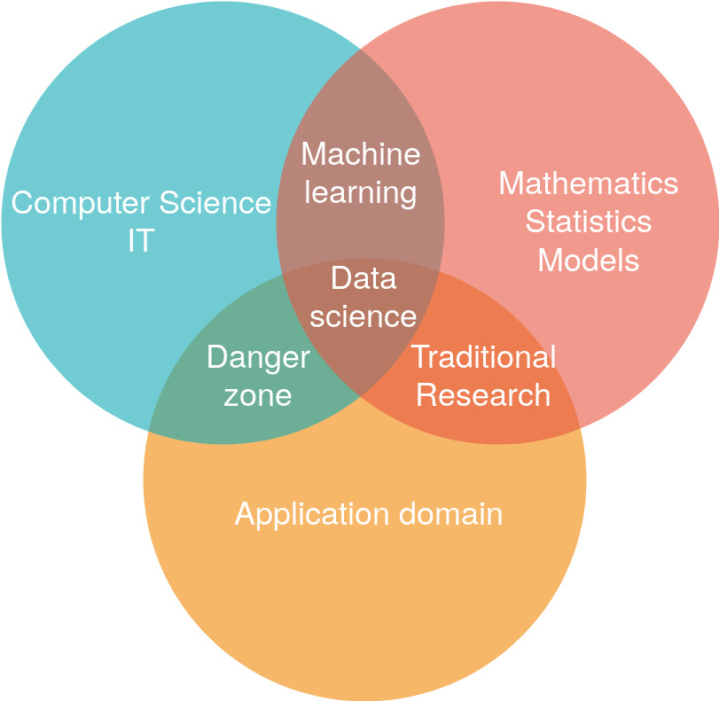
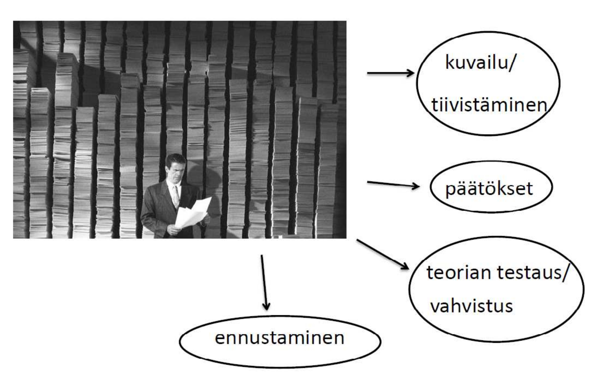
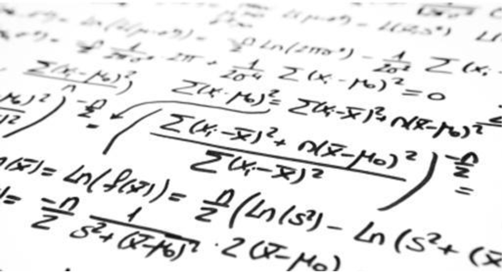

# Tilastotiede tieteenalana

Tässä luvussa hahmottelemme tilastotieteen piirteitä tieteenalana. Käymme läpi tilastotieteelle
ominaisia piirteitä, jotka erottavat sen niin lähitieteistä, kuten matematiikasta ja tietojenkäsit-
telytieteestä, kuin myös sovellusaloista. Usein näkee tilastotieteen typistettävän vain työkaluksi
eri sovellusalojen empiiriseen tutkimukseen siitäkin huolimatta että tilastotieteellä on oma rikas
teoriapohjansa sekä kiistaton asema omana tieteenalanaan.
Tieteenalan määritteleminen lyhyesti on aina hieman hankalaa. Tästä huolimatta seuraavassa
yritämme osaltaan vastata seuraaviin kysymyksiin:

- Mitä tilastotiede on ja mitä se ei ole? Miksi tilastotiede ei ole vain sovellettua matematiikkaa
tai matematiikalla höystettyä tietojenkäsittelyä?
- Mihin tilastotiedettä käytetään? Onko tilastotieteellä käyttöä ns. “akatemian” eli tutki-
musyhteisön ulkopuolella?
- Tilastotieteelle tyypillistä kritiikkiä?

## Lisää tilastotieteen perustermejä

Seuraavia tilastotieteen esittelyä ja karakterisointeja ajatellen määritellään seuraavassa lisää tilastotieteellisen tutkimuksen peruskäsitteitä. Näihin käsitteisiin paneudutaan osaltaan tarkemmin mm. luvussa ?? [otantaluku].

- Tilastotieteellinen tutkimus tarkastelee reaalimaailman ilmiöitä. Täten tutkimuskohteena on tavallisessa elämässä tavattavia asioita, ihmisiä tai tapahtumia. Tutkimuskohteita kutsutaan tilastoyksiköiksi ja niiden joukkoa kutsutaan populaatioksi (perusjoukoksi). Esimerkiksi jos tutkitaan kuntavaaleissa äänestävien tuloja niin jokainen äänestysikäinen muodostaa oman tilastoyksikkönsä (ks. alla) ja täten populaationa (perusjoukkona) toimii kaikki
äänestysikäiset kansalaiset. Jos taas tutkitaan äänestysaktiivisuutta eri kunnissa, muodostaa jokainen kunta oman tilastoyksikkönsä ja kaikki Suomen kunnat muodostavat populaation.

::: {.defblock .mikko data-latex="{}"}
**Populaatio**  

Konkreettinen tai hypoteettinen tutkimuskohteiden joukko, joka koostuu kaikista tilastoyksiköistä
:::

- Populaation muodostavilta tilastoyksiköiltä tarkastellaan niiden ominaisuuksia, eli **tilastollisia muuttujia**. Edellisissä esimerkeissä nämä olisivat esim. äänestäjien tulot ja kuntien äänestysprosentti. Mielenkiinnon kohteena olevia tilastollisia muuttujia kutsutaan **tutkimusmuuttujiksi** (tulot ja kuntien äänestysprosentti) ja niiden lisäksi voidaan kerätä ylimääräistä tietoa eli **taustamuuttujia** (näitä voisi olla esimerkiksi asuinpaikka ja kunnan väkiluku).

- Tilastoyksiköiden tilastollisilla muuttujilla on tietty mahdollisten arvojen joukko, ja näillä arvoilla on jokin **jakauma** populaatiossa. Esimerkiksi tulot voivat määritelmästä riippuen saada minkä tahansa positiivisen arvon mutta äänestysprosentti on luonnollisesti rajattu nollan ja sadan prosentin väliin.

::: {.defblock .mikko data-latex="{}"}
**Tilastoyksikkö ja tilastollinen muuttuja**  

Populaation muodostavilta tilastoyksiköiltä (populaation alkioilta) tarkastellaan  tilastollisia muuttujia, joita voidaan mitata tai havaita.
:::

- Kun tarkasteltavien tilastoyksikön tilastollisten muuttujien (numeeriset) arvot havaitaan, kutsutaan näiden arvojen joukkoa **havainnoksi**


::: {.defblock .mikko data-latex="{}"}
**Havainto**  

Havainto muodostuu tilastoyksikön tarkasteltavien tilastollisten muuttujien havaitusta arvoista.
:::

- Populaatio koostuu tilastoyksiköistä, joilla on tilastollisia muuttujia. Tarkasteltavista tilastollisista muuttujista kerätään havaintoja, joiden pohjalta tutkitaan **populaation ominaisuuksia**.

- Kerättyjen havaintojen joukko muodostaa **havaintoaineiston**, eli **datan**.


::: {.defblock .mikko data-latex="{}"}
**Havaintoaineisto/data**  

Havaintoaineisto, data, on tilastoyksiköiden tilastollisista muuttujista kerätty havaintojen joukko.
:::


**Tiivistettynä**: 

- Populaatio tutkimuksen kohteena olevia tilastoyksiköitä.
- Havaitaan tilastoyksiköistä tutkimuksen kannalta mielenkiintoisia tilastollisten muuttujien numeerisia arvoja.
- Nämä havainnot muodostavat havaintoaineiston, eli datan, jota voidaan käyttää tutkimuksessa.

– Terminologiaa (käydään vielä läpi tarkemmin jatkossa):
  - Tilastoala = Tilastotiede + Tilastotoimi
  - Tilastotiede = Teoreettinen tilastotiede + Soveltava tilastotiede
  - Tilastotoimi = Tilastojen tuotanto + Tilastojen hyödyntäminen

## Mitä tilastotiede on ja mitä se ei ole?

- Aloitetaan tarkastelemalla erinäisiä **tilastotieteen "karakterisointeja"** eri tahojen ja tutkijoiden toimesta:
  - __*Tilastotiede on tietotuotannon teknologiaa*__, *jonka avulla voidaan suorittaa kvantitatiivisten tietojen joukkotuotantoa ja havaintoihin perustuvia tieteellisiä ja käytännöllisiä päätöksiä. Tilastotiede on siis yksikköjen muodostamaan joukkoon liittyvän numeerisen tietoaineiston keräämistä, analysointia ja tulkintaa koskeva tiede* ^[[Leo Törnqvistin]( https://fi.wikipedia.org/wiki/Leo_T%C3%B6rnqvist), Suomen ensimmäisen tilastotieteen professorin, esittämä luonnehdinta (Vartia, 1989).].
  - __*Tilastotiede on yleinen menetelmätiede*__, *jota sovelletaan, jos reaalimaailman ilmiöstä halutaan tehdä johtopäätöksiä ilmiötä kuvaavien kvantitatiivisten tai numeeristen tietojen perusteella sellaisissa tilanteissa, joissa tietoihin liittyy epävarmuutta tai satunnaisuutta* ^[Mellin, (2005).].
  - __*Tilastotiede on yleinen menetelmätiede*__, *jota sovelletaan, jos reaalimaailman ilmiöstä halutaan tehdä johtopäätöksiä ilmiötä kuvaavien kvantitatiivisten tai numeeristen tietojen perusteella sellaisissa tilanteissa, joissa tietoihin liittyy epävarmuutta tai satunnaisuutta.*
  - *Vale, emävale, tilasto* ^[[Mark Twain](https://fi.wikipedia.org/wiki/Mark_Twain) popularisoi tämän lausahduksen teoksessaan *Chapters from My Autobiography* jo vuonna 1907. ].
  - *Statistics concerns what can be learned from data* ^[(A.C. Davison)].
  - *"Maalaisjärjen tehostamista"* ^[(Sund, 2003)].


- Tilastotiede siis **kehittää** ja **soveltaa menetelmiä** ja (tilastollisia) **malleja**, joiden avulla reaalimaailman ilmiöistä voidaan tehdä johtopäätöksiä ilmiöitä kuvaavien numeeristen tai kvantitatiivisten tietojen perusteella tilanteissa, joissa tietoihin liittyy **epävarmuutta ja satunnaisuutta**.
  - Tilastollisten menetelmien avulla pyritään löytämään reaalimaailman satunnaisia ilmiöitä kuvaavista numeerisista (eli kvantitatiivisista) tiedoista **systemaattisia piirteitä** joita jalostetaan sellaiseen muotoon, että ilmiöistä voidaan tehdä päätelmiä. 
    - Vrt. signaalin ja kohinan erottaminen (ks. Silver, 2014).
  - Tilastolliset mallit perustuvat todennäköisyyslaskentaan ja niillä mallinnetaan reaalielämän ilmiöiden alla piileviä prosesseja tai mekanismeja. Näiden prosessien tuottamia tietoja (aineistoja) tiivistetään usein graafisiksi esityksiksi ja tunnusluvuiksi sekä tilastollisten mallien parametreiksi, joiden pohjalta johtopäätöksiä tehdään.
  - Tässä onnistuakseen tilastollisten menetelmien tuleekin pyrkiä erottelemaan **sattuma** ja **systemaattisuus** tarkasteltavissa ilmiöissä tai, tarkemmin, niitä kuvaavissa aineistoissa, jotta johtopäätökset olisivat luotettavia.
  
**Voidaan sanoa, että saadakseen tarkemmin selville mitä tilastotiede on, pitää opiskella tilastotiedettä ja sen käyttöä!**

- Edellisten tilastotieteen yleismaailmallisten luonnehdintojen jälkeen onkin sopivaa kysyä **mitä tilastotiede ei ole**.
  - Vaikka sana **tilasto** tuo useimmille ensimmäisenä mieleen yhteiskuntaa ja sen toimintaa kuvaavat **numeeristen tietojen järjestelmälliset kokoelmat**, tilastotiede ei suinkaan ole ainoastaan tilastojen ja niiden tekemisen oppia.
    - Tämä siitäkin huolimatta, että niiden menetelmien konstruointi, joilla näitä tilastoja tuotetaan, jalostetaan ja analysoidaan on keskeinen osa tilastotiedettä. Tilastot ovat siis usein tilastotieteen soveltajan tutkimuskohteena ja tilastojen laadinnassa käytetään apuna tilastotieteen menetelmiä.
    - Suomessa [Tilastokeskus](https://www.stat.fi/) toimii virallisena tilastoviranomaisena ja tilastotuottajana. Tätä **tilastotuotannon** kokonaisuutta nimitetään ajoittain **tilastotoimeksi**. **Tilastotieteen käyttöalue on paljon tätä laajempi**. 
  - Tilastotieteen kannalta mikä tahansa reaalimaailman ilmiötä kuvaava **numeeristen tai kvantitatiivisten tietojen järjestelmällinen kokoelma** voi muodostaa **tilastollisen aineiston** ja siten tilastollisen tutkimuksen mahdollisen kohteen.
  - Esimerkiksi kaikki **empiirisen** tai **kvantitatiivisen**
tutkimuksen tutkimus- tai havaintoaineistot ovat tilastotieteen kannalta tilastollisia aineistoja.
- Tilastotiede sijoittuu tieteiden kentässä matematiikan, filosofian ja tietojenkäsittelytieteen rinnalle. Tästä huolimatta se ei kuitenkaan ole yksiselitteisesti minkään näiden osa-alue.
  - **Tilastotiede ei ole matematiikan osa-alue**, sillä tilastotiede lähestyy tieteellistä ongelmanratkaisua eri tavoin: matematiikka on tietyllä tavallaan aina eksaktia ja sen tulokset perustuvat formaaliin deduktioon ja loogisiin todistuksiin, johtaen usein ``eksaktiin''  ratkaisuun tai matemaattisesti formaaliin ratkaisun esitystapaan. Tilastotiede sen sijaan on aina konteksti- ja aineistopohjaista ja perustuu induktiiviseen päättelyyn. Saadut tulokset ovat aina epävarmoja - koska ne kuvailevat epävarmaa tietoa generoivia prosesseja!
    - Tilastotiede on siis hyvä nähdä omana tieteenalanaan matemaattisesta esitystavastaan huolimatta. Eihän esimerkiksi myöskään fysiikkaa (sentään) pidetä matematiikan osa-alueena!
  - **Tilastotiede ei ole myöskään tietojenkäsittelytieteen osa-alue**, vaikkakin useiden laskennallisten menetelmien ja tehokkaan tietojenkäsittelyn rooli tilastollisissa analyyseissä on jatkuvasti kasvanut. Tietojenkäsittelytieteen teoria ei rakennu tilastotieteen tavoin ajatukselle epävarmoista ja satunnaisista reaalimaailman ilmiöistä.
  - Vaikka nämä ja jotkin muut alat jakavat tilastotieteen kanssa useita piirteitä ja ominaisuuksia, on tilastotiede kuitenkin siis perustellusti oma tieteenalansa. Tämä erottelun vaikeus jo itsessään todistaa kuinka keskeinen rooli tilastotieteellä on eri aloilla! 
- Tilastotiede ei siis kuulu yksiselitteisesti sen lähitietieden alle, vaan muodostaa oman tieteenalan omine teorioineen ja tieteellisine premisseineen. Käsittelemme myöhemmin tilastotieteen roolia matematiikan ja/tai datatieteiden ("data science") kokonaisuudessa ja keskustelemme tarkemmin näiden erojen luonteesta.


- **Tilastotiede yleisenä menetelmätieteenä**
  - Tieteellistä tietoa ympäröivästä maailmasta hankitaan tieteellisillä **menetelmillä/metodeilla** (Ks. tieteellisen menetelmän kriteerit [Luku ??  2])), joiden avulla tutkitaan jotain ilmiötä tai sen generoimaa kvantitatiivista mutta epävarmaa tietoa sisältävää aineistoa. 
  - Tilastotieteessä kehitetyt ja kehitettävät menetelmät antavat tutkijoille yhtenevät ja tiedeyhteisön hyväksymät raamit, jotka mahdollistavat (tilastollisen) päättelyn ja päätöksenteon epävarman tiedon vallitessa. Näin voidaan uskottavasti ja luotettavasti tiivistää tietoa, jota erilaiset aineistot sisältävät, perustaa johtopäätöksiä näille tiivistyksille ja saavuttaa uusia tieteellisiä löytöjä.
    - Tilastotieteen menetelmien käyttö ja soveltaminen onkin siis aina alakohtaista. Tästä huolimatta tilastollisia menetelmiä sovelletaan aina johonkin **aineistoon**!
  - Tilastotieteen nähdäänkin usein kuuluvan ns. **menetelmätieteisiin**, joissa mm.:
    - Kehitetään työkaluja muiden tieteiden tutkimusongelmien ratkaisuksi
    - On myös oma sovelluksista vapaa teorianmuodostuksensa
  - Menetelmäkehityksen näkökulma tilastotieteeseen: *tilastotiede kehittää matemaattisia* __*malleja*__ *satunnaisilmiöitä kuvaavia kvantitatiivisia tietoja generoiville prosesseille.* Koska tietoihin liittyy **epävarmuutta** tai **satunnaisuutta**, **tilastolliset mallit** perustuvat **todennäköisyyslaskentaan**.
  - Juuri sattuman ja epävarmuuden huomioiminen tutkimusasetelmissa erottaa tilastotieteen muista menetelmätieteistä!
  

- **Aineisto:** Tilastotieteessä lähtökohtana ja ratkaisevassa asemassa on siis aina jonkin satunnaisilmiön generoima aineisto, josta haluamme oppia tai tietää lisää, kenties voidaksemme tehdä suuria yhteiskunnallisia päätöksiä sen pohjalta!
  - Tämä aineistokeskeisyys osaltaan erottaa tilastotieteen rajatieteistään ja osaltaan tuo sen lähemmäksi niitä ja sovellusalojaan. (Näitä tarkastellaan myöhemmin luvussa ?.?).
  - Aineistoa analysoidaan, kuvaillaan ja mallinnetaan tilastollisin menetelmin, joiden kehittäminen on keskeinen osa tilastotiedettä. 
  - Pelkkä menetelmien kehittäminen kuuluu pitkälti matemaattisen tai teoreettisen tilastotieteen osa-alueelle.
  - Pelkkä ainestoon keskittyminen ja (mekaaninen) analysointi voi sen sijaan olla joissain tilanteissa pitkälti tietojenkäsittelyä.
  - **Tilastollinen "mallintaminen"** löytyykin näiden välistä ja se sisältää eri alojen sovelluksista kumpuavan tarpeen uusien menetelmien kehittämiseen.
    - Tämä vuoropuhelu muodostaa tilastotieteelle luonnollisen "takaisinkytkennän" teoreettisen ja soveltavan puolen välillä: uudet teoreettiset menetelmät vastaavat soveltavan tilastotieteen ongelmiin mutta herättävät aina uusia kysymyksiä, jotka palautuvat taas teoreetikon pöydälle!
  - Luonnollisesti valtaosa tilastotieteilijöistä ja lähitieteiden harrastajista asettuvat näiden äärimmäisten luonnehdintojen välimaastoon eikä tarkkaa luokittelua ole sinänsä tarpeen tehdä ja korostaa.
  - Joka tapauksessa tilastotieteen kehityksen keskiössä ovat aina sovellusalakohtaiset ongelmat, joista useat palautuvat yleisemmälle tasolle teoreettisen tilastotieteen kehityspolkuihin. 
  
  
  
## Tilastotieteen suhde lähitieteisiin

- Kuvio \@ref(fig:datasc) tarjoaa karkean yleistyksen tietojenkäsittelytieteen (Computer Science) ja sovellusalan (Application domain) sekä tilastotieteen (Statistics) ja matematiikan (Mathematics) välisistä yhteyksistä. On selvää että tilastotieteellä on paljon päällekäisyyksiä lähitieteidensä kanssa ja joskus näkeekin (huolimatta edellä tehdyistä huomioista) että tilastotiede niputetaan yhteen matematiikan tai tietojenkäsittelytieteen kanssa. 

- Yritetään siis vielä hahmotella tilastotiedettä lähimpänä olevaa (soveltavaa) matematiikkaa.


```{r datasc, echo=FALSE, fig.cap="Tilastotieteen ja rajatieteiden yhteyksiä kuvaava Venn-diagrammi", fig.align='center', out.width = "150%"}

```
    
- Tilastotieteessä olennaisen otantateorian (Luku ?.?) voisi ajatella olevan matemaattisesti määritelty teoria, jossa myös on aineiston käsite, mutta se ei tee siitä vielä varsinaisesti tilastotiedettä.
- Matematiikassa kuvataan ongelma ja esitetään se teorian muodossa, malli on "parametreista havaintoihin"
- Tilastotieteessä ongelma on käänteinen, edetään "havainnoista parametreihin", mutta ongelman matemaattinen kuvaus vaaditaan ensin
- Tilastotiede esittää menetelmiä ja käsitteitä käänteisen ongelman ratkaisemiseen
  - Karkeasti erotellen tilastotieteessä käsiteltävät ongelmat lähtevät aina havainnoista eli aineistosta ja matematiikassa suunta on teoriasta aineistoon.
  - Voidaankin siis sanoa, että tilastotieteen erottaa puhtaasta matematiikasta se, että siinä tutkitaan metodeja, jotka mahdollistavat päättelyn/tiedon hankinnan puutteellisesta tai epävarmasta tiedosta.
\
\
\

- Ilmiöiden kuvaamiseen ja käyttäytymisen ennakoimiseen käytetään usein **mallia**. Mallit (matemaattiset/tilastolliset mallit) voidaan jakaa **deterministisiin** ja **stokastisiin** malleihin.
    - Deterministisen mallin tapauksessa, tiettyjen alkuehtojen (alkuarvojen) vallitessa voidaan määrittää tarkaltevan ilmiön lopputulos. Esimerkkejä ovat esim. monet fysikan lait.
    - Stokastiset mallit perustuvat todennäköisyyslaskentaan. Stokastisia malleja käytetään kun alkuehtojen perusteella ei voida varmasti määrittää tarkasteltavan ilmiön lopputulosta. Tällöin eri vaihtoehtoihin liittyvät tietyt esiintymistodennäköisyydet. Esimerkkejä ovat esim. rahanheitto tai sään ennustaminen.
    - Kun jotain ilmiötä kuvataan stokastisen mallin avulla, voidaan käyttää (joudutaan käyttämään) tilastollisia menetelmiä. Vaikka käytännössä laskenta hoidetaan tietokoneohjelmien avulla, meidän tilastotieteen tutkijoina ja käyttäjinä on huolehdittava tutkimusprosessin onnistuneesta toteutuksesta muilta osin.
\
\
\
- Tarkastellaan seuraavaksi tilastotieteen suhdetta viime vuosien aikana paljon suosiota keränneeseen datatieteeseen (data science)
  - Tilastollinen tietojenkäsittely
  - Data-analyysi
  - Koneoppiminen
\
\
\
- Tilastotiede = tietojenkäsittelytiede? vai Tilastotiede = datatiede (data science)?
  - Hyödyllisen tiedon survomista aineistosta. Suomen kielessä tietojenkäsittely ymmärretään kuitenkin laajemmassa mielessä ohjelmoitavissa olevaksi automatisoimiseksi, jota tilastotiede ei perusolemukseltaan suinkaan ole.
\
\
\
- "Danger zone"
  - Kuvan \@ref(fig:datasc) "danger zone" kuvaaa tilannetta, jossa ilmiöiden/mallien tilastotieteellinen perusta unohdetaan.
  - Tilastotieteen näkökulman ohittava (laiminlyövä) soveltaja ei aina kykene ajattelemaan kriittisesti muodostuvaa ennustemallia, tai ennen muuta vain esilletulevaa ennustetulosta, kohtaan eikä päädy parhaisiin mahdollisiin (tarkimpiin) ennustetuloksiin tilanteessa, jossa jokin toinen malli kuvaisi ilmiötä annettua mallia paremmin.
  - Ko. soveltaja ottaa mallin sekä sen antaman ennustetuloksen annettuna, eikä mieti mistä kyseinen ennustetulos johtuu. Jotta tarkat ennustetulokset toteutuvat jatkossakin (kun uutta aineistoa, dataa, tulee saataville), on ennustajan oleellista huomioida mitkä tekijät johtivat tarkkaan ennustulokseen.
  - Eri menetelmät sopivat eri sovelluskohteisiin. Tilastotieteilijä osaa useimmiten tunnistaa eri sovelluskohteisiin sopivat menetelmät paremmin kuin tietojenkäsittelijä. Vastaavasti tehokkaan/onnistuneen ohjelmointikoodin kirjoittamisessa tilanne on usein toisinpäin.

## Tilastotieteen osa-alueet


- Tilastotiede jakautuu moniin osa-alueisiin. Osa-alueita on niin paljon, että alan huiputkaan eivät voi hallita niitä kaikkia! 
- Tästä huolimatta tilastotiede voidaan karkeasti jakaa teoreettiseen ja soveltavaan osa-alueeseen, jotka toimivat alituisessa vuoropuhelussa.

:::{.defblock .mikko data-latex="{}"}
**Soveltava tilastotiede**  

on nimensä mukaisesti teoreettisen tilastotieteen kehittämien menetelmien soveltamista jonkin tutkimusalan empiiriseen ongelmaan. Suurin osa tilastotieteen menetelmistä on alun perin kehitetty jonkin konkreettisen tutkimusongelman innoittamana. 
:::

- Yleisesti ottaen eri tieteenaloilla kohdattavat menetelmäsuuntaukset voidaan jakaa kahteen luokkaan tutkimusaineistojen tyypin perusteella:
- **Kvantitatiivinen**: eli määrällinen tutkimus on tutkimusta, jossa tutkimusongelma on muotoiltu tarkasti etukäteen ja tutkimuskysymyksiin vastataan käyttäen tilastollisia menetelmiä pyrkien **selittämään ja ennustamaan** tutkimuksen kohteena olevaa ilmiötä.
  - Täsmällisten ja laskennallisten tilastollisten menetelmien käyttäminen on kvantitatiiviselle tutkimukselle ehkä ominaisin piirre.
  - Perustuu yleensä satunnaisotokseen (kts. luvut 4, 5 ja 6) ja tutkimusaineisto on tiivistetty numeeriseksi havaintomatriisiksi, jolle oleellinen vaatimus on sen totuudellisuus.
  - Kritiikki: määrällinen tutkimus on (paikoin) sokea tutkittavien ilmiöiden sellaiselle luonteelle, jota ei pystytä kvantifioimaan, eli muuntamaan numeeriseen muotoon. Näihin voidaan katsoa lukeutuvan mm. tunteet, merkitykset ja kokemukset, ellei tutkija keksi niiden numeeriselle mittaamiselle uskottavaa keinoa.  
- **Kvalitatiivinen**: eli laadullinen tutkimus on tutkimusta, jossa tutkimuksen kohteena olevaa ilmiötä ja sen merkitystä sekä tarkoitusta pyritään **ymmärtämään** kokonaisvaltaisella tavalla.
  - Laadullisessa tutkimuksessa annetaan usein tilaa tutkimuksen kohteena olevien ilmiöiden ja/tai ihmisten näkökulmille, vaikuttimille, kokemuksille ja tuntemuksille. Tutkimusyksikköjen otanta on täten usein harkinnanvaraista.
  - Laadullisessa tutkimuksessa tutkimusongelma muotoutuu tutkimuksen edetessä ja sille tyypillistä on hypoteesittomuus, eli tutkimus on tarkoitus aloittaa mahdollisimman vähin ennakko-oletuksin. Ennakko-oletuksista on kuitenkin mahdotonta täysin irtautua, joten niiden ilmi tuominen esioletuksina tai "tutkimushypoteeseina" eli arvauksina tuloksista on osa tutkimusta.
  - Kritiikkiä: laadullinen tutkimus ei pysty vastaamaan kysymykseen miksi, sillä ilman määrällisiä (numeraalisia) aineistoja ei ilmiöiden välisiä riippuvuuksia kyetä tutkimaan: laadullisessa tutkimuksessa menetetäänkin mahdollisuus tutkia ilmiöiden todellisia syitä.
  - Usein pyritään vastaamaan kysymyksiin "miksi?", "miten?" ja "millainen?"
- Yleisenä menetelmätieteenä tilastotiedettä voidaan (ja myös pitäisi) soveltaa kaikilla reaalimaailmaa tutkivilla tieteenaloilla, joiden tutkimusaineistot voidaan esittää kvantitatiivisessa muodossa.
\
\
- Tilastotiede on saanut alkunsa siitä, että yhteiskunnan modernisoituessa on tarvittu yhä enemmän tietoja erilaisiin hallinnollisiin tarpeisiin. Samalla on syntynyt tarve kehittää menetelmiä joiden avulla tilastojen luotettavuutta on voitu parantaa.
- Kehitys oli pitkään ns. ongelmasta menetelmään!
\
\
- Tilastollisia menetelmiä voidaan soveltaa tietojen keruun, jalostuksen ja analysoinnin jokaisessa vaiheessa. Päämääränä on jalostaa tiedot muotoon, joka mahdollistaa tutkittavaa reaalimaailman ilmiötä koskevien johtopäätösten tekemisen käytettyjen menetelmien pohjalta, eli ns. **tilastollisen päättelyn**.
  - Tutkimuksessa on pystyttävä valitsemaan ja käyttämään menetelmiä, jotka antavat aineistosta vastauksia haluttuihin kysymyksiin. Tämä vaatii yhtä lailla sovellusalakohtaista osaamista (ns. substanssiosaamista) kuin myös kattavaa menetelmäosaamista.
\
\
- Menetelmien käytön tarkoituksena on (voi olla) __*(i) kuvailla ja tiivistää tietoa*__, jota havaittu aineisto sisältää __*(ii)*__ tilastotieteen oman ja jonkin toisen tieteenalan **teorian empiirinen testaus** tai __*(iii)*__ edellisten pohjalta **tilastollinen päättely**.
  - **Deskriptiivinen eli kuvaileva tilastotiede** kehittää ja soveltaa menetelmiä, joiden avulla havaintoaineistosta voidaan esimerkiksi laskea tunnuslukuja, kuvata havaintomuuttujien jakaumia ja visualisoida aineiston generoimaa ilmiötä tai siitä johdettuja tunnuslukuja.
  - **Teorian testaaminen** voi johtaa joko teorian vahvistumiseen (*verifiointiin*) tai sen vääräksi osoittamiseen (*falsifioimiseen*).^[Lienee kuitenkin tieteenfilosofinen kysymys, onko falsifioinnin vastakohta juuri verifiointi tai että onko kumpikaan ylipäätään mahdollista. Jätämme kuitenkin semantiikan muille kursseille ja käytämme näitä termejä löyhästi, tavan kansalaisen ymmärtämin sisällöin.] On myös syytä muistaa, että yksi tutkimus ei vielä osoita teoriaa oikeaksi tai vääräksi vaan siihen tarvitaan useita tutkimuksia sekä erilaisia tutkimusasetelmia ja -menetelmiä. 
  - **Tilastollinen päättely** on sen sijaan aineiston tarkasteluun/kuvailuun sekä mallintamiseen perustuvaa päätöksentekoa, jossa kvantitatiiviseen aineistoon kuuluva epävarmuus ja satunnaisuus on otettu huomioon. Tilastollisia päättely voidaan pohjata näiden mallien testaamiseen - hypoteesien testaaminen!
  - Kuvaileva tilastotiede ja tilastollinen päättely kulkevat tilastollisessa tutkimuksessa käsi kädessä.
\
\
- Useimmiten kuitenkin ajatellaan, että on käytettävä niin yksinkertaisia menetelmiä kuin mahdollista, mutta ei yhtään yksinkertaisempia. Ns. **parsimoonisuusperiaate** eli **vähäparametrisuus-** tai **säästeliäisyysperiaate**.
  - Vähäparametrisuusperiaatteen voidaan nähdä perustuvan ns.[Occamin partaveitsen -periaatteeseen](https://fi.wikipedia.org/wiki/Occamin_partaveitsi), jonka mukaan *"ilmiöitä selittävien tekijöiden määrän tulee olla mahdollisimman vähäinen"*, ts. tilastotieteessä menetelmien (mallien) tulee olla mahdollisimman yksinkertaisia, mutta silti riittäviä.
  - Tämä periaate ja sen suhde ns. **varianssin ja harhan väliseen kompromissiin** on erityisen tärkeä erityisesti tilastollisen ennustamisen ja viime vuosikymmeninä yleistyneen tilastollisen (kone)oppimisen sovellutuksissa (ks. tarkemmin alaluku 3.?? ja luku ?? (estimaattoriluku)).
  
:::{.defblock .mikko data-latex="{}"}
**Teoreettinen tilastotiede** kehittää (tilasto)matemaattisia malleja kuvaamaan satunnaisilmiöitä- ja prosesseja, jotka generoivat reaalimaailman ilmiöitä kuvaavia numeerisia tai kvantitatiivisia tietoja, joihin liittyy epävarmuutta ja satunnaisuutta.
:::

- Teoreettinen tilastotiede luo pohjan tilastollisten menetelmien ymmärtämiselle, soveltamiselle ja kehittämiselle.
  - Ilman riittävää ymmärrystä tilastollisten menetelmien toimintaperiaatteista niiden soveltaja on vaarassa tehdä virhepäätelmiä! (Ks. alaluku 3.?? tilastotieteen kritiikistä)

```{r soveltava, echo=FALSE, fig.cap="Soveltava tilastotiede", fig.align='center', out.width = "150%"}

```

- Mallit perustuvat todennäköisyyslaskentaan, ja niitä kutsutaan tilastollisiksi malleiksi, stokastisiksi malleiksi tai todennäköisyysmalleiksi.
  - Tilastolliset mallit perustuvat laajalti niin kutsuttuun uskottavuusfunktioon. Se on malli, joka riippuu havaintoaineiston lisäksi yhdestä tai useammasta parametrista.
  - Uskottavuusfunktion arvo kertoo kuinka todennäköisenä voidaan havaittua aineistoa pitää, mikäli sen oletetaan olevan peräisin vastaavasta mallista jollain parametriarvoilla.
  - Uskottavuuspäättelyn perusajatuksena on, että se tai ne parametriarvot, joilla uskottavuusfunktion arvo maksimoituu kuvaa aineiston generoimaa prosessia parhaiten.
  - Aineistoa koskevia hypoteeseja voidaan testata käyttäen uskottavuusfunktion maksimia vastaavaa tilastollista mallia!
  -*"Kaikki mallit ovat vääriä, mutta jotkut ovat käyttökelpoisia."*(Box, 1976).
\
\
- Uskottavuusfunktiot perustuvat aina satunnaisilmiöiden mahdollisia arvoja kuvaaviin nk. **tiheysfunktioihin** tai todennäköisyysfunktioihin.
  - Tiheysfunktiot kuvaavat jonkin satunnaismuuttujan (satunnaisilmiön) saamien arvojen jakaumaa.
  - Esimerkiksi kolikonheitto on satunnaisilmiö ja sillä on vain kaksi arvoa^[Kolikon kantilleen jäämistä ei tässä lasketa mahdolliseksi tapahtumaksi.] ja kolikonheittoa voidaan kuvata nk. binomijakaumalla, merkitään $\text{Bin}(n,p)$ missä $n$ on heittojen lukumäärä ja $p$ on kruunan todennäköisyys.
  - Esimerkki: heitetään kolikkoa 40 kertaa ja saadaan kruuna 40/40 tapauksessa. Onko tämän havaintoaineiston perusteella uskottavaa, että kolikonheitto noudattaa binomijakaumaa $\text{Bin}(40, 0.5)$? Eli kuinka uskottavan voidaan pitää että kyseinen kolikko on tavallinen, painottamaton kolikko??
\
\
- Todennäköisyyslaskenta luo tilastotieteelliselle epävarmuuden mallintamiselle vahvan ja uskottavan matemaattisen perustan. 
  - Todennäköisyyslaskentaa opetetaan tarkemmin (tätä kurssia seuraavilla) kursseilla [https://opas.peppi.utu.fi/fi/opintojakso/TILM3553/1734) (pääaineopiskelijoille](TILM3553 Todennäköisyyslaskennan peruskurssi), [https://opas.peppi.utu.fi/fi/opintojakso/TILM3568/3385](TILM3568 Todennäköisyyslaskenta sivuaineopiskelijoille) ja [https://opas.peppi.utu.fi/fi/opintojakso/SMAT5306/4400](SMAT5306 Todennäköisyyslaskennan jatkokurssi).


```{r teoreettinen, echo=FALSE, fig.cap="Teoreettinen tilastotiede", fig.align='center', out.width = "150%"}
knitr::include_graphics("images/teoreettinen.jpg")
```

```{r statmath, echo=FALSE, fig.cap="Matemaattinen tilastotiede", fig.align='center', out.width = "150%"}

```

```{r perus, echo=FALSE, fig.cap="Tilastotiede ja todennäköisyys", fig.align='center', out.width = "150%"}
knitr::include_graphics("images/perustuu.jpg")
```
