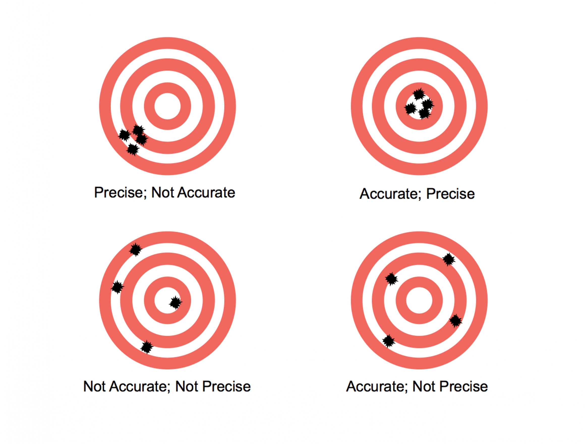

---
output:
  pdf_document: default
  html_document: default
---
# Otokset ja otosjakaumat: tilastollisen päättelyn näkökulma {#luku6}

Tarkastellaan seuravaaksi otoksia ja otosjakaumia "tilastollisemmin" mitä edellisten lukujen erityisesti otantaa koskevan johdannon yhteydessä. Tilastollinen päättely on keskeinen osa tilastotiedettä, sillä se mahdollistaa päätelmien yleistämisen otoksesta populaatioon/perusjoukkoon. Tämä luku toimii esimerkkinä formaaliin matemaattiseen esitykseen perustuvan tilastollisen päättelyn perusteista (otannan ja otantajakaumien näkökulmasta), jonka ideana on yleisesti tehdä luotettavia johtopäätöksiä perusjoukosta otoksen perusteella. Tällä kurssilla käydään läpi (vain) tarvittavia yksityiskohtia sekä rakennetaan pohjia tn-laskennan kurssin jälkeiselle tilastollisen päättelyn peruskurssille (TILM3555).

## Satunnaisotos, yhteisjakauma ja tilastollinen malli {#alaluku61}

- Luvusta 4 muistamme, että tilastollisen tutkimuksen kohteena on satunnaisilmiöt, joita kuvataan satunnaismuuttujilla. Satunnaismuuttujilla on todennäköisyysjakaumat, joita tilastotieteessä kuvataan todennäköisyys- eli tiheysfunktion avulla.  
  - Merkitään satunnaismuuttujia isolla kirjaimella, $Y$, ja yksittäisen satunnaismuuttuja realisaatiota pienellä kirjaimella $y$. Otoskokoa, eli otokseen osallistuvien tilastoyksiköiden määrää merkitään $n$:llä ja tilastoyksiköitä indeksöidään alaindeksillä $i=1,\ldots,n$. 
  - Otoksen poimimisen jälkeen satunnaismuuttujat $Y_1, \ldots, Y_n$ saavat havaituiksi arvoikseen havaintoarvot $y_1, \ldots, y_n$ (ts. $Y_1=y_1, \ldots, Y_n = y_n$).
  - Näin havaintoaineisto on siis __satunnaisotos__, joka voidaan määritellä tarkemmin seuraavasti.

::: {.defblock .mikko data-latex="{}"}
**Satunnaisotos**  

Olkoot $Y_1, \ldots, Y_n$ riippumattomia ja samoinjakautuneita satunnaismuuttujia, joiden tiheysfunktiota (tf., tai pistetoden\-näköisyysfunktiota (ptnf)) merkitään $f(y, \theta)$:llä, jossa $y$:n on yksittäisen sm:jan $Y$ reaalisaatio ja $\theta$ on jokin jakauman muodon määräävä parametri (tai parametrit).  

Parametrin $\theta$ arvoa ei yleensä tunneta ja tavoitteena onkin päätellä, __estimoida__, sen arvoa lopulta käytettävää aineistoa käyttäen.
:::

\
\

__Satunnaisotoksen tilastollinen malli__

- Havaintoarvot $y_1, \dots, y_n$ ovat kiinteitä lukuja, mutta ne vaihtelevat satunnaisesti otoksesta toiseen. Satunnaisotannassa __satunnaisuus liittyy siis havaintoarvojen vaihteluun satunnaisesti otoksesta toiseen__. 
  - Satunnaisuus ei siis liity otannan tuloksena saatuihin havaintoarvoihin, vaan otoksen poimintaan.

- Satunnaismuuttujien $Y_1, \ldots, Y_n$ __yhteisjakauma__ muodostaa (tiettyjen lisäoletusten jälkeen) __tilastollisen mallin__ havaintoarvojen satunnaiselle vaihtelulle eri otoksissa.
  - Koska tällä kurssilla satunnaismuuttujat $Y_1, \ldots, Y_n$ oletetaan __riippumattomiksi toisiinsa nähden__, niiden yhteisjakauma on tulomuotoa $f(y_1, \ldots, y_n; \theta) = f(y_1; \theta) \times \cdots \times f(y_n; \theta)$.

- Oletetaan, että $Y_1, \ldots, Y_n$ ovat aiempien oletusten pätiessä riippumattomia sm:jia ja, että ne muodostavat  satunnaisotoksen jakaumasta, jonka odotusarvo on $\mu$ ja varianssi on $\sigma^2$.
  - Ts. oletamme

$$
\text{E}(Y_i) = \mu, \quad i=1,\ldots,n,  \\
\mathrm{Var}(Y_i) = \sigma^2, \quad i=1,\ldots,n.
$$

  - Tässä tapauksessa mielenkiinnon kohteena olevat parametrit ovat siis $\mu$ ja $\sigma^2$ eli $\theta = (\mu \quad \sigma^2)$.
  - Tilastollisten mallien tehtävänä on siis estimoida nämä todennäköisyysjakaumien parametrit havaitun aineiston perusteella, joten keskeinen tilastollinen kysymys on että miten estimointi suoritetaan luotettavasti.

::: {.eblock .kimmo data-latex="{}"}
**Esimerkki: satunnaisotos normaalijakaumasta**  

Normaalijakautuneiden satunnaismuuttujien satunnaisotokselle pätee $Y_1, \ldots, Y_n \indep, \,\, Y_i \thicksim \text{N}(\mu, \sigma^2),\,\, i=1,\ldots,n$.

- Esimerkiksi R-ohjelmassa voidaan generoida 10 havainnon ($n=10$) satunnaisotos standardoidusta normaalijakaumasta (ts. $Y_i \thicksim \text{N}(0,1),\, i=1,\ldots,10$) komennolla rnorm(10).
:::

::: {.eblock .kimmo data-latex="{}"}
**Esimerkki: miesten pituus**  

- Kerätään havaintoja miesten pituuksista yksinkertaisella satunnaisotannalla (takaisinpalauttaen) $n$ kappaletta. 

- Tällöin havaintoarvoja $Y_1, \ldots, Y_n$ voidaan pitää riippumattomina satunnaismuuttujina, joista jokainen noudattaa tehdyn jakaumaoletuksen mukaan normaalijakaumaa $\text{N}(\mu, \sigma^2)$.

- Estimoinnin tehtävänä on muodostaa parhaat mahdolliset arviot parametreille $\mu$ ja $\sigma^2$, ja mahdollisesti testata esimerkiksi odotusarvolle $\mu$ asetettua hypoteesia.
:::

## Otosjakauma: Estimaattori ja estimaatti {#alaluku62}

- Erityisesti klassisessa tilastotieteessä päättely pohjautuu aineiston tilastollisen mallin kuvaamalle tilastolliselle stabiliteetille, joka ilmenee ajatuksena aineiston keruun toistamisesta.
    - Oletetaan, että tarkasteltavan aineiston on tuottanut satunnaisotanta tai satunnaiskoe, joka noudattaa tilastollista mallia $f(y_1, \ldots, y_n; \theta)$ (aiemmin merkinnöin).
    - Toistetaan aineiston keruu samoissa olosuhteissa yhä uudelleen ja uudelleen.
    - Saatava aineisto (numeeriset arvot) $y_1, \ldots, y_n$ vaihtelevat näin ollen valitun tilastollisen mallin jakauman kuvaamalla tavalla.

- Satunnaisotoksesta voidaan laskea erilaisia __tunnuslukuja/otossuureita__, joita merkitään $T$:llä, ts. ne ovat aineiston funktioita 
$$
T = g(Y_1, \ldots, Y_n).
$$

- Tunnusluvut ovat satunnaismuuttujien funktioina myös satunnaismuuttujia.
  - Tunnusluvulla on nk. todellinen arvo, $g(\theta)$, joka vastaa tunnusluvun arvoa perusjoukon tasolla ja jota pyritään aineistoa käyttäen estimoimaan.
  - Esimerkkinä tunnusluvusta on keskiarvo $\bar{Y} = \frac{1}{n} \sum_{i=1}^{n} Y_i$.
  - Tunnusluvun havaittu arvo (realisaatio) pisteessä ($y_1,\ldots, y_n$) eli havaitussa aineistossa on

$$
t = g(y_1, \ldots, y_n).
$$

  - Otoksen poimimisen jälkeen, havaintoarvoja käyttäen, voidaan laskea tunnuslukujen havaitut arvot (jolloin ne ovat siis ei-satunnaisia). 
  - Esimerkiksi keskiarvo on havaittujen arvojen keskiarvo, kun se lasketaan kerätystä aineistosta.

- Jos tunnuslukua $T$ käytetään tilastollisen mallin parametrin (parametrien) $\theta$ estimointiin, niin tätä sanotaan tällöin parametrin __estimaattoriksi__.
  - Estimaattorin otoskohtaisia arvoja, kuten yllä $t$, kutsutaan __estimaateiksi__.
  - Toivottavaa olisi, että estimaatit $t = g(y_1, \ldots, y_n)$ osuisivat mahdollisimman lähelle tunnusluvun todellista arvoa $g(\theta)$. Ts. satunnaismuuttujan eli tässä tapauksessa estimaattorin $T=g(Y_1, \ldots, Y_n)$ jakauman tulisi keskittyä mahdollisimman tiiviisti $g(\theta)$:n ympärille.

- Koska tunnusluku/estimaattori $T$ on satunnaismuuttuja, sillä on todennäköisyysjakauma, jota kutsutaan tunnusluvun $T$ __otosjakaumaksi__. 

  - Otosjakauma muodostaa (tilastollisen mallin) todennäköisyysmallin tunnusluvun $T$ arvojen satunnaisvaihtelulle otoksesta toiseen.
  - Otosjakaumat riippuvat tuntemattomista __parametreista__, joiden arvoja ei yleensä tunneta ja niitä pyritään estimoimaan kerättyä otosta ja sopivaa tunnuslukua käyttäen.
  - Parametri on (usein) perusjoukon tunnusluku, jota halutaan arvioida. Parametrit __estimoidaan__ havaintoaineistoa käyttäen.

\
\

__Estimaattorin ominaisuudet__

- Merkitään seuraavassa parametrin $\theta$ estimaattoria $\widehat{\theta}$:lla ja siltä voidaan toivoa seuraavia ominaisuuksia:

::: {.defblock .mikko data-latex="{}"}
**Harhattomuus**  

Estimaattorin odotettavissa oleva arvo yhtyy tuntemattoman parametrin $\theta$ todelliseen arvoon eli $\text{E}(\widehat{\theta}) = \theta$.

- Harhaton estimaattori tuottaa keskimäärin oikean kokoisia arvoja (estimaatteja) estimoitavalle parametrille
- Estimaattorin tuottama arvo parametrille saattaa tietylle otokselle poiketa paljonkin parametrin todellisesta arvosta, mutta odotusarvon frekvenssitulkinnan mukaan estimaattorin tuottamat otoskohtaiset arvot parametrille jakautuvat otantaa toistettaessa (symmetrisesti) parametrin todellisen arvon ympärille
:::

```{r unbiased, echo=FALSE, fig.cap="Harhaton estimaattori", fig.align='center', out.width = "100%"}

```

::: {.defblock .mikko data-latex="{}"}
**Tyhjentävyys**  

Tyhjentävä estimaattori käyttää kaiken otokseen sisältyvän parametria $\theta$ koskevan informaation.
:::

::: {.defblock .mikko data-latex="{}"}
**Tehokkuus**  

Kahdesta saman parametrin $\theta$ estimaattorista tehokkaampi on se, jonka varianssi on pienempi. Ts. $\widehat{\theta}^{(1)}$ on tehokkaampi kuin $\widehat{\theta}^{(2)}$, jos  $\mathrm{Var}(\widehat{\theta}^{(1)}) \le \mathrm{Var}(\widehat{\theta}^{(2)})$.
:::

::: {.defblock .mikko data-latex="{}"}
**Tarkentuvuus**  

Tarkentuvan estimaattorin $\widehat{\theta}$ arvot lähestyvät parametrin $\theta$ oikeaa arvoa otoskoon kasvaessa.
:::

- Voidaan osoittaa (yksityiskohdat sivuutetaan tällä kurssilla), että esimerkiksi yksinkertaisen satunnaisotoksen tapauksessa tavanomaisilla binomi- ja normaalijakauman parametrien estimaattoreilla on kaikki edellä mainitut hyvyysominaisuudet.
  - Näin ei ole yleisesti monimutkaisemmissa otantatilanteissa ja tilastollisisssa malleissa.
  - Estimaattoreiden kehittäminen erilaisten tilastollisten mallien tapauksessa kuuluu teoreettisen tilastotieteen alaan.

## Otoskeskiarvo ja otosvarianssi (estimaattoreinta) {#alaluku63}

- Tarkastellaan seuraavaksi tarkemmin kahta kenties useimmiten tarkasteltua tunnuslukua ja niiden otosjakaumia: 
  - Aritmeettisen keskiarvon otosjakaumaa
  - Suhteellisen osuuden (frekvenssin) otosjakaumaa

__Otoskeskiarvo__

- Oletetaan, kuten aiemmin, että $Y_1,\ldots,Y_n$ ovat riippumattomia sm:jia ja että ne muodostavat satunnaisotoksen jakaumasta jonka odotusarvo on $\mu$, ts. $\text{E}(Y_i) = \mu$ ja varianssi on $\sigma^2$, ts. $\text{Var}(Y_i) = \sigma^2$. 
  - Havaintojen (satunnaismuuttujien) $Y_1, \ldots, Y_n$ __otoskeskiarvo__ on  

$$
\bar{Y} = \frac{1}{n}(Y_1 + \ldots + Y_n) = \frac{1}{n} \sum_{i=1}^{n} Y_i
$$

  - Yksittäisen otoksen otoskeskiarvo on tällöin sm:jien realisaatioiden aritmeettinen keskiarvo

$$
\bar{y} = \frac{1}{n} \sum_{i=1}^{n} y_i.
$$
    - Otoskeskiarvo on satunnaismuutuja, jonka saama arvo vaihtelee satunnaisesti otoksesta toiseen johtuen satunnaisotannasta.
    - Kun satunnaismuuttujat ovat samoin jakautuneet odotusarvonaan $\mu$, on otoskeskiarvo jakauman odotusarvon harhaton estimaattori, ts. 

$$\text{E}(\bar{Y}) = \mu$$
    - Täten otoskeskiarvo kuvaa aineiston perusjoukon tilastollisen mallin odotusarvoa, ts. $\text{E}(\bar{Y}) = \text{E}(\widehat{\theta}) = \theta = \mu$

__Aritmeettisen keskiarvon ominaisuuksia__
- Aiempien oletusten pätiessä aritmeettisella keskiarvolla $\bar{Y}$ on seuraava odotusarvo ja varianssi:
$$
\text{E}(\bar{Y}) = \mu,  \\
\mathrm{Var}(\bar{Y}) = \frac{\sigma^2}{n}.
$$

- Aritmeettisen keskiarvon $\bar{Y}$ __standardipoikkeama__
$$
\text{D}(\bar{Y}) = \sqrt{\mathrm{Var}(\bar{Y})} = \frac{\sigma}{\sqrt{n}}.
$$
- Standardipoikkeamaa kutsutaan myös __keskiarvon keskivirheeksi__ ja se kuvaa otoskeskiarvon otosvaihtelua odotusarvon $\mu$ ympärillä.

- Aritmeettisen keskiarvon otosjakauma keskittyy yhä voimakkaammin havaintojen yhteisen odotusarvon $\mu$ ympärille, kun otoskoko $n$ kasvaa. 
  - Ts. otoskoon $n$ kasvaessa $\mathrm{Var}(\bar{Y}) = \frac{\sigma^2}{n}$ pienenee.

__Otosvarianssi__
- Aineiston sisältämää vaihtelua kuvataan __otosvarianssilla__
$$
S^2= \frac{1}{n-1} \sum_{i=1}^{n} (Y_i - \bar{Y})^2.
$$
  - Vastaavasti sm:jien vaihtelua perusjoukon tasolla kuvataan __populaatiovarianssilla__

$$
\sigma^2= \frac{1}{N} \sum_{j=1}^{N} (Y_j - \mu)^2,
$$
jota otosvarianssi harhattomasti estimoi.
- Huomioi, että __otosvarianssi__ on eri asia kuin __otoskeskiarvon varianssi__.

- Otoskeskiarvo $\bar{Y}$ ja otosvarianssi $S^2$ ovat siis satunnaismuuttujia, joiden saamat arvot vaihtelevat satunnaisesti otoksesta toiseen.

__Normaalijakautunut otos__

- Muodostakoot havainnot $Y_1, \ldots, Y_n$ satunnaisotoksen normaalijakaumasta $\text{N}(\mu, \sigma^2)$.
- Tällöin voidaan osoittaa, että havaintojen $Y_1, \ldots, Y_n$ keskiarvo $\bar{Y}$ noudattaa normaalijakaumaa odotusarvolla $\mu$ ja varianssilla $\sigma^2/n$. Merkitään
$$
\bar{Y} \thicksim \text{N} \Big(\mu, \frac{\sigma^2}{n} \Big).
$$

- Itse asiassa ns. __asymptoottiseen teoriaan__ vedoten (suurten otosten tapauksessa) voidaan osoittaa, että edellämainittu tulos pätee myös ilman normaalisuusoletusta. 
    - Nämä tarkastelut vaativat jälleen selvästi enemmän käytyjä tilastotieteen (ja matematiikan) opintoja.

\
\
\
\

__Standardoidun aritmeettisen keskiarvon otosjakauma__

- Tarkastellaan __standardoitua__ satunnaismuuttujaa
$$
Z = \frac{\bar{Y} - \text{E}(\bar{Y})}{\text{D}(\bar{Y})} = \frac{\bar{Y} - \mu}{\sigma / \sqrt{n}} = \sqrt{n} \Big(\frac{\bar{Y} - \mu}{\sigma}\Big).
$$
  - Tällöin $Z$:n odotusarvo $\text{E}(Z) = 0$ ja varianssi $\mathrm{Var}(Z) = 1$.

- Jos $Y_i \thicksim \text{N}(\mu, \sigma^2), i=1,\ldots,n$, niin tällöin $Z$ noudattaa standardoitua normaalijakaumaa: 
$$
Z \thicksim \text{N}(0,1).
$$
  - Jälleen voidaan osoittaa, että tämä tulos pätee asymptoottisesti (suurissa otoksissa) myös ilman yllä tehtyä normaalisuusoletusta.

## Suhteellisen frekvenssin otosjakauma {#alaluku64}

__Frekvenssi ja suhteellinen frekvenssi__

- Oletetaan, että tapahtuman $A$ todennäköisyys on
$$
\text{P}(A) = p,
$$
jolloin tapahtuman $A$ komplementtitapahtuman (vastatapahtuman) $A^c$ todennäköisyys on
$$
\text{P}(A^c) = 1- p = q.
$$

- Poimitaan satunnaisotos, jonka koko on $n$. Tällöin $A$-tyyppisten alkioiden frekvenssi eli lukumäärä kyseisessä otoksessa on $f$. 

- Suhteellinen frekvenssi eli osuus on tällöin
$$
\widehat{p} = \frac{f}{n}.
$$
- Sekä frekvenssi (lukumäärä) $f$ ja (täten myös) suhteellinen frekvenssi $\widehat{p}$ ovat satunnaismuuttujia, joiden saamat arvot vaihtelevat satunnaisesti otoksesta toiseen.

__Frekvenssin otosjakauma__

- Frekvenssillä $f$ on odotusarvo
$$
\text{E}(f) = np,
$$
ja varianssi
$$
\mathrm{Var}(f) = npq = np(1-p).
$$
- Frekvenssi $f$ noudattaa binomijakaumaa parametrein $n$ ja $p$:
$$
f \thicksim \mathrm{Bin}(n,p).
$$

__Suhteellinen frekvenssi: Odotusarvo ja varianssi__

- Suhteellisen frekvenssin $\widehat{p}$ odotusarvo
$$
\text{E}(\widehat{p}) = \text{E} \Big(\frac{f}{n} \Big) = p,
$$
ja varianssi
$$
\mathrm{Var}(\widehat{p}) = \frac{pq}{n} = \frac{p(1-p)}{n}.
$$

- Suhteellisen frekvenssin $\widehat{p}$ standardipoikkeamaa
$$
\text{D}(\widehat{p}) = \sqrt{\mathrm{Var} (\widehat{p})} =  \sqrt{\frac{pq}{n}}
$$
voidaan kutsua __suhteellisen frekvenssin keskivirheeksi__ ja se kuvaa suhteellisen frekvenssin otosvaihtelua odotusarvon $p$ ympärillä.

__Suhteellisen frekvenssin otosjakauma__

- Koska $\text{E}(\widehat{p}) = p$ ja $\mathrm{Var}(\widehat{p}) = \frac{pq}{n}$, 
niin suhteellisen frekvenssin otosjakauma keskittyy yhä voimakkaammin tapahtuman A
todennäköisyyden $\text{P}(A) = p$ ympärille, kun otoskoko $n$ kasvaa.

- Jälleen suurten otosten tapauksessa voidaan osoittaa, että suhteellinen frekvenssi noudattaa em. oletusten pätiessä normaalijakaumaa:
$$
\widehat{p} \thicksim \text{N} \Big(p, \frac{pq}{n} \Big).
$$

- Aritmeettisen keskiarvon tapaan standardoitu sm. 
$$
Z = \frac{\widehat{p} - p}{\sqrt{\frac{pq}{n}}} \thicksim \text{N}(0,1)
$$
noudattaa suurissa otoksissa approksimatiivisesti standardoitua normaalijakaumaa.

::: {.eblock .kimmo data-latex="{}"}
**EU-kansanäänestys**  


- Suomen EU-kansanäänestyksessä vuonna 1994 jäsenyyttä kannattaneiden suhteellinen osuus oli 0,54 (54\%).

- Mikä olisi ollut tällöin tn., että ennen äänestystä 200 havainnon otoksessa kyllä-osuus olisi ollut alle 50\%?

- Suhteellisen frekvenssin otosjakauman perusteella kyllä-kannatusosuuden jakauma olisi
$$
%\widehat{p} \stackrel{as}{\thicksim} \text{N} \Big(0.54, \frac{0.54 \times (1-0.54)}{200} \Big),
\widehat{p} \thicksim \text{N} \Big(0.54, \frac{0.54 \times (1-0.54)}{200} \Big),
$$
jossa $\frac{0.54 \times (1-0.54)}{200} = 0.0352^2$.

- Näin ollen haluttu todennäköisyys (ts. saada sellainen satunnaismuuttujan $Z \thicksim \text{N}(0,1)$ arvo että suhteellinen osuus on pienempi kuin 0.5)
$$
P \Big(Z < \frac{0.5-0.54}{0.0352} \Big) = P (Z < -1.14) \approx 0.127.
$$
:::


## Muita tunnuslukuja {#alaluku65}

Tilastollisia analyysejä tehtäessä johtopäätösten ja objektiivisten tulkintojen tueksi tarvitaan tunnuslukuja, joita muodostetaan tarkasteltavasta jakaumasta ja mm. otoskeskiarvon osalta jo sivuttiin edellä. Tunnuslukuja on paljon, ja jokainen niistä valottaa muuttujan jakaumaa eri näkökulmista. 

Jakaumien tunnusluvut voidaan jakaa sijaintilukuihin, hajontalukuihin ja muihin tunnuslukuihin. Kahdesta ensimmäisestä esimerkkejä ovat keskiarvo ja varianssi tai keskihajonta (välimatka- ja suhdeasteikon havaintojen tapauksessa). Esitellään seuraavassa vielä lyhyesti muutamia muita tunnuslukuja.

- __Moodi__: Moodi eli tyyppiarvo on havaintoaineiston yleisin muuttujan arvo tai se on luokka, jolla on suurin frekvenssi.
- __Mediaani__: Mediaani on järjestetyn havaintoaineiston keskimmäinen arvo (jos havaintoarvoja on pariton määrä, parillisessa tapauksessa esitetään jompikumpi keskimmäisistä arvoista). Mediaani siis jakaa järjestetyn havaintoaineiston kahteen osaan siten, että puolet arvoista on mediaania pienempiä ja puolet arvoltaan mediaania suurempia.
  - Luokitteluasteikolla mitattaville muuttujille ei ole olemassa luontevia sijaintilukuja keskilukujen yhteydessä pl. moodi.

- Järjestysasteikolla mitatuille muuttujille voidaan mediaanin lisäksi määrittää __fraktiileja__: pp%:n fraktiili jakaa tilastoaineiston kahteen osaan siten, että kyseistä fraktiilia pienempiä havaintoarvoja on pp%. 
  - Eniten käytettyjä fraktiileja ovat __kvartiilit__. __Alakvartiili__ $Q_1$ on 25%:n fraktiili, ja __yläkvartiili__ $Q_3$ on 75% fraktiili.
  - Tietyistä fraktiileista käytetään nimitystä __desiili__. Ensimmäinen desiili $D_1$ on 10% fraktiili ja esim. yhdeksäs fraktiili $D_9$ on 90% fraktiili.

- Hajontalukuja: Varianssin/keskihajonnan lisäksi, jos muuttuja on mitattu vähintään järjestysasteikolla, sille voidaan määrittää vaihteluväli ja kvartiiliväli. __Vaihteluväli__ kuvaa aineiston kokonaispeittoa ja siinä ilmoitetaan aineiston pienin havainto ja suurin havainto. Ts. vaihteluväli=(pienin havainto, suurin havainto). __Kvartiiliväli__ = ($Q_1, Q_3$).

- Muita tunnuslukuja: Tilastollisen päätöksenteon yhteydessä käytettäviä tunnuslukuja ovat __vinous__ ja __huipukkuus__. Vinous ja huipukkuus voidaan määrittää välimatka- ja suhdeasteikon muuttujille. Vinous ja huipukkuus mittaavat kumpikin omalla tavallaan jakauman poikkeamaa normaalijakaumasta. Normaalijakauman vinous on 0 ja huipukkuus on 3.

## Luottamusvälit {#alaluku66}

- Satunnaisesti saadusta aineistosta laskettujen tunnuslukujen luotettavuus on tilastollisen mallin parametrien estimoinnissa keskeinen tilastollinen kysymys. 
  - Otoksen poimintaan liittyvän satunnaisvaihtelun vuoksi emme voi varmuudella tietää onko saatu otokseen perustuva parametriestimaatti "lähellä" vai "kaukana" sen todellisesta arvosta.
  - Täten tarvitaan jokin tapa, jolla saadun parametriestimaatin luotettavuutta voidaan arvioida.

::: {.defblock .mikko data-latex="{}"}
**Luottamusväli**  

Luottamusväli on otoksen perusteella määrätty väli, joka tutkijan valitsemalla todennäköisyydellä (luottamustasolla) peittää tarkasteltavan tilastollisen mallin $f(y;\theta)$ parametrin $\theta$ tuntemattoman todellisen arvon. Se perustetaan otostunnusluvun, estimaattorin, otosjakaumaan. 
:::

- Otoskoko on luottamusvälejä koskevissa tarkasteluissa keskeinen ja luottamusväleihin palataankin otoskoon käsittelyn yhteydessä.

- Valittua luottamustasoa merkitään usein $1-\alpha$:lla, jossa __merkitsevyystaso__ ( __riskitaso__ ) $\alpha$ on esimerkiksi $\alpha=0.05$.

- Tulkinta: Jos __otantaa__ jakaumasta $f(y;\theta)$ toistetaan, niin keskimäärin $100 \times (1-\alpha)\%$ otoksista kontstruloiduista luottamusväleistä peittää parametrin $\theta$ todellisen arvon.

- Oletetaan, että olemme tehneet johtopäätöksen, että konstruloitu luottamusväli peittää parametrin $\theta$ tuntemattoman todellisen arvon. 
  - Tällöin otantaa toistettaessa luottamusvälin konstruktiosta seuraa, että tehty johtopäätös on oikea keskimäärin $100 \times (1-\alpha)\%$ tapauksista.
  - Vastaavasti taas $100 \times alpha \%$ ei peitä parametrin todellista arvoa.

- Luottamusväli on kenties tunnetumpi kansankieliseltä nimitykseltään __virhemarginaali__, joka on itseasiassa luottamusvälin puolikas: todellinen parametriarvo kuuluu saadun estimaatin ja virhemarginaalien sisään jäävälle osuudelle. 
  - Normaalisti mm. otoskoon kasvu pienentää virhemarginaalia.
  - Kuten jatkossa tullaan havaitsemaan, virhemarginaalin suuruuteen vaikuttavat otosasetelma, otoskoko, luottamustaso ja tutkittavan tilastollisen tunnusluvun jakauma.

- Luottamusväleissä ei kuitenkaan varsinaisesti ole kyse "virheestä" vaan saadun/muodostetun tiedon tarkkuudesta. 
  - Luottamusvälit, eli virhemarginaalit, siis (yleisesti) riippuvat valittavasta luottamustasosta $1-\alpha$ ja näin ollen samasta aineistosta on saatavissa useita virhemarginaaleja.
    - Täten on tarkalleen ottaen virheellistä sanoa, että "tutkimuksen virhemarginaali on 3,5 puoleen tai toiseen".
    - Oikeammin olisi sanoa esimerkiksi "tutkimuksessa saadun kannatuksen virhemarginaali on 3,5 puoleen tai toiseen 95% luottamustasolla."
    - Virhemarginaali kasvaa, kun aineistoa lohkotaan: jos tuhannen hengen otoksesta esitetään tietoja, jotka kuvaavat erikseen miesten ja naisten ominaisuuksia, sukupuolittain lasketut ovat estimaatit epävarmempia kuin koko otoksesta esitetyt.
  - Vastaavasti on virheellistä sanoa että tutkimuksella olisi virhemarginaali, sillä virhemarginaali liittyy aina vain tutkimuksen antamiin numeerisiin arvoihin. 
  - Aitoja virhelähteitä ovat mm. otantatutkimukseen liittyvien kysymysten muotoilu, käsitteiden monitulkintaisuus, vastaajien valikoituminen ja vastauskato.

__Normaalijakauman odotusarvon luottamusväli__

- Käsittelemme seuraavassa (normaalijakauman) odotusarvon $\mu$ luottamusvälejä ja jatkossa oletetaan (ellei toisin mainita), että taustalla oleva populaatio, $N$, on "iso" (ääretön). 
  - Näin ollen ns. äärellisyyskorjausta ei käytetä (yksinkertaisuuden vuoksi).

- Tarkastellaan satunnaisotosta normaalijakaumasta 
$Y_1, \ldots, Y_n \indep, \,\, Y_i \thicksim \text{N}(\mu, \sigma^2),\, i=1,\ldots,n$.
  - Merkintä $\indep$ tarkoittaa, että sm:t $Y_1,\ldots,Y_n$ ovat riippumattomia ja samoin jakautuneita (toisinaan myös lyhyesti $iid$, joka tulee englannin kielen ilmaisusta "independent and identically distributed"). 

- Tarkastellaan normaalijakauman odotusarvon $\mu$ luottamusvälin määräämistä otannan avulla olettaen että jakauman varianssi $\sigma^2$ on tunnettu.
  - Muistetaan että normaalijakauman odotusarvoparametrin $\text{E}(Y_i) = \mu$ __harhaton estimaattori} on aritmeettinen keskiarvo

$$
\bar{Y} = \frac{1}{n} \sum_{i=1}^{n} Y_i.
$$


- Valitaan __luottamustasoksi__ $1-\alpha$, eli $\alpha$ määrää todennäköisyyden, jolla luottamusväli peittää odotusarvon $\mu$ todellisen arvon: yleinen valinta ihmistieteissä on $\alpha = 0.05$ tai $\alpha = 0.1$ vastaten 95% ja 90% prosentin luottamustasoa. Luonnontieteissä $\alpha$ on usein paljon pienempi. 

- Määrätään __luottamuskertoimet__ $-z_{\alpha/2}$ ja $z_{\alpha/2}$ (luottamusväli on kaksisuuntainen), joille pätee
$$
\text{P}(-z_{\alpha/2} \le Z \le z_{\alpha/2}) = 1-\alpha,
$$
jossa standardoitu satunnaismuuttuja
$$
Z = \frac{\bar{Y} - \mu}{\sigma / \sqrt{n}} = \sqrt{n} \Big( \frac{\bar{Y} - \mu}{\sigma} \Big),  
$$
(ks. aiemmat jaksot \@ref(luku6)) noudattaa $\text{N}(0,1)$-jakaumaa. 
  - $\text{P}(\cdot)$:llä merkitään todennäköisyysjakaumaa, ts. se on normaalijakauman jakaumafunktio ja $z_{\alpha/2}$ on jakaumafunktion arvo pisteessä $\alpha/2$.

- Tällöin etsitään odotusarvoparametrille $\mu$ sellainen arvo, jolla oheinen epäyhtälö pätee ja päädytään luottamusväliin.

- Nyt epäyhtälöketju voidaan kirjoittaa muodossa
$$
-z_{\alpha/2} \le  \frac{\bar{Y} - \mu}{\sigma / \sqrt{n}}  \le z_{\alpha/2}.
$$

- Joka voidaan kirjoittaa uudelleen muodossa
$$
\bar{Y} - z_{\alpha/2} \frac{\sigma}{\sqrt{n}} \le   \mu  \le 
\bar{Y} + z_{\alpha/2} \frac{\sigma}{\sqrt{n}},
$$
kertomalla nimittäjällä puolittain ja vähentämällä sm:jien keskiarvo molemmin puolin. 

- Normaalijakauman odotusarvon $(1-\alpha) \times 100$% luottamusväli on siis
$$
\Big(\bar{Y} - z_{\alpha/2} \frac{\sigma}{\sqrt{n}}, 
\bar{Y} + z_{\alpha/2} \frac{\sigma}{\sqrt{n}} \Big).
$$

- Luottamusväli on symmetrinen keskipisteensä $\bar{Y}$ suhteen. Siksi luottamusväli esitetään usein
$$
\bar{Y} \pm z_{\alpha/2} \frac{\sigma}{\sqrt{n}}.
$$

- Luottamusvälin pituus
$$
2 \cdot z_{\alpha/2} \frac{\sigma}{\sqrt{n}}.
$$

- __Virhemarginaali__ on luottamusvälin pituuden puolikas eli 
$$
z_{\alpha/2} \frac{\sigma}{\sqrt{n}}.
$$

- Edellä tiettyyn otokseen liittyvä luottamusväli perustetaan realisoituneeseen otoskeskiarvoon $\bar{y}=\frac{1}{n} \sum_{i=1}^{n} y_i$.

- Olisi toivottavaa pystyä konstruoimaan parametrille $\mu$ mahdollisimman lyhyt luottamusväli, johon liittyvä luottamustaso olisi samanaikaisesti mahdollisimman korkea. Molempien vaatimusten samanaikainen täyttäminen ei ole kuitenkaan mahdollista, jos otoskoko $n$ pidetään kiinteänä:
  - Luottamustason kasvattaminen pidentää luottamusväliä, jolloin tieto parametrin $\mu$ todellisesta arvosta tulee epätarkemmaksi.
  - Luottamusvälin lyhentäminen pienentää luottamustasoa, jolloin tieto parametrin $\mu$ todellisesta arvosta tulee epävarmemmaksi.

```{r foo, echo=FALSE, fig.cap="Standardoitu normaalijakauma: Virhemarginaaleja", fig.align='center', out.width = "150%"}
knitr::include_graphics("images/gaussian-distribution.jpg")
```

\
\

__Normaalijakauman odotusarvon luottamusväli ($\sigma^2$ tuntematon)__

- Tarkastellaan edelleen satunnaisotosta normaalijakaumasta, mutta oletetaan nyt että varianssi $\sigma^2$ tuntematon.

- Normaalijakauman odotusarvon $(1-\alpha) \times 100$\% luottamusväli:
$$
\Big(\bar{Y} - t_{\alpha/2} \frac{S}{\sqrt{n}}, 
\bar{Y} + t_{\alpha/2} \frac{S}{\sqrt{n}} \Big),
$$
jossa __luottamuskertoimet__ $-t_{\alpha/2}$ ja $t_{\alpha/2}$
saadaan nyt __$t$-jakaumasta} $t_{n-1}$, jossa $S^2$ on varianssin $\sigma^2$ harhaton estimaattori ja vapausasteiden lukumäärä on $n-1$.

  - (Studentin) $t$-jakauma muistuttaa silmämääräisesti normaalijakaumaa, mutta se on paksuhäntäisempi. Vapausasteluvun kasvaesssa $t$-jakauma lähestyy normaalijakaumaa.

  - Suurissa otoksissa ($n$ iso) luottamuskertoimet voidaan poimia (approksimatiivisesti) myös normaalijakaumasta eli korvata edellä kertoimet $t_{\alpha/2}$ aiemmin käytetyillä kertoimilla $z_{\alpha/2}$.

  - Normaalijakauman odotusarvon luottamusväli ($\sigma^2$ tuntematon), $t$-jakauma eri vapausastein $df$

```{r, echo=FALSE, fig.cap="Standardoitu normaalijakauma: Virhemarginaaleja", fig.align='center', out.width = "100%"}
knitr::include_graphics("images/NjaT-jakauma.jpg")
```

\
\

__Luottamusväli: Suhteellisen osuuden odotusarvo__

- Käsittelemme seuraavassa suhteellisen osuuden $p$ luottamusvälejä.

- Tarkastellaan satunnaisotosta Bernoulli-jakaumasta 
$Y_1, \ldots, Y_n \indep, \,\, Y_i \thicksim B(p),\, i=1,\ldots,n$,
jossa merkitään $Y_i=1$ jos tapahtuma A tapahtuu ja $Y_i=0$ jos tapahtuma A ei tapahdu.

- Bernoulli-jakauman odotusarvoparametrin $p=\text{E}(Y_i)$ harhaton estimaattori on tapahtuman A suhteellinen otosfrekvenssi
$$
\widehat{p} = \frac{1}{n} \sum_{i=1}^{n} Y_i.
$$

- Bernoulli-jakauman (vrt. binomijakauma) ominaisuuksien 
perusteella $\text{E}(Y_i)=p$ ja $\mathrm{Var}(Y_i)=pq$, jossa
$q=1-p$.

- Näin ollen voimme normaalijakauman odotusarvoparametrin
luottamusvälin konstruloinnin tapaan määritellä satunnaismuuttujan $Z$:
$$
Z = \frac{\widehat{p} - p}{\sqrt{\frac{p (1-p)}{n}}} = 
\sqrt{n} \Big(\frac{\widehat{p} - p}{\sqrt{p (1-p)}} \Big),  
$$
joka noudattaa (suurissa otoksissa) $\text{N}(0,1)$-jakaumaa.

- Suhteellisen frekvenssin hajonnan estimaattori on siis
$$
\sqrt{\frac{\widehat{p} (1-\widehat{p})}{n}},
$$
jossa tuntematon $p$ on korvattu sen estimaattorilla (otosvastineella) $\widehat{p}$.


- Luottamuskertoimet määrätään aiempaan tapaan:
$$
\text{P}(-z_{\alpha/2} \le Z \le z_{\alpha/2}) = 1-\alpha,
$$


- Näin ollen odotusarvoparametrin (suhteellisen osuuden) $p$ $(1-\alpha)$% luottamusväliksi
saadaan
$$
\Big(
\widehat{p} - z_{\alpha/2} \sqrt{\frac{\widehat{p}(1-\widehat{p})}{n}},
\widehat{p} + z_{\alpha/2} \sqrt{\frac{\widehat{p}(1-\widehat{p})}{n}} 
\Big)
$$

- Luottamusväli voidaan kirjoittaa
$$
\widehat{p} \pm z_{\alpha/2} \sqrt{\frac{\widehat{p}(1-\widehat{p})}{n}}
$$
ja luottamusvälin pituus on 
$$
2 \times z_{\alpha/2} \sqrt{\frac{\widehat{p}(1-\widehat{p})}{n}}.
$$
- Ks. kuvio \@ref(fig:foo)

## Otoskoko {#alaluku67}

  