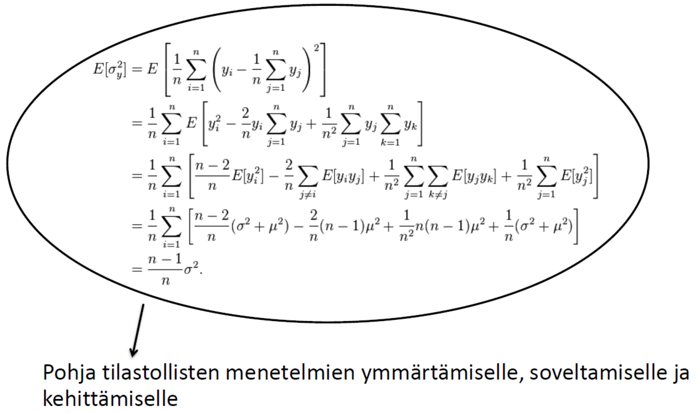

--- 
title: "TILM3701 - Tilastotiede ja data 2022"
author:
  - Koonneet
  - Henri Nyberg^[Turun yliopisto, matematiikan ja tilastotieteen laitos, henri.nyberg@utu.fi]
  - Roope Rihtamo^[Turun yliopisto, matematiikan ja tilastotieteen laitos, roope.rihtamo@utu.fi]
date: "`r Sys.Date()`"
site: bookdown::bookdown_site
output: bookdown::gitbook
documentclass: book
bibliography: [book.bib, packages.bib]
biblio-style: apalike
link-citations: yes
colorlinks: yes
urlcolor: blue
linkcolor: blue
github-repo: rstudio/bookdown-demo
description: "Tilastotieteen ensimmäinen kurssi."
---

# Kurssin rakenne {-}

- Tällä kurssilla tarkoituksena on melko yleisellä tasolla johdatella tilastotieteen ja aineistojen (datan) maailmaan pohtimalla myös näiden laajempia merkityksiä tieteellisen tutkimuksen hyvin keskeisinä osina. 

- Kurssilla vältetään, mahdollisuuksien mukaan, kovin teknistä matemaattista esitystapaa, mutta tarvittavissa määrin tullaan myös käyttämään tilastotieteen perusopinnoissa tarvittavia matemaattisia merkintöjä ja määritelmiä. Esim. todennäköisyyslaskennan ja tilastollisen päättelyn perusteita ei käydä vielä riittävällä matemaattisella tarkkuudella lävitse, vaan nämä tarkastelut jäävät tätä kurssia seuraavien kurssien ([TILM3553 Todennäköisyyslaskennan peruskurssi](https://opas.peppi.utu.fi/fi/opintojakso/TILM3553/1734?period=2022-2024) tai [TILM3568 Todennäköisyyslaskenta sivuaineopiskelijoille](https://opas.peppi.utu.fi/fi/opintojakso/TILM3568/3385?period=2022-2024) sekä [TILM3555 Tilastollisen päättelyn peruskurssi](https://opas.peppi.utu.fi/fi/opintojakso/TILM3555/1731?period=2022-2024)) asiaksi. Nämä kurssit, yhdessä alkuvaiheen pakollisten matematiikan kurssin lisäksi, muodostavat siis tämän kurssin johdannon kanssa lähtökohdan tilastotieteen opinnoille.

- Luennot eivät suoraan perustu yhteen kirjaan tai lähteeseen. Käytettyjä lähdemateriaaleja luetellaan alapuolella oheislukemiston myötä. 

- Oheislukemistoa (sopivilta osin):
  - Mellin, I. (2004). Johdatus tilastotieteeseen: Tilastotieteen johdantokurssi (1.kirja). Yliopistopaino, Helsingin yliopisto.
  - Mellin, I. (2000). Johdatus tilastotieteeseen: Tilastotieteen jatkokurssi (2.kirja). Yliopistopaino, Helsingin yliopisto.
  - Mellin, I. (2006). Tilastolliset menetelmät. Luentomoniste, Aalto yliopisto (TKK).
  - Holopainen, M. ja P. Pulkkinen (2008). Tilastolliset menetelmät. Sanoma Pro Oy.
  - Pahkinen, E. ja R. Lehtonen (1989). Otanta-asetelmat ja tilastollinen analyysi. Gaudeamus, Helsinki.
  - Pahkinen, E. ja R. Lehtonen (2004). Practical Methods for Design and Analysis of Complex Surveys. 2. painos, Wiley.
  - Sund, R. (2003). Tilastotiede käytännön tutkimuksessa -kurssi. Helsingin yliopisto.
  - Silver, N. (2014). Signaali ja kohina: Miksi monet ennusteet epäonnistuvat mutta jotkin eivät? Terra Cognita. (Suomentanut Kimmo Pietiläinen)
    - Englanninkielinen teos: Silver, N. (2015). The Signal and the Noise: Why So Many Predictions Fail--but Some Don't. Penguin Books; Illustrated edition
  - Pesonen, M. (2017). Kurssimateriaali kurssille Aineistonhankinta ja tutkimusasetelmat, Turun yliopisto.
  - Vartia, Y. (1989). Tilastotieteen perusteet. Yliopistopaino, Helsinki. II painos.

- Muita taustamateriaaleja
    - [Tilastokeskuksen tilastokoulu (linkki)](https://tilastokoulu.stat.fi/verkkokoulu_v2.xql?course_id=tkoulu_tilaj&lesson_id=1&subject_id=0&page_type=sisalto)
    - Tilastotieteen sanasto suomi-englanti-suomi, ks. Juha Alho, Elja Arjas, Esa Läärä ja Pekka Pere (2021). [Tilastotieteen sanasto. Suomen Tilastoseuran julkaisuja 8.](https://tilastoseura.fi/)

Suuret kiitokset Visa Kuntzelle ja Emil Lehdelle kommenteista ja avusta materiaalin työstämisessä. Kaikki jäljelle jääneet painovirheet ovat materiaalin kokoajien.

## Kurssimateriaali {-}

Kurssin materiaali on koostettu em. lähteistä ja pyrkii paikoin pelkistettyyn esitysmuotoon mutta kuitenkin niin että materiaalin opiskelemalla kurssin osaamistavoitteet täyttyvät kokonaisuudessaan. Osaamistavoitteet on listattu Turun yliopiston opinto-oppaassa matematiikan ja tilastotieteen laitoksen opintotarjonnasta [kurssikuvauksen alta](https://opas.peppi.utu.fi/fi/opintojakso/TILM3701/90798) ja ne löytyvät alta vielä laajemmin. 

- Opintojakson suoritettuaan opiskelija:
  - On saanut kokonaiskuvan tilastotieteestä ja sen perusteista
  - Osaa hahmottaa tilastotieteen roolin omana tieteenalana ja eri sovellusalueiden yhteydessä
  - Tunnistaa erilaiset tutkimusasetelmat ja aineistotyypit
  - On sisäistänyt tilastotieteen keskeisiä käsitteitä ja osaa niiden avulla tarkastella kriittisesti tieteellisiä tutkimuksia
  - Pystyy erottamaan edustavan otoksen ja näytteen

Kurssin sisältöä on listattu opinto-oppaassa ja laajemmin alla. Tämä listaus toimii hyvänä luettelona kurssin keskeisistä teemoista.

- Kurssin sisältöä:
  - Tilastotiede tieteenalana ja sen suhde lähitieteisiin, kuten datatieteeseen (data science)
  - Tilastotieteen rooli uuden tieteellisen tiedon tuottamisessa
  - Tilastolliset aineistot (data), niiden kerääminen ja mittaaminen
  - Tilastollisen päättelyn perusteita
  - Otannan perusteet
  - Tilastotieteen sovellusten ja sovellusalueiden esittelyä

Materiaalin seassa on eritelty väärikoodatuin tietolaatikoin erinäisiä tärkeitä tilastotieteellisiä konsepteja ja termejä sekä esimerkkejä tilastotieteen sovelluksista. Näistä ensin mainitut löytyvät Deltan violeteista laatikoista ja jälkimmäiset Statistikan oransseista.^[Toim. Huom. värit eivät täysin alkuperäisten värien kanssa yhteneväisiä.] Alla esimerkkilaatikot.

::: {.defblock data-latex="{}"}
**Konsepti tai termi**

Konseptin tai termin löyhä määritelmä.
:::

::: {.eblock data-latex="{}"}
**Esimerkki**

Aihetta koskeva esimerkki.
:::

<!--chapter:end:index.Rmd-->

# Johdantoa ja johdattelua tilastotieteeseen

_Ihmisellä on luontainen pyrkimys ymmärtää, mitä hänen ympärillään tapahtuu. Ymmärrys perustuu ihmisen tekemiin havaintoihin, joita luokittelemalla tai seuraamalla hän pyrkii löytämään säännönmukaisuuksia. Näiden säännönmukaisuuksien löytäminen vaatii loogisten johtopäätösten tekoa. Pelkän uteliaisuuden tyydyttämiseen ja älyllisen mielihyvän lisäksi ihminen pyrkii ennakoimaan tulevaa ja siten varautumaan tuleviin tapahtumiin... Edellä kuvattuja taitoja voi oppia._

Holopainen ja Pulkkinen (2008)

## Tilastotiede ja kurssin idea 

- Tämän tilastotieteen ensimmäisen kurssin ideana on (ainakin)
  - Esitellä ja johdatella __tilastolliseen ja tieteelliseen ajatteluun__ ja sen hyödyntämiseen eri tyyppisissä tutkimusongelmissa.
  - Esitellä tilastotieteen roolia __empiirisen tutkimusaineiston keräämisessä ja analyysissä__ sekä tarkastella tieteentekemisen ja tilastotieteen suhdetta.
  - Pohtia __tilastotieteen olemusta tieteenalana__ ja tarkastella tilastotieteen ja datatieteiden (data sciencen) samankaltaisuuksia ja eroja.
  - Pohtia __sattuman ja satunnaisuuden roolia__ jokapäiväisessä elämässä ja erityisesti osana tieteellistä tutkimusprosessia. 
  - Oppia tilastotieteen peruskäsitteitä ja (tilastollisen) tutkimuksenteon alkeita ja siihen liittyviä mahdollisia ongelmia esimerkiksi tilastollisten aineistojen keräämisessä.
  - Oppia tilastollisten aineistojen __kuvaamisen ja käsittelyn__ alkeita sekä tilasto(tieteellisen)llisen __mallintamisen__ ja __koeasetelmien__ peruskäsitteitä.
  
  
\vspace{0.75cm}

- Kurssilla käsitellään myös __tilastollisen päättelyn__ peruskäsitteitä ja perusteita kuten
  - Mitä on __todennäköisyys__ ja miten se tulkitaan tilastotieteessä sekä laajemmin tieteessä. Erityisesti tilastotieteen osalta keskiössä on tämän kurssin osalta __satunnaismuuttujat__ sekä niihin liitettävät käsitteet
    - __Odotusarvo__, __varianssi__ ja kahden (tai useamman) satunnaismuuttujan __korrelaatio__.
    - Satunnaismuuttujien __todennäköisyysjakaumien__ perusteita ja niiden yhteyksiä mm. normaalijakaumaan ja muutamiin muihin keskeisiin jakaumiin.
    - Tilastollinen malli työkaluna satunnaismuuttujien formaalissa mallintamisessa ja päättelyssä. Tilastolliseen malliin liittyy (usein) __parametreja__ joihin tilastollinen päättely kohdistuu.
    - Tilastollisten mallien __estimoinnin__ perusidea, eli miten tilastollisen mallin parametreille muodostetaan arvot käytettävissä olevan aineiston pohjalta. Esimerkiksi: mitä tarkoittaa tilastollisen mallin parametrin __estimaattori__ ja sen __harhattomuus__?
    - Alustavia tarkasteluja tilastollisen mallin uskottavuuden käsitteelle ja __luottamusväleille__ tilastollisen mallin estimoiduille parametreille.

\vspace{0.75cm}

- Toinen kurssin keskeisistä teemoista on tarkastella tieteellistä tutkimusprosessia teoriassa ja käytännössä. Tämä sisältää mm. seuraavia aiheita (joita siis käsitellään tällä kurssilla päällisin puolin varsin yleisestä näkökulmasta katsoen ja tarkemmat yksityiskohdat jätetään tätä kurssia seuraavien tilastotieteen kurssien aihepiireiksi):
  - __Tutkimusongelman__ asettaminen: mitä halutaan tutkia?
  - Tutkimusongelman täsmentäminen ja __tutkimusstrategian__ laatiminen: millä keinoin asetettuun tutkimusongelmaan voidaan vastata?
  - __Tutkimusaineiston__ (tai vain lyhyemmin __aineiston__ eli __datan__) kerääminen
    - __Aineiston ennakkoehdot__: mitkä ehdot tulee täyttyä, jotta asetettuun tutkimusongelmaan voidaan vastata?
    - __Otanta__ (ja mittaaminen): miten tutkimusaineisto kerätään niin, että se täyttää aineiston ennakkoehdot? Erilaisissa tutkimuksissa käytetään erilaisia aineistoja kuten:
      - Survey- eli haastatteluaineistot: aineisto kerätään haastattelemalla tutkimuskohteita
      - Rekisteriaineistot: aineisto on kerätty valmiiksi rekisteriin ja sitä käytetään tutkimukseen 
      - Aikasarja-aineistot tai pitkittäisaineistot: useita mahdollisesti korreloituneita havaintoja samoista tutkimuskohteista
      - Ynnä muita, ks. \@ref(luku10)
- __Aineiston kuvaaminen__: minkälaista aineistoa on kerätty ja vastaako se ennakkoehtoja? 
- __Aineiston analyysin__ lähtökohtia   
  - Mitä tilastollista mallia/malleja käytetään?
  - Mitä tarkoitetaan mallien tuntemattomien parametrien arvojen estimoinnilla?
  - Tilastollinen päättely (estimointitulosten pohjalta)

- __Johtopäätelmien__ tekeminen tilastollisen päättelyn pohjalta: saatiinko tutkimusongelmaan vastaus ja kuinka luotettava saatu vastaus on?

## Tilastotieteen asema tutkimusyhteisön ulkopuolella

- Tilastotiede on oppiaineena usein varsin tuntematon toisen asteen opinnoista valmistuneelle, sillä sitä ei juurikaan opeteta lukioissa tai ammattikouluissa huolimatta sen keskeisestä ja kasvavasta roolista tieteenteossa.
- Tiedeyhteisön ulkopuolellakin __tilastotiedettä ja tilastotieteilijöitä arvostetaan laajalti__. 
- __Tilastotiede onkin nostanut profiiliaan viimeisten vuosikymmenien aikana__ tietoteknisen kehityksen tuotua laajat tietoaineistot ja kehittyneet laskennalliset menetelmät lähes jokaisen kansalaisen saataville. 
- Tämä "_datavallankumous_" näkyy tilastotieteilijöiden kysynnässä työmarkkinoilla: erilaisten aineistojen määrän lisääntyessä kasvaa myös kysyntä työntekijöistä, jotka osaavat ammatitaitoisesti käsitellä, tulkita ja mallintaa tilastollisia aineistoja.
- Ei siis liene ihmekään, että erilaisten "data"-alkuisten työpaikkojen, kuten __datatieteilijä__ (eng. __data scientist__) tai __data-analyytikko__ (__data analyst__) määrä on kasvanut voimakkaasti jo pidempään. Kaikkia tieto- ja datainensiivisten ammattien tekijöitä yhdistää yksi tekijä: __heidän tulee hallita ja osata tilastotiedettä!__ 
  - Karkeistettuna mitä paremmin ja enemmän (laajemmin), sen parempi palkka ja monipuolisemmat työtehtävät!

## Kurssin luonne tilastotieteen opintojen esittelijänä

Kurssin mittaan esitellään tilastotieteen perusteiden lisäksi __miten Turun yliopistossa tilastotieteen opinnoissa syvennytään__ tällä kurssilla esiteltäviin menetelmiin, aineistotyyppeihin ja mallinnuskokonaisuuksiin. Tilastotieteen opintotarjontaan voi perehtyä [TY:n opinto-oppaan avulla](https://opas.peppi.utu.fi/fi/ohjelma/89589)!

```{r include=FALSE}
# automatically create a bib database for R packages
knitr::write_bib(c(
  .packages(), 'bookdown', 'knitr', 'rmarkdown'
), 'packages.bib')
```

<!--chapter:end:01-intro.Rmd-->

# Tieteellinen tieto, tilastot ja arkitieto yhteiskunnassa {#luku2}

Tässä luvussa tarkastellaan tieteen ja tieteellisen tutkimusprosessin luonnetta erityisesti uuden **tutkitun** tiedon tuottamisen näkökulmasta. **Tiedelukutaidon** merkitys on kasvanut nyky-yhteiskunnassa, kun tiedejulkaisujen saavutettavuus ja tunnettuus on lisääntynyt mm. tieteen popularisoinnin ja median laajemman tiedeuutisoinnin vuoksi. Tiedon, erityisesti tieteellisen tiedon, rooli korostuu yhä enemmän myös kaikilla elämän osa-alueilla: terveysteknologia (esim. sykemittarit tai Oura-sormus) perustuu lääke- ja terveystieteellisiin läpimurtoihin, talouspoliittisia päätöksiä edeltää entistä suurempi määrä asiantuntijoiden taloustiedeperusteista analyysia ja jopa peruskouluopetus on murroksessa kasvatustieteen saavutusten myötä.  

Voidakseen ymmärtää ja arvioida kriittisesti tiedeuutisia tulee lukijan olla tietoinen tieteellisen tutkimuksen luonteesta: miten tutkimusartikkeleja luetaan, mitä niiltä voidaan odottaa ja minkälaiset tulokset ovat uskottavia. **Tilastotiede näyttelee keskeistä roolia lähes kaikessa tutkimuksessa ja erityisesti erilaisten tutkimuskysymysten ja niitä vastaavien hypoteesien testauksessa**. Aloitetaan kurssin varsinainen oppimateriaali kunnianhimoisesti tarkastelemalla mitä tiede oikeastaan on.

## Mitä on tiede? {#alaluku21}

- Annetaan tieteen määritelmälle ensin muutamia pohtivia suuntaviivoja: 
  - *Tiede on __järjestelmällistä__ ja __järkiperäistä__ uuden tiedon hankintaa*.^[Haaparanta ja Niiniluoto (1986). Johdatus tieteelliseen ajatteluun. Filosofian laitoksen julkaisuja 3/86. Helsingin yliopisto.] Tiede (voidaan) siis ymmärtää toiminnaksi, jossa tavoitellaan ja hankitaan **tietoa**.
  - Tieteellinen tutkimus on tutkivan subjektin ja tutkimusobjektin välistä vuorovaikutusta.
  - Tiede pyrkii järjestämään tiedon yksinkertaisiksi kokonaisuuksiksi ja pyrkii löytämään säännönmukaisuuksia.
\
\
- Tiede on siis tiedon hankintaa, jonka kohteena on meitä ympäröivä todellinen maailma sen ilmiöineen ja tapahtumineen. 
  - Tiedon hankinnalla tarkoitetaan kumulatiivista prosessia, jossa ympäröivän maailman ilmiöitä ja niiden välisiä suhteita 
    i) selitetään, 
    ii) niitä koskevia käsityksiä vahvistetaan osoittamalla ne tosiksi sekä 
    iii) löydetään niistä uutta tietoa.
  - Tiede siis erottaa intuition ja "arkitiedon" oikeasta, tutkitusta tiedosta esittämällä reaalimaailmaa koskevia väitteitä ja osoittamalla ne todeksi tieteellisin menetelmin.
  - Tiede käsittää myös aiemman tutkimuksen ja se toimii kaiken tieteellisen tiedon jäsenneltynä kokonaisuutena.
  - Tieteen tekemiseen liittyvä vaatimus **uudesta tiedosta** kuitenkin sulkee tieteen ulkopuolelle toiminnot, joissa on kyse vain aikaisemmin hankittujen tietojen omaksumisesta ja järjestämisestä (vrt. opiskelu, komitea/selvitystyöt).
    - Aikaisemmin hankittujen tietojen vahvistaminen ja todentaminen, eli uuden tutkimuksen tekeminen, on kuitenkin tiedettä sen tuottaessa uutta tietoa.
\
\
- Tieteelle voidaan asettaa (ainakin) seuraavat kaksi sitä määrittelevää ominaisuutta.
  - **Järjestelmällisyys**: tieteellinen tiedonhankinta on yhteiskunnallisesti organisoitu tutkimusta tekevien (ja opetusta järjestävien) instituutioiden tehtäväksi, joka kokoaa tutkimustulokset systemaattisiksi tietojärjestelmiksi niin kansallisella kuin kansainvälisellä tasolla. 
    - Näihin instituutioihin lukeutuu yliopistot, korkeakoulut ja tutkimuslaitokset ja vastaavasti tietojärjestelmiksi mm. tieteelliset julkaisut.
    - Tiede ylittää järjestelmällisyytensä vuoksi tiedostamisen "arkitason" (vrt. aiemmat pohdinnat arkitiedon ja tieteellisen tiedon välillä).
  - **Järkiperäisyys**: Järkiperäisyyden vaatimus asettaa rajoitteita tieteelliselle ajattelutavalle. Tiede ei siis voi nojautua
    - Yksilölliseen vaistoon tai intuitioon
    - Suostutteluun
    - Propagandaan
    - "Jumalalliseen ilmoitukseen" tai vastaavaan
\
\
- Tieteen keskiössä on todellista maailmaa koskevat (tieteelliset) __teoriat__ ja niihin liitettävät __hypoteesit__.

:::{.defblock .mikko data-latex="{}"}
**Tieteellinen teoria**  

Tieteelliset teoriat ovat hyvin perusteltuja kuvauksia ja selityksiä siitä, miten ympäröivä maailmamme toimii tai esimerkiksi siitä miten eri ilmiöt ovat yhteyksissä toisiinsa. Ne ovat luotetuin, täsmällisin ja kattavin tieteellisen tiedon muoto. Teorian vahvuus riippuu siitä, kuinka laajoja ja erilaisia reaalimailman ilmiöitä sillä voidaan (yksinkertaisesti) selittää.

- Teoria muodostuu tieteellistä menetelmää käyttämällä ja se on kehittynyt ajassa kumulatiivisesti kertyneen tiedon myötä. Teoria muodostuu siis toistuvien sitä vahvistavien uusien havaintojen ja tutkimuksen myötä.
- Tieteellisen teorian pyrkimys on selittää ja ennustaa sen kohteena olevaa ilmiötä tyylikkäästi sekä yksinkertaisesti. Se on luonteeltaan induktiivinen ja alisteinen muutoksille tai jopa hylkäämiselle empiirisen todistusaineiston ("evidenssin") osoittaessa sen olevan puutteellinen tai väärä.
  - Tieteellisen teorian tulee siis olla empiirisesti testattavissa ja sen tekemät ennusteet falsifioitavissa: teoriaan liittyvät ennustukset määrittelevät sen hyödyllisyyden, sillä teoria joka ei tee testattavia ennustuksia on hyödytön.
  - Teoriat kehittyvät vuorovaikutuksessa todellisen maailman kanssa kun tieteellisessä tutkimuksessa niitä ja erityisesti niihin liittyviä hypoteeseja testataan ja saatuja tuloksia tulkitaan vallitsevien teorioiden valossa.
    - Jos tulokset ovat linjassa teorian tekemien ennustusten kanssa, teoria vahvistuu (se "verifioidaan") ja riittävän evidenssin myötä se voidaan hyväksyä, eli siitä on _tieteellinen konsensus_: paras mahdollinen selitys kys. ilmiölle.
    - Jos tulokset poikkeavat teorian ennustuksista, ne tulkitaan teorian empiiriseksi vastaväitteeksi ("falsifikaatioksi"). Tällöin voidaan ensin tarkastella onko tulokset saatu uskottavalla _tieteellisellä menetelmällä_ ja mikäli näin on, ja seuraavatkin tutkimustulokset ovat vastaavia, teoriaa voidaan parantaa tai mahdollisesti muuttaa kokonaan.
  - Tämä tieteellisen tiedon kumuloituminen muokkaa teorioita vuosien saatossa täsmällisemmiksi ja paremmiksi kuvauksiksi ympäröivästä maailmasta.
    - On kuitenkin syytä huomauttaa että tieteellisetkään teoriat eivät ikinä ole (eikä niiden tarvitse olla) täydellisen täsmällisiä, jotta ne olisivat käyttökelpoisia ja hyödyllisiä. 
- Teorianmuodostukseen liittyy keskeisesti tieteellinen menetelmä, johon taas liittyy teorioita koskevien _hypoteesien_ testaaminen.
:::

\
\

 Tieteilijät yleensä perustavat hypoteesinsa aikaisemmin tehtyihin havaintoihin, joita ei voida selittää olemassa olevilla tieteellisillä teorioilla tyydyttävästi.

:::{.defblock .mikko data-latex="{}"}
**Hypoteesi**  

  - Hypoteesi tarkoittaa teorioista johdettua tai aikaisemman tutkimuksen perusteella esitettyä ennakoitua ratkaisua tai selitystä tutkittavaan ongelmaan. 
  - Hypoteesi ilmaistaan teoriaa koskevana väitteenä, jonka paikkansapitävyyttä halutaan tutkia.
  - Hypoteeseja voidaan testata kokeellisesti ja näin saadut tiedot/tulokset voivat osoittaa hypoteesin vääräksi.
  - __Nollahypoteesi__ vastaa tavallisesti tyypillistä, odotettavissa olevaa tulosta, esimerkiksi ettei kahden mitatun ilmiön välillä ole yhteyttä tai että tietty hoito on tehotonta.
    - Nollahypoteesia _ei todisteta ("hyväksytä")_, vaan voidaan ainoastaan sanoa, ettei aineisto tarjoa todistusaineistoa nollahypoteesin hylkäämiselle.
  - Vastahypoteesi sisältää usein mielenkiinnon kohteena olevan tapahtuman, kuten "on eroa" tai "on vaikutusta".
    - Tiedeyhteisöllä on usein taipumus jättää julkaisematta tutkimustuloksia, joissa nollahypoteesi jää voimaan. Yleensä tämä tilanne syntyy, kun lopputulos ei eroa jo aikaisemmin otaksutusta. (Toki ajoittain tilanne on myös toisinpäin eli "toivotaan" nollahypoteesin hylkäämistä).
:::

\
\

- Uuden tieteellisen tiedon tuottaminen ja jo tuotetun tiedon ymmärtäminen vaatii **tieteellisen ajattelutavan** omaksumista, jonka **perustana on lähes aina tilastollinen päättely**.
  - Tieteelliselle ajattelulle ja tiedon tuottamiselle on tunnusomaista, että se pohtii ja kehittelee **paradigmojaan** eli oman toimintansa perusteita. 

:::{.defblock .mikko data-latex="{}"}

**Paradigma** on tietyn alan oman tieteellisen toiminnan oppirakennelma, ajattelutapa ja peruste, joka mm. ohjaa tutkimuskysymysten asettelua, käytettäviä menetelmiä ja tulosten tulkintoja. Paradigmat elävät jatkuvassa muutoksessa tieteen kehityksen myötä.

  - Esimerkkinä toimii taloustieteen nk. "[uskottavuusvallankumous](https://www.taloustieteellinenyhdistys.fi/wp-content/uploads/2019/10/KAK_3_2019_nettiin-5-8.pdf)", jossa tilastollisten menetelmien myötä taloustieteellisen tutkimuksen painopiste tuntuu siirtyneen vahvemmin empiirisen kausaalitutkimuksen puolelle.

:::  

- Paradigmat siis ohjaavat uuden tieteellisen tiedon tuottamista asettamalla tutkimukselle yhtenevät raamit, jotka ohjaavat sitä, miten tutkimuskysymyksiä asetetaan ja miten niihin etsitään vastauksia sekä myös sitä, miten saatuja tuloksia tulkitaan.
  - Tieteellinen tieto perustuu siis eri tutkimusalojen tiedeyhteisöjen paradigmoihin ja täten siihen, minkälaista tutkimusta, ja mistä ilmiöistä, kannattaa tehdä.
  - Paradigmojen ei pidä ajatella olevan kaavoihin kangistuneita ajattelu- ja menettelytapoja, jotka oikeuttavat vain tietynlaisen tutkimuksen tekemisen. 
    - Päinvastoin, paradigmat ovat ajan myötä kumuloitunutta tietoa siitä, mitkä toimintatavat ja -menetelmät tuottavat uskottavaa, koko tiedeyhteisön hyväksymää tiedettä, joka täyttää hyvän tieteen kriteerit. 
    - On kuitenkin mahdollista, ja käytännössä varmaa, että vallitsevat paradigmat myös estävät osaltaan uusien löytöjen syntymistä: liian vahvasti alan paradigmojen kanssa ristiriidassa oleva tulos saattaa jäädä julkaisematta, mikäli tutkija ei pidä sitä lainkaan mahdollisena suhteessa vallitseviin paradigmoihin.
  - Tieteelliseen ajattelutapaan kuuluu olennaisesti juuri tiedon kumuloitumisen ymmärtäminen: yksittäinen vahva tulos on vasta alku ja vahvistettu tieto jostain ilmiöstä, yhteydestä tai vaikutuksesta syntyy monien mittausten ja tutkimusten jatkumona.
  - Tietoa ei siis voida johtaa siitä, miltä asiat näyttävät, kuten on tyypillistä "arkiajattelussa". 
    - Tiede kehittää teorioita kriittisesti ja määrätietoisesti rationaalisen ajattelun keinoin.
    - Teorioita ja niihin liitettäviä hypoteeseja testataan tieteellisin menetelmin ja näin saadaan uutta tietoa tutkittavasta ilmiöstä.
  - Tiivistetysti voidaan sanoa että tiede on kumulatiivinen tutkimusprosessi, jossa hankitaan uutta tietoa ja samalla vahvistetaan vanhaa, mutta epävarmaa tietoa tieteellisin menetelmin. 
    - Tieteellisten menetelmien käyttöä ohjaa tutkimusalakohtaiset paradigmat, jotka ovat suuntaviivoja ja viiteistöjä siitä, minkälainen tutkimus tuottaa uskottavia tuloksia. 
  
  
  
```{r arki, echo=FALSE, fig.cap="Arkitieto ja tieteellinen tieto", fig.align='center', out.width = "100%"}
knitr::include_graphics("images/Arkitieto-tieteellinentieto.jpg")
```


## Tieteellinen menetelmä {#alaluku22}

- Milloin tutkimus sitten on tieteellistä? Tiede on tiedonhankintaa, jossa käytetään erityistä, mahdollisesti tilanteesta (sovelluksesta) riippuvaa, tieteellistä **menetelmää** eli **metodia**.

:::{.defblock .mikko data-latex="{}"}

**Tieteellinen menetelmä**: Tieteellinen menetelmä on kullakin tieteen alalla vallitseva, ajan myötä kehittynyt ja nykyisten paradigmojen mukainen menettelytapa, jolla uutta tietoa tuotetaan ja vanhaa, mutta epävarmaa tietoa vahvistetaan. Se ei ole selkeä työvaiheiden luettelo tai menetelmähakemisto, vaan yleisesti hyväksytty ja hyväksi todettu tapa pyrkiä totuuteen erilaisten tutkimusongelmien ratkomisessa. Hyvälle tieteelliselle menetelmälle voidaan lukea seuraavia kriteerejä.

  - **Objektiivisuus ja loogisuus**
    - Tutkimuskohteen ominaisuudet ovat tutkijan mielipiteistä riippumattomia.
    - Tieteellinen tieto tutkimuskohteesta syntyy tutkijan ja tutkimuskohteen vuorovaikutuksen tuloksena.
    - Tiedon lähteenä on tutkimuskohteesta saatava kokemus.
    - Tutkimuskohteesta voidaan saada totuudellista tietoa, jonka laadusta myös tutkijayhteisö voi olla yhtä mieltä.
  - **Kriittisyys**
    - Ilmenee niinä vaatimuksina, joita **hypoteesin** asettamiselle, testaamiselle ja hyväksymiselle on asetettu.
    - Tieteellisten hypoteesien tulee olla intersubjektiivisesti testattavissa eli niillä täytyy olla yhdessä sopivien lisäoletusten kanssa sellaisia seurauksia, joiden totuus tai virheellisyys voidaan julkisesti tarkistaa.
  - **Autonomisuus**
    - Tieteen tulosten arvioiminen on (tiukasti ottaen) tieteellisen yhteisön oma asia, johon tieteen ulkopuolella olevat ryhmät eivät saa vaikuttaa.
    - Ei ole hyväksyttävää vedota siihen, että väitteen totuus olisi toivottavaa tai epätoivottavaa esimerkiksi poliittisista, uskonnollisista tai moraalisista syistä.
  - **Edistyvyys**
    - Tieteen edistyminen merkitsee kasvun eli tulosten määrällisen lisääntymisen ohella sitä, että virheellisiä hypoteeseja tai teorioita korvataan uusilla tuloksilla, jotka ovat tosia tai ainakin vähemmän virheellisiä kuin aikaisemmat.
  - **Toistettavuus ja yleistettävyys**
    - Tieteen tulokset tulee olla muiden tutkijoiden toistettavissa eli replikoitavissa. Toistettavuudelle (paikoin myös uusittavuudelle, joskin merkitys vaihtelee) on erilaisia määritelmiä. 
:::  

- Tarkastellaan lähemmin erästä määritelmää erilaisille toistettavuuden lajeille. Esittelemme tässä Hamermeshin (2007)^[Hamermesh, D. S. (2007). Replication in economics. _Canadian Journal of Economics/Revue canadienne d’ ́economique_ 40 (3), 715–733.] esittämän erilaisten replikointien jaottelun:
  - **Puhdas replikointi**: toinen tutkija, käyttäen täysin samaa tutkimusaineistoa ja samaa tilastollista menetelmää kuin alkuperäisessä tutkimuksessa, saa täsmälleen samat tutkimustulokset.
  - **Tilastollinen replikointi**: toinen tutkija, käyttäen eri tutkimusaineistoa (otosta), joka on kuitenkin poimittu samasta populaatiosta (ks. Luku \@ref(luku5)), mutta samaa menetelmää, saa vastaavanlaisia tuloksia, jotka vahvistavat alkuperäisen tutkimuksen perustulokset.
  - **Tieteellinen replikointi**: toinen tutkija, käyttäen samoja asioita mittaavaa tutkimusaineistoa, joka on kuitenkin kerätty eri populaatiosta, ja käyttäen samankaltaista, mutta ei identtistä menetelmää, saa vastaavanlaisia tuloksia, jotka vahvistavat alkuperäisen tutkimuksen perustulokset.

\
\

- Teorioiden sisältämiä väitteitä voidaan muotoilla tieteellisiksi malleiksi, joihin voidaan liittää hypoteeseja, joita testataan tieteellisin menetelmin käyttäen ilmiö(i)stä mitattua havaintoaineistoa. 
  - Tieteelliset mallit ovat yksinkertaistuksia reaalimaailmasta ja ne kuvaavat tutkimuksen aihetta jostain näkökulmasta tarkasteltavana systeeminä. 
  - Mallit hyödyntävät matemaattista esitystapaa, sillä se tarjoaa formaalin ja objektiivisen tutkimusaiheen kuvauksen sekä mahdollistaa siihen liittyvän loogisen päättelyn havaitun, empiirisen aineiston pohjalta.
  - Tilastolliset mallit ovat käytännössä tieteellisten mallien formaaleja matemaattisia esityksiä, jotka lisäksi mahdollistavat mallia koskevan tilastollisen päättelyn esimerkiksi hypoteesien ja niiden
testaamisen avulla. Päättely perustuu tilastotieteen teoriaan, joka mahdollistaa päättelyn epävarman ja satunnaisen aineiston tapauksissa.
  - Hypoteesien asettamisen voidaan ajatella tutkittavaa ilmiötä koskeviksi ennusteiksi, joita verrataan havaittuun aineistoon. Mikäli havaittu aineisto ei sovi testattavaan teoriaan tai siihen liittyviin hypoteeseihin, voidaan (hieman yksinkertaistaen) teoriaa kehittää paremmaksi. Tämä vuoropuhelu vie tiedettä eteenpäin ja tuottaa lisää tutkittua tietoa ympäröivästä maailmasta.

- Hypoteesien testaaminen on yhtäältä tieteellisten teorioiden kehittämisen ja vahvistamisen ja toisaalta kritiikin keskiössä.
  - Metodologinen pluralismi: Kaikkia menetelmiä voi soveltaa hyvin tai huonosti, mutta niitä voi käyttää myös luovasti väärin. 

## Tilastojen yleisestä roolista yhteiskunnassa {#alaluku23}

- Ihminen ei voi toimia maailmassa järkevästi, ellei hän pysty muodostamaan oikeata kuvaa maailmasta ja sen tilasta. Nykyaikana oikeaa kuvaa varten tarvitaan maailmaa ja sen tilaa merkityksellisesti ja oikein kuvaavia, ajantasaisia **(tilasto)tietoja**.
\
\
- Yhteiskunnan kaikilla sektoreilla toiminnan seuranta, päätöksenteko ja ennakointi perustuvat eri sektoreita kuvaaviin **(tilasto)tietoihin** ja niiden analysoinnissa käytettäviin **tilastollisiin menetelmiin**.  
  - Oikein todellisuutta kuvaavat, ajantasaiset (tilasto)tiedot ovat välttämättömiä modernin yhteiskunnan toiminnalle.
  - Esimerkiksi päätöksenteko sekä julkisella että yksityisellä sektorilla (elinkeinoelämässä) perustuu pitkälti yhteiskuntaa ja elinkeinoelämää kuvaaviin (tilasto)tietoihin ja tilastollisten menetelmien tuottamiin tuloksiin sekä niiden perusteella tehtäviin päätöksiin. 
    - Esimerkkejä ovat tietyt konkreettiset (talous)poliittiset toimenpiteet (talous)tilastojen perusteella. Lisäksi tuotantoprosessien ohjaus ja laadunvalvonta teollisuudessa sekä markkinatutkimus kaupan alalla perustuvat tilastollisiin menetelmiin.
  - (Tilasto)tietojen saatavuutta voidaan pitää jopa toimivan demokratian edellytyksenä.
\
\
- Koska todellisuutta kuvaaviin (tilasto)tietoihin sisältyy (lähes) aina epävarmuutta ja satunnaisuutta, tilastotiede ja tilastolliset menetelmät luovat perustan tilastojen tuotannolle, jalostukselle ja analysoinnille. 
  - Niinpä tilastojen tuotannon, jalostuksen ja analysoinnin menetelmien kehittäminen on keskeinen osa tilastotieteen tehtäväkenttää.
  - Samoin tilastotieteen menetelmien ymmärtämisellä on keskeinen rooli tietoyhteiskunnassa toimimisessa ja vaikuttamisessa. 
\
\

::: {.eblock .kimmo data-latex="{}"}
**Esimerkki (väite)**: Naiset puhuvat enemmän kuin miehet.

- Lähtökohta väitteen (hypoteesin) tutkimiseen:
  - Uskomus on väärä kunnes toisin todistetaan.
  - Lähdetään liikkeelle olettamuksesta, että miehet ja naiset puhuvat yhtä paljon.
  - Olettamuksen tueksi tai kumoamiseksi täytyy kerätä todistusaineistoa.
  - Jotta tutkimukseen saataisiin täysin varma vastaus, kaikki miesten ja naisten puheet ihmiskunnan olemassa olon ajalta pitäisi pystyä laskemaan = mahdotonta.

- Mitä siis tehdä?
  - Täytyy tyytyä tutkimaan osajoukkoja miehistä ja naisista (otos), mihin tarvitaan **otantamenetelmiä** (käsitellään tarkemmin myöhemmin luvussa \@ref(luku5)).
  - Arvotaan satunnaisesti tutkimushenkilöitä miesten ja naisten joukosta ja mitataan kuinka paljon he puhuvat.
  - Satunnaisuus tärkeää, sillä jos valikoitaisiin tarkoituksella puheliaita tai vähäsanaisia tutkimushenkilöitä, tulokset vääristyisivät.
  
- Jokaiseen mittaukseen liittyy virhe.
  - Täysin satunnainenkaan otos ei edusta täydellisesti koko väestöä. Joukkoon saattaa valikoitua puhtaasti sattumaltakin poikkeuksellisen puheliaita tai harvasanaisia naisia tai miehiä.
  - Millaisia sekoittavia tekijöitä tulee mieleen? Mitkä seikat voisivat vaikuttaa tutkittavaan asiaan?
  - Otoskoolla, eli sillä kuinka monta tutkimishenkilöä tutkitaan, on keskeinen rooli tutkimuksen luotettavuudelle. Mitä suurempi otos, sitä pienemmäksi sattuman osuus käy ja vastaavasti mitä pienempi otos, sitä suurempi on yksittäisten sattumien vaikutus. 
    - Tilastolliset mallit turvautuvat todennäköisyyksiin erottaakseen sattuman vaikutuksen: kun aineisto on kerätty, halutaan tietää kuinka todennäkoistä on, että uskomus pitää paikkaansa.

- Palataan takaisin esimerkkiimme: Yleisen uskomuksen mukaan naiset puhuvat enemmän kuin miehet.
  - Tutkimuksen mukaan miehet vaikuttavat kuitenkin puhuvan yhtä paljon kuin naisetkin.
  - Laajemmat tutkimukset osoittavat, että __tilanteella__ on puheen määrään paljon suurempi vaikutus kuin sukupuolella.
- Kiitos tilastotieteen, väärä uskomus on korvautunut tiedolla!
:::

```{r talkative, echo=FALSE, fig.cap="Are women really more talkative than men?", fig.align='center', out.width = "100%"}
knitr::include_graphics("images/Are-women-really-more-talkative.jpg")
```

## Mitä on tutkimus? {#alaluku24}

- Tiede tavoittelee tietoa, mutta mistä? 
  - Jokaisen tutkimuksen lähtökohtana on (tai ainakin pitäisi useimmiten olla) tiedollisen uteliaisuuden, käytännön tarpeiden tai teorian kehittämispyrkimyksen herättämä ongelma, johon tutkimuksen avulla etsitään vastausta. Tutkimus yrittää käsittää sekä tulkitun ilmiön, että sen tajunnassa synnyttämät spontaanit mielikuvat tai arkipäivän tiedot.
  - Tutkimus siis pyrkii löytämään täysin uutta tietoa, varmentamaan (mahd. aiempien tutkimusten myötä) syntyneitä vallitsevia mutta epävarmoja käsityksiä sekä tarkistamaan vakiintuneen tiedon paikkansapitävyyttä.
  - Valtaosa tieteestä asemoituu erityisesti kahden viimeisen kohdan alaisuuteen vaikka tieteen popularisoinnissa (mm. median toimesta) usein keskitytäänkin uusiin tiedemaailmaa ja joskus "käytännön" elämää järisyttäviin löydöksiin, jotka tosin voivat usein olla hyvin epävarmoja!
    - Lisää tieteen popularisoinnista jaksossa \@ref(alaluku46).
\
\
- Millaisia kysymyksiä **tutkimuksessa** asetetaan (voidaan asettaa)?
  - **Kuvaus**: Kuinka suuri on yli 65-vuotiaiden osuus Suomen väestöstä?
  - **Riippuvuuden kuvaus**: Ovatko paljon mainostavat yritykset kannattavampia kuin vähän mainostavat?
  - Kuvattujen ilmiöiden **selittäminen** ja **ymmärtäminen**. Miksi vanhempien sosioekonominen asema vaikuttaa ekonomien työhönsijoittumiseen? Tämän tutkimuskysymyksen tapauksessa pyrkimys on lähinnä selittää (ymmärtää) ilmiötä.
  - **Ennustaminen**: Jos kansantulon kasvu pienenee x\%, työttömyyden ennustetaan kasvavan y tuhannella.
  - Kohdetta kuvaavien käsitteiden ja teorioiden rakentaminen, teorioiden ansioiden ja puutteiden arviointi.
- Myöhemmin materiaalissa (luvussa \@ref(luku11)) keskustellaan vielä tarkemmin miten tilastotieteessä ilmiön ymmmärtäminen (selittäminen) ja ennustaminen eroavat toisistaan.
\
\
- **Tutkimuksen rajat?** Onko niitä?
  - Tutkimus antaa aina vajavaisen kuvan tutkimuskohteesta.
    - Kehittynytkin tieteellinen teoria tai malli on aina reaalimaailman yksinkertaistus: tutkimus on aina alisteinen käytetylle menetelmälle ja sen oletuksille! 
  - Ymmärtämiseen tarvittava havaintomaailman hahmotus (saattaa) tuottaa ideologisesti ja historiallisesti sitoutuneita yksinkertaistavia sekä luonteeltaan usein hyvin teoreettisia abstraktioita.
    - Alakohtainen substanssitietous sekä sen vahvuuksien ja puutteiden sekä historiallisen ja ideologisen kontekstin tiedostaminen on ensiarvoisen tärkeää kaikessa tutkimuksessa!
  - Joka tapauksessa täyteen neutraaliuteen ja objektiivisuuteen on mahdotonta päästä. Tästä huolimatta on hyvä ja tärkeää pystyä tunnistamaan tämä haaste.
  - Tutkimusta voi tehdä joistakin arvolähtökohdista, mutta sen tulisi olla näkyvää. Omien arvojen mahdollisimman selvä eksplikointi on yksi keino, jolla voi yrittää vähentää piiloarvojen vaikutusta tutkimukseen.
    - Arvot ilmenevät esimerkiksi tutkimuksessa käytetyissä käsitteissä, jotka harvoin ovat arvovapaita. Useimmat käsitteet voidaan korvata toisilla, joilla on paikoin hyvin erilainen arvosisältö joskin arvottava lataus saattaa myös olla paikoin tarkoituksellista! Joka tapauksessa arvopainotteisten valintojen tunnistaminen on vaikeaa.
    - Toisaalta arvoihin sitoutuminen on väistämätöntä, sillä se on sosiaalisen olemassaolon sivutuote. Yhteiskunnan jäseninä meillä on tuskin mahdollisuuksia (täydellisesti) irroittautua arvoistamme kun pyrimme esim. ammatillisiin päämääriin.
      - Myös päinvastainen ongelma olemassa: Tutkimusta arvioidaan siihen perustellusti tai perusteettomasti kiinnitettyjen arvonäkökohtien mukaan!

\
\

- Tutkimukseen kuuluu olennaisesti myös oman tutkimustyön kuvaaminen, ts. kertomus siitä, miten esitettyihin tuloksiin on päästy.
  - Tämän myötä tieteelliselle ajattelulle on ominaista automaattinen **itsensä korjaaminen**.
  - Tutkimuskysymys, valitut menetelmät, käytetty aineisto ja tehdyt johtopäätökset perataan auki tutkimusartikkelissa/raportissa, joka sitten lähetetään **vertaisarvioitavaksi** tietelliseen julkaisuun, jossa muut alan asiantuntijat arvioivat sen ja päättävät hyväksytäänkö se julkaistavaksi.
- **Vertaisarvioinnissa** yksi tai useampi, tehdystä tutkimuksesta riippumaton, saman alan tutkija lukee ja tarkastaa tehdyn tutkimusartikkelin, arvioi sitä ja suosittaa tietellisen julkaisun arvioinnista vastaavalle päätoimittajalle (editorille) kyseisen artikkelin hyväksymistä tai hylkäämistä.
  - Vertaisarviointi ei aina takaa sitä, että julkaistu tutkimus olisi virheetön ja erinomaisesti tehty, vaan myös väärää tietoa pääsee välillä vertaisarviointiprosessin läpi.
  - Tämä ei kuitenkaan poista tieteellisen prosessin luotettavuutta, sillä uusi tieto varmentuu vasta usean samaa tutkimuskysymystä tutkineen ja vastaavat tulokset saaneen tutkimuksen myötä. Toisin sanoen, tieteellisen prosessin voidaan ajatella konvergoituvan totuuteen, vaikka yksittäisiä virhearviointeja sattuisikin.
\
- **Tutkimuksen kieli**
  - Tutkimus edellyttää arkikieltä täsmällisempää kommunikaatiota. 
  - Ongelmaan liittyvien käsitteiden huolellinen määritteleminen ja erittely on tarpeellista. 
    - Käsitteiden ja eri aloilla, osin samoista asioista käytettävien, toisistaan eroavien termien systemaattinen määrittely ja jäsentely selkeyttää tiedeyhteisön välistä kommunikointia.  
    - Eivät korvaa empiiristä tietoa vaan vaikuttavat tiedon järjestymiseen ja sen perusteella tehtäviin päätelmiin.
\
\

::: {.eblock .kimmo data-latex="{}"}
**Esimerkki: Luonnontieteelliset vs. yhteiskunnalliset sovellutukset**: 

- Luonnontieteiden lainalaisuuksia: Monet luonnontieteelliset ilmiöt ovat luonteeltaan varsin pysyviä.
  - Voidaan tehdä luotettavasti laajojakin yleistyksiä.
  - Selityksiä voidaan empiirisesti testata.
  - Luotettavia matemaattisia esityksiä voidaan kehittää.
- Yhteiskuntatieteissä (yhteiskuntatieteiden historiallisuuden myötä) erinäisiä lainalaisuuksia ja tyypillisiä piirteitä:
  - Usein tutkitaan **yhteiskunnallisia ilmiöitä**, jotka eivät suurelta osin ole toistettavissa.
  - Vaihtelevat huomattavasti ajan myötä (aiemmin voimassaolleet lainalaisuudet eivät välttämättä ole enää voimassa ja päinvastoin), mikä vaikeuttaa tilastollista analyysiä.
  - Yhteiskunnallisten ilmiöiden mittaaminen?
    - Yhteiskunnan rakenne ja toiminta on ehdollinen siinä käytettävän merkitysjärjestelmän suhteen. Kysymys **mittaamisesta** on asetettava suhteessa tähän käsitejärjestelmään. Joudutaan tekemään erilaisia kompromisseja eksaktisuus- ja systemaattisuusvaatimusten sekä arkikielen monimerkityksellisyyden välillä.
:::


## Tutkimuksen vaiheet ja tulosten julkaiseminen {#alaluku25}

Tieteellinen tutkimus ja asiantuntijatyö tuottavat valtavan määrän perusteltua, luotettavaa tutkimustietoa. Ks. tarkemmin tieteellisestä julkaisemisesta linkin tapauksessa erityisesti yhteiskuntatieteiden alalla, mutta perusperiaatteet pätevät myös muiden tieteenalojen tapauksessa

  [https://blogs.uef.fi/tiedonhaku-yhteiskuntatiede/tieteelliset-julkaisut/](https://blogs.uef.fi/tiedonhaku-yhteiskuntatiede/tieteelliset-julkaisut/)
\

Vastuullisen tieteen 

  [https://vastuullinentiede.fi/fi/julkaiseminen](https://vastuullinentiede.fi/fi/julkaiseminen)
  
artikkelit tarjoavat tietoa siitä, kuinka tutkittua tietoa tuotetaan, julkaistaan ja arvioidaan luotettavasti ja yhteisesti hyväksytyllä tavalla. Jotta tiede vaikuttaa koko yhteiskunnan hyväksi, toiminnan on oltava vastuullista tutkimuksen jokaisessa vaiheessa.

Helsingin Yliopisto tarjoaa lisäksi [Tiedelukutaidon perusteet -kurssia](https://tiedelukutaito.mooc.fi/) MOOC-toteutuksena (Massive Open Onlince Course). Keskustelethan ennen kurssin käymistä oman alasi koulutussuunnittelijan (tai vastaavan vastuuhenkilön) kanssa siitä, soveltuuko kyseinen kurssi sisällytettäväksi johonkin omaan opintokokonaisuuteesi.    
\

- Julkisuus ja avoimuus tekevät tutkimuksesta tiedettä. 
- Tiedeviestintä on tiedeyhteisöjen sisäistä ja ulkoista tiedonvälitystä ja vuorovaikutusta. Tutkimuksesta viestiminen ei ole vain tutkimustuloksista viestimistä. Vastuullinen tiedeviestintä lisää luottamusta tieteelliseen tietoon. 
- Tieteellinen julkaiseminen on tutkijoille tärkeä meritoitumisen tapa, ja siksi on tärkeää, että tekijyys määritellään niin, että se palkitsee tutkijat oikeudenmukaisesti.

```{r nice-tab, tidy=FALSE, include = FALSE}
knitr::kable(
  head(iris, 20), caption = 'Here is a nice table!',
  booktabs = TRUE
)
# you can reference tables generated from `knitr::kable()`, e.g., see Table \@ref(tab:nice-tab).
```

<!--chapter:end:02-tieto_tilastot.Rmd-->

# Tilastotiede tieteenalana {#luku3}

Tässä luvussa hahmottelemme tilastotieteen piirteitä tieteenalana. Käymme läpi tilastotieteelle ominaisia piirteitä, jotka erottavat sen niin lähitieteistä, kuten matematiikasta ja tietojenkäsittelytieteestä, kuin myös sovellusaloista. Usein näkee tilastotieteen typistettävän vain työkaluksi eri sovellusalojen empiiriseen tutkimukseen siitäkin huolimatta että tilastotieteellä on oma rikas teoriapohjansa sekä kiistaton asema omana tieteenalanaan. 

Tieteenalan määritteleminen lyhyesti on aina hieman hankalaa. Tästä huolimatta seuraavassa yritämme osaltaan vastata seuraaviin kysymyksiin:

- Mitä tilastotiede on ja mitä se ei ole? Miksi tilastotiede ei ole vain sovellettua matematiikkaa tai matematiikalla höystettyä tietojenkäsittelyä?
- Mihin tilastotiedettä käytetään? Onko tilastotieteellä käyttöä ns. “akatemian” eli tutkimusyhteisön ulkopuolella?
- Minkälaista on tyypillinen tilastotiedettä kohtaan esitetty kritiikki?

## Lisää tilastotieteen perustermejä {#alaluku31}

Seuraavia tilastotieteen esittelyä ja karakterisointeja ajatellen määritellään seuraavassa lisää tilastotieteellisen tutkimuksen peruskäsitteitä. Näihin käsitteisiin paneudutaan osaltaan tarkemmin mm. luvussa \@ref(luku5).

- Tilastotieteellinen tutkimus tarkastelee reaalimaailman ilmiöitä. Täten tutkimuskohteena on tavallisessa elämässä tavattavia asioita, ihmisiä tai tapahtumia. Tutkimuskohteita kutsutaan tilastoyksiköiksi ja niiden joukkoa kutsutaan populaatioksi (perusjoukoksi). 
  - Esimerkiksi jos tutkitaan kuntavaaleissa äänestävien tuloja niin jokainen äänestysikäinen muodostaa oman tilastoyksikkönsä (ks. alla) ja täten populaationa (perusjoukkona) toimii kaikki äänestysikäiset kansalaiset. Jos taas tutkitaan äänestysaktiivisuutta eri kunnissa, muodostaa jokainen kunta oman tilastoyksikkönsä ja kaikki Suomen kunnat muodostavat populaation.

::: {.defblock .mikko data-latex="{}"}
**Populaatio**  

Konkreettinen tai hypoteettinen tutkimuskohteiden joukko, joka koostuu kaikista tilastoyksiköistä
:::

- Populaation muodostavilta tilastoyksiköiltä tarkastellaan niiden ominaisuuksia, eli **tilastollisia muuttujia**. 
  - Edellisissä esimerkeissä nämä olisivat esim. äänestäjien tulot ja kuntien äänestysprosentti. 
  - Mielenkiinnon kohteena olevia tilastollisia muuttujia kutsutaan **tutkimusmuuttujiksi** (tulot ja kuntien äänestysprosentti) ja niiden lisäksi voidaan kerätä lisätietoa eli **taustamuuttujia** (näitä voisivat olla esimerkiksi asuinpaikka ja kunnan väkiluku).
  - Tilastoyksiköiden tilastollisilla muuttujilla on tietty mahdollisten arvojen joukko, ja näillä arvoilla on jokin **jakauma** populaatiossa. 
    - Esimerkiksi tulot voivat määritelmästä riippuen saada minkä tahansa positiivisen arvon mutta äänestysprosentti on luonnollisesti rajattu nollan ja sadan prosentin väliin.

::: {.defblock .mikko data-latex="{}"}
**Tilastoyksikkö ja tilastollinen muuttuja**  

Populaation muodostavilta tilastoyksiköiltä (populaation alkioilta) tarkastellaan  tilastollisia muuttujia, joita voidaan mitata tai havaita.
:::

- Kun tarkasteltavien tilastoyksikön tilastollisten muuttujien (numeeriset) arvot havaitaan, kutsutaan näiden arvojen joukkoa **havainnoksi**


::: {.defblock .mikko data-latex="{}"}
**Havainto**  

Havainto muodostuu tilastoyksikön tarkasteltavien tilastollisten muuttujien havaitusta arvoista.
:::

- Kerättyjen havaintojen joukko muodostaa **havaintoaineiston**, eli **datan**.

::: {.defblock .mikko data-latex="{}"}
**Havaintoaineisto/data**  

Havaintoaineisto, data, on tilastoyksiköiden tilastollisista muuttujista kerätty havaintojen joukko.
:::


**Tiivistettynä**: 

- Populaatio koostuu tutkimuksen kohteena olevista tilastoyksiköistä.
- Havaitaan tilastoyksiköistä tutkimuksen kannalta mielenkiintoisia tilastollisten muuttujien numeerisia arvoja.
- Nämä havainnot muodostavat havaintoaineiston, eli datan, jota voidaan käyttää tutkimuksessa ja tutkia **populaation ominaisuuksia**.

## Mitä tilastotiede on ja mitä se ei ole? {#alaluku32}

- Aloitetaan tarkastelemalla erinäisiä **tilastotieteen "karakterisointeja"** eri tahojen ja tutkijoiden toimesta:
  - __*Tilastotiede on tietotuotannon teknologiaa*__, *jonka avulla voidaan suorittaa kvantitatiivisten tietojen joukkotuotantoa ja havaintoihin perustuvia tieteellisiä ja käytännöllisiä päätöksiä. Tilastotiede on siis yksikköjen muodostamaan joukkoon liittyvän numeerisen tietoaineiston keräämistä, analysointia ja tulkintaa koskeva tiede* ^[[Leo Törnqvistin]( https://fi.wikipedia.org/wiki/Leo_T%C3%B6rnqvist), Suomen ensimmäisen tilastotieteen professorin, esittämä luonnehdinta (Vartia, 1989).].
  - __*Tilastotiede on yleinen menetelmätiede*__, *jota sovelletaan, jos reaalimaailman ilmiöstä halutaan tehdä johtopäätöksiä ilmiötä kuvaavien kvantitatiivisten tai numeeristen tietojen perusteella sellaisissa tilanteissa, joissa tietoihin liittyy epävarmuutta tai satunnaisuutta* ^[Mellin (2005).].
  - __*Tilastotiede on yleinen menetelmätiede*__, *jota sovelletaan, jos reaalimaailman ilmiöstä halutaan tehdä johtopäätöksiä ilmiötä kuvaavien kvantitatiivisten tai numeeristen tietojen perusteella sellaisissa tilanteissa, joissa tietoihin liittyy epävarmuutta tai satunnaisuutta.*
  - *Vale, emävale, tilasto* ^[[Mark Twain](https://fi.wikipedia.org/wiki/Mark_Twain) popularisoi tämän lausahduksen teoksessaan *Chapters from My Autobiography* jo vuonna 1907. Huomionarvoista toki on, että valtaosa "modernin" tilastotieteen, jolle nykytilastotiede pohjautuu, teoriakehityksestä on tapahtunut vasta Twainin teoksen julkaisun jälkeen. Esimerkiksi Ronald Fisher, jota pidetään modernin tilastotieteen isänä, julkaisi merkityksellisimmät työnsä vasta 1920- ja 30-lukujen aikana. Tällä lentävällä lausahduksella ei siis ole mitään tekemistä nykyisten tilastollisten menetelmien kanssa.].
  - *Statistics concerns what can be learned from data* ^[(A.C. Davison)].
  - *"Maalaisjärjen tehostamista"* ^[(Sund, 2003)].

- Tilastotiede siis **kehittää** ja **soveltaa menetelmiä** ja (tilastollisia) **malleja**, joiden avulla reaalimaailman ilmiöistä voidaan tehdä johtopäätöksiä ilmiöitä kuvaavien numeeristen tai kvantitatiivisten tietojen perusteella tilanteissa, joissa tietoihin liittyy **epävarmuutta ja satunnaisuutta**.
  - Tilastollisten menetelmien avulla pyritään löytämään reaalimaailman satunnaisia ilmiöitä kuvaavista numeerisista (eli kvantitatiivisista) tiedoista **systemaattisia piirteitä** joita jalostetaan sellaiseen muotoon, että ilmiöistä voidaan tehdä päätelmiä. 
    - Vrt. signaalin ja kohinan erottaminen (ks. Silver, 2014)^[Silver, N. (2014). Signaali ja kohina: Miksi monet ennusteet epäonnistuvat mutta jotkin eivät? Terra Cognita. (Suomentanut Kimmo Pietiläinen)].
  - Tilastolliset mallit perustuvat todennäköisyyslaskentaan ja niillä mallinnetaan reaalielämän ilmiöiden alla piileviä prosesseja tai mekanismeja. Näiden prosessien tuottamia tietoja (aineistoja) tiivistetään usein graafisiksi esityksiksi ja tunnusluvuiksi sekä tilastollisten mallien parametreiksi, joiden pohjalta johtopäätöksiä tehdään.
  - Tässä onnistuakseen tilastollisten menetelmien tuleekin pyrkiä erottelemaan **sattuma** ja **systemaattisuus** tarkasteltavissa ilmiöissä tai, tarkemmin, niitä kuvaavissa aineistoissa, jotta johtopäätökset olisivat luotettavia.

\

**Voidaan sanoa, että saadakseen tarkemmin selville mitä tilastotiede on, pitää opiskella tilastotiedettä ja sen käyttöä!**

\

**Mitä tilastotiede ei ole**

- __Tilastotiede ei ole vain tilastojen tuotantoa__
  - Vaikka sana **tilasto** tuo useimmille ensimmäisenä mieleen yhteiskuntaa ja sen toimintaa kuvaavat **numeeristen tietojen järjestelmälliset kokoelmat**, tilastotiede ei suinkaan ole ainoastaan tilastojen ja niiden tekemisen oppia.
    - Tämä siitäkin huolimatta, että niiden menetelmien konstruointi, joilla näitä tilastoja tuotetaan, jalostetaan ja analysoidaan on keskeinen osa tilastotiedettä. Tilastot ovat siis usein tilastotieteen soveltajan tutkimuskohteena ja tilastojen laadinnassa käytetään apuna tilastotieteen menetelmiä.
    - Suomessa [Tilastokeskus](https://www.stat.fi/) toimii virallisena tilastoviranomaisena ja tilastotuottajana. Tätä **tilastotuotannon** kokonaisuutta nimitetään ajoittain **tilastotoimeksi**. **Tilastotieteen käyttöalue on paljon tätä laajempi**. 
    - Terminologiaa:    
      - Tilastoala = Tilastotiede + Tilastotoimi  
      - Tilastotiede = Teoreettinen tilastotiede + Soveltava tilastotiede  
      - Tilastotoimi = Tilastojen tuotanto + Tilastojen hyödyntäminen  
      
          
- Tilastotieteen kannalta mikä tahansa reaalimaailman ilmiötä kuvaava **numeeristen tai kvantitatiivisten tietojen järjestelmällinen kokoelma** voi muodostaa **tilastollisen aineiston** ja siten tilastollisen tutkimuksen mahdollisen kohteen.
  - Esimerkiksi kaikki **empiirisen** tai **kvantitatiivisen** tutkimuksen tutkimus- tai havaintoaineistot ovat tilastotieteen kannalta tilastollisia aineistoja.

\

- Tilastotiede sijoittuu tieteiden kentässä matematiikan, filosofian ja tietojenkäsittelytieteen rinnalle. Tästä huolimatta se ei kuitenkaan ole yksiselitteisesti minkään näiden osa-alue.
  - **Tilastotiede ei ole matematiikan osa-alue**, sillä tilastotiede lähestyy tieteellistä ongelmanratkaisua eri tavoin: 
    - Matematiikka on tietyllä tavalla aina eksaktia ja sen tulokset perustuvat formaaliin deduktioon ja loogisiin todistuksiin, johtaen usein "eksaktiin" ratkaisuun tai matemaattisesti formaaliin ratkaisun loogiseen esitystapaan.        - Tilastotiede sen sijaan on aina konteksti- ja aineistopohjaista ja perustuu induktiiviseen päättelyyn. Saadut tulokset ovat aina epävarmoja - koska ne kuvailevat epävarmaa tietoa generoivia prosesseja!
      - Tilastotiede on siis hyvä nähdä omana tieteenalanaan matemaattisesta esitystavastaan huolimatta. Eihän esimerkiksi myöskään fysiikkaa (sentään) pidetä matematiikan osa-alueena!
  - **Tilastotiede ei ole myöskään tietojenkäsittelytieteen osa-alue**, vaikkakin useiden laskennallisten menetelmien ja tehokkaan tietojenkäsittelyn rooli tilastollisissa analyyseissä on jatkuvasti kasvanut. 
    - Tietojenkäsittelytieteen teoria ei rakennu tilastotieteen tavoin ajatukselle epävarmoista ja satunnaisista reaalimaailman ilmiöistä.

- Vaikka nämä ja jotkin muut alat jakavat tilastotieteen kanssa useita piirteitä ja ominaisuuksia, on tilastotiede kuitenkin siis perustellusti oma tieteenalansa. Tämä erottelun vaikeus jo itsessään todistaa kuinka keskeinen rooli tilastotieteellä on eri aloilla! 
  - Tilastotiede ei siis kuulu yksiselitteisesti sen lähitieteiden alle, vaan muodostaa oman tieteenalan omine teorioineen ja tieteellisine premisseineen. Käsittelemme myöhemmin tilastotieteen roolia matematiikan ja/tai datatieteiden ("data science") kokonaisuudessa ja keskustelemme tarkemmin näiden erojen luonteesta.

\
\

**Mitä tilastotiede (ainakin) on**

- **Tilastotiede yleisenä menetelmätieteenä**
  - Tieteellistä tietoa ympäröivästä maailmasta hankitaan tieteellisillä **menetelmillä/metodeilla** (Ks. tieteellisen menetelmän kriteerit luku \@ref(luku2))), joiden avulla tutkitaan jotain ilmiötä tai sen generoimaa kvantitatiivista mutta epävarmaa tietoa sisältävää aineistoa. 
  - Tilastotieteessä kehitetyt ja kehitettävät menetelmät antavat tutkijoille yhtenevät ja tiedeyhteisön hyväksymät raamit, jotka mahdollistavat (tilastollisen) päättelyn ja päätöksenteon epävarman tiedon vallitessa. Näin voidaan uskottavasti ja luotettavasti tiivistää tietoa, jota erilaiset aineistot sisältävät, perustaa johtopäätöksiä näille tiivistyksille ja saavuttaa uusia tieteellisiä löytöjä.
    - Tilastotieteen menetelmien käyttö ja soveltaminen onkin siis aina alakohtaista. Tästä huolimatta tilastollisia menetelmiä sovelletaan aina johonkin **aineistoon**!
  - Tilastotieteen nähdäänkin usein kuuluvan ns. **menetelmätieteisiin**, joissa mm.:
    - Kehitetään työkaluja muiden tieteiden tutkimusongelmien ratkaisuksi
    - On myös oma sovelluksista vapaa teorianmuodostuksensa
  - Menetelmäkehityksen näkökulma tilastotieteeseen: *tilastotiede kehittää matemaattisia* __*malleja*__ *satunnaisilmiöitä kuvaavia kvantitatiivisia tietoja generoiville prosesseille.* Koska tietoihin liittyy **epävarmuutta** tai **satunnaisuutta**, **tilastolliset mallit** perustuvat **todennäköisyyslaskentaan**.
    - Juuri sattuman ja epävarmuuden huomioiminen tutkimusasetelmissa erottaa tilastotieteen muista menetelmätieteistä!

- Tilastollisia menetelmiä voidaan soveltaa tietojen keruun, jalostuksen ja analysoinnin jokaisessa vaiheessa. Päämääränä on jalostaa tiedot muotoon, joka mahdollistaa tutkittavaa reaalimaailman ilmiötä koskevien johtopäätösten tekemisen käytettyjen menetelmien pohjalta, eli ns. **tilastollisen päättelyn**.
  - Tutkimuksessa on pystyttävä valitsemaan ja käyttämään menetelmiä, jotka antavat aineistosta vastauksia haluttuihin kysymyksiin. Tämä vaatii yhtä lailla sovellusalakohtaista osaamista (ns. substanssiosaamista) kuin myös kattavaa menetelmäosaamista.

\
\

- Tilastotieteessä lähtökohtana ja ratkaisevassa asemassa on siis aina jonkin satunnaisilmiön generoima __aineisto__, josta haluamme oppia tai tietää lisää, kenties voidaksemme tehdä suuria yhteiskunnallisia päätöksiä sen pohjalta!
  - Tämä aineistokeskeisyys yhtäältä erottaa tilastotieteen rajatieteistään ja toisaalta tuo sen lähemmäksi niitä ja sovellusalojaan.
  - Aineistoa analysoidaan, kuvaillaan ja mallinnetaan tilastollisin menetelmin, joiden kehittäminen on keskeinen osa tilastotiedettä. 
  - Pelkkä menetelmien kehittäminen kuuluu pitkälti matemaattisen/teoreettisen tilastotieteen osa-alueelle.
  - Pelkkä ainestoon keskittyminen ja (mekaaninen) analysointi voi sen sijaan olla joissain tilanteissa pitkälti tietojenkäsittelyä.
  - **Tilastollinen "mallintaminen"** löytyykin näiden välistä ja se sisältää eri alojen sovelluksista kumpuavan tarpeen uusien menetelmien kehittämiseen.
    - Tämä vuoropuhelu muodostaa tilastotieteelle luonnollisen "takaisinkytkennän" teoreettisen ja soveltavan puolen välillä: uudet teoreettiset menetelmät vastaavat soveltavan tilastotieteen ongelmiin mutta herättävät aina uusia kysymyksiä, jotka palautuvat taas teoreettisen tilastotieteilijän pöydälle!
  - Luonnollisesti valtaosa tilastotieteilijöistä ja lähitieteiden harrastajista asettuvat näiden äärimmäisten luonnehdintojen välimaastoon eikä tarkkaa luokittelua ole sinänsä tarpeen tehdä ja korostaa.
  - Joka tapauksessa tilastotieteen kehityksen keskiössä ovat aina sovellusalakohtaiset ongelmat, joista useat palautuvat yleisemmälle tasolle teoreettisen tilastotieteen kehityspolkuihin. 
  
  
  
## Tilastotieteen suhde lähitieteisiin {#alaluku33}

- Kuvio \@ref(fig:datasc)^[Kuvan lähde: [Duchesnay (2020)](https://duchesnay.github.io/pystatsml/introduction/machine_learning.html)] tarjoaa karkean yleistyksen tietojenkäsittelytieteen (Computer Science) ja sovellusalan (Application domain) sekä tilastotieteen (Statistics) ja matematiikan (Mathematics) välisistä yhteyksistä. On selvää että tilastotieteellä on paljon päällekäisyyksiä lähitieteidensä kanssa ja joskus näkeekin (huolimatta edellä tehdyistä huomioista) että tilastotiede niputetaan yhteen matematiikan tai tietojenkäsittelytieteen kanssa. 

```{r datasc, echo=FALSE, fig.cap="Tilastotieteen ja rajatieteiden yhteyksiä kuvaava Venn-diagrammi. (Duchesnay, 2020)", fig.align='center', out.width = "100%"}
knitr::include_graphics("images/data_science.jpg")
```


- Yritetään siis vielä hahmotella tilastotieteen suhdetta sitä lähimpänä olevaan (soveltavaan) matematiikkaan.
  - Tilastotieteessä olennaisen otantateorian (Luku \@ref(luku5)) voisi ajatella olevan matemaattisesti määritelty teoria, jossa myös on aineiston käsite, mutta se ei tee siitä vielä varsinaisesti tilastotiedettä.
  - Matematiikassa kuvataan ongelma ja esitetään se teorian muodossa, eli malli on _"parametreista havaintoihin"_.
  - Tilastotieteessä ongelma on käänteinen, edetään _"havainnoista parametreihin"_, mutta ongelman matemaattinen kuvaus vaaditaan ensin.
  - Tilastotiede esittää menetelmiä ja käsitteitä tämän käänteisen ongelman ratkaisemiseen.
    - Karkeasti erotellen tilastotieteessä käsiteltävät ongelmat lähtevät aina havainnoista eli aineistosta ja matematiikassa suunta on teoriasta aineistoon.
    - Voidaankin siis sanoa, että tilastotieteen erottaa puhtaasta matematiikasta se, että siinä tutkitaan metodeja, jotka mahdollistavat päättelyn/tiedon hankinnan puutteellisesta tai epävarmasta tiedosta.

- Ilmiöiden kuvaamiseen ja käyttäytymisen ennakoimiseen käytetään usein **mallia**. Mallit (matemaattiset/tilastolliset mallit) voidaan jakaa **deterministisiin** ja **stokastisiin** malleihin.
    - Deterministisen mallin tapauksessa, tiettyjen alkuehtojen (alkuarvojen) vallitessa voidaan määrittää tarkaltevan ilmiön lopputulos. Esimerkkejä ovat esim. monet fysiikan lait.
    - Stokastiset mallit perustuvat todennäköisyyslaskentaan. Stokastisia malleja käytetään kun alkuehtojen perusteella ei voida varmasti määrittää tarkasteltavan ilmiön lopputulosta. Tällöin eri vaihtoehtoihin liittyvät tietyt esiintymistodennäköisyydet. Esimerkkejä ovat esim. rahanheitto tai sään ennustaminen.
    - Kun jotain ilmiötä kuvataan stokastisen mallin avulla, voidaan käyttää (joudutaan käyttämään) tilastollisia menetelmiä. Vaikka käytännössä laskenta hoidetaan tietokoneohjelmien avulla, meidän tilastotieteen tutkijoina ja käyttäjinä on huolehdittava tutkimusprosessin onnistuneesta toteutuksesta muilta osin.

\
\

- Tilastotiede ei myöskään ole puhtaasti tietojenkäsittelyä, vaikka tilastotiede onkin luonteeltaan aineistopohjaista ja aineistojen sisältämää tietoa on käsitelty osin samoin kuin tietojenkäsittelyssä siitä asti kun se on ollut mahdollista (tietokoneen keksimisen myötä).
  - Tilastotieteen ja tietojenkäsittelytieteen ero on lähitieteistä selvin: tilastotieteellä on "mekaanisesta" tai teoreettisesta tietojenkäsittelystä selkeästi erillinen ja oma teoriapohjansa.
    - Siinä missä tilastotieteen teoria perustuu aineiston stokastiselle mallintamiselle, tietojenkäsittely on enemmänkin algoritmista ajattelua, missä aineistolla on ratkaisevalla tavalla erilainen rooli.
  - Lisäksi suomen kielessä tietojenkäsittely ymmärretään laajemmassa mielessä ohjelmoitavissa olevaksi automatisoimiseksi, jota tilastotiede ei perusolemukseltaan suinkaan ole.

\
\

- Tarkastellaan seuraavaksi tilastotieteen suhdetta viime vuosien aikana paljon suosiota keränneeseen datatieteeseen (data science) johon voidaan katsoa lukeutuvan mm.
  - Tilastotiede ja matematiikka
    - Erityisesti tilastollinen data-analytiikka ja satunnaisen aineiston mallintaminen sekä soveltuvat soveltavan matematiikan osa-alueet.
  - Tietojenkäsittely
    - Tietoteknologian kehityksen myötä taitavien tietojenkäsitteljöiden kysyntä on kasvanut merkittävästi. Lähes jokaisella alalla kerätään entistä enemmän dataa lähes kaikesta, jonkun pitäisi osata myös käsitellä sitä! 
    - Datatieteen voidaankin osaltaan katsoa syntyneen tästä elinkeinoelämän tarpeesta asiantuntijoille, jotka osaavat käsitellä suuria tietoaineistoja (dataa) sekä mallintaa niitä hyödyllisellä tavalla.
  - Sovellusala
    - Datatiede on luonteeltaan pääosin soveltavaa ja sen alaan lukeutuvia menetelmiä sovelletaan aina johonkin tosielämän ongelmaan. Tästä syystä nk. substanssiosaaminen sovellusalalta on datatieteilijälle erityisen tärkeää ja nykypäivänä datatieteilijän rooli onkin pirstaloitunut yhä enemmän eri sovellusalojen datatieteisiin. 
    - Tästä huolimatta datatieteilijöiden käyttämät mallinnusmenetelmät ovat usein varsin samanlaisia, sillä ne pohjautuvat edelleen tilastotieteen ja matematiikan teoriapohjaan. Ilman jälkimmäisten riittävää osaamista, liikutaan datatieteen osalta vaarallisilla vesillä! (Ks. oheinen kuva ja keskustelu alla).  
- Datatieteellä ei usein nähdä olevan omaa historiallisen tieteellisen prosessin luomaa teoriapohjaa vaan sen voidaan katsoa olevan kokoelma eri alojen tieteellisiä menetelmiä ja tuloksia, jotka voidaan yhdistää tavalla, jonka "datavallankumous" (ks. kuva \@ref(fig:datarevolution)) mahdollistaa ja jotka ovat keskeisessä roolissa dataintensiivisissä sovellutuksissa.

```{r datarevolution, echo=FALSE, fig.cap="Datavallankumous (Hilbert, M. ja Lopez, P. (2011) The Worlds Technological Capacity to Store, Communicate and Compute Information. Science, 332(6025), 60-65.", fig.align='center', out.width = "100%"}
knitr::include_graphics("images/datarevolution.jpg")
```

- "Danger zone"
  - Kuvan \@ref(fig:datasc) "danger zone" ([Duchesnay, 2020](https://duchesnay.github.io/pystatsml/introduction/machine_learning.html)) kuvaa tilannetta, jossa ilmiöiden/mallien tilastotieteellinen perusta unohdetaan.
  - Tilastotieteen näkökulman ohittava (laiminlyövä) soveltaja ei aina kykene suhtautumaan kriittisesti muodostuvaa ennustemallia, tai ennustetulosta, kohtaan eikä täten päädy parhaisiin mahdollisiin (tarkimpiin) ennustetuloksiin tilanteessa, jossa jokin toinen malli kuvaisi ilmiötä annettua mallia paremmin.
  - Ko. soveltaja ottaa mallin sekä sen antaman ennustetuloksen annettuna, eikä mieti _mistä kyseinen ennustetulos johtuu_. Jotta tarkat ennustetulokset toteutuvat jatkossakin (kun uutta aineistoa, dataa, tulee saataville), on ennustajan oleellista huomioida mitkä tekijät johtivat tarkkaan ennustulokseen.
  - Eri menetelmät sopivat eri sovelluskohteisiin. Tilastotieteilijä osaa useimmiten tunnistaa eri sovelluskohteisiin sopivat menetelmät paremmin kuin tietojenkäsittelijä. Vastaavasti tehokkaan/onnistuneen ohjelmointikoodin kirjoittamisessa tilanne on usein toisinpäin.

## Tilastotieteen osa-alueet {#alaluku34}

- Tilastotiede on saanut alkunsa siitä, että yhteiskunnan modernisoituessa on tarvittu yhä enemmän tietoja erilaisiin hallinnollisiin tarpeisiin. Samalla on syntynyt tarve kehittää menetelmiä joiden avulla tilastojen luotettavuutta on voitu parantaa.
  - Kehitys oli pitkään ns. ongelmasta menetelmään ja tutkimusalojen erilaisuudesta johtuen myös tilastotiede on kehittynyt vastaamaan monipuolisesti erilaisiin menetelmällisiin ongelmiin!
  - Tämä on johtanut osaltaan siihen, että tilastotiede jakautuu moniin osa-alueisiin. Osa-alueita on niin paljon, että alan huiputkaan eivät voi hallita niitä kaikkia! 
- Tästä huolimatta tilastotiede voidaan karkeasti jakaa teoreettiseen ja soveltavaan osa-alueeseen, jotka toimivat alituisessa vuoropuhelussa.

__Soveltava tilastotiede__

:::{.defblock .mikko data-latex="{}"}
**Soveltava tilastotiede**  

on nimensä mukaisesti teoreettisen tilastotieteen kehittämien menetelmien soveltamista jonkin tutkimusalan empiiriseen ongelmaan. Suurin osa tilastotieteen menetelmistä on alun perin kehitetty jonkin konkreettisen tutkimusongelman innoittamana. 
:::

- Yleisesti ottaen eri tieteenaloilla kohdattavat menetelmäsuuntaukset voidaan jakaa kahteen luokkaan tutkimusaineistojen tyypin perusteella:
  - **Kvantitatiivinen**: eli määrällinen tutkimus on tutkimusta, jossa tutkimusongelma on muotoiltu tarkasti etukäteen ja tutkimuskysymyksiin vastataan käyttäen tilastollisia menetelmiä pyrkien **selittämään ja ennustamaan** tutkimuksen kohteena olevaa ilmiötä.
    - Täsmällisten ja laskennallisten tilastollisten menetelmien käyttäminen numeeriseen aineistoon on kvantitatiiviselle tutkimukselle ominaisin piirre.
    - Perustuu yleensä satunnaisotokseen (kts. luvut \@ref(luku4), \@ref(luku5) ja \@ref(luku6)) ja tutkimusaineisto on tiivistetty numeeriseksi havaintomatriisiksi, jolle oleellinen vaatimus on sen totuudellisuus.
    - __Kritiikki__: määrällinen tutkimus on (paikoin) sokea tutkittavien ilmiöiden sellaiselle luonteelle, jota ei pystytä kvantifioimaan, eli muuntamaan numeeriseen muotoon. Näihin voidaan katsoa lukeutuvan mm. tunteet, merkitykset ja kokemukset, ellei tutkija keksi niiden numeeriselle mittaamiselle uskottavaa keinoa.  
  - **Kvalitatiivinen**: eli laadullinen tutkimus on tutkimusta, jossa tutkimuksen kohteena olevaa ilmiötä ja sen merkitystä sekä tarkoitusta pyritään **ymmärtämään** kokonaisvaltaisella tavalla.
    - Laadullisessa tutkimuksessa annetaan usein tilaa tutkimuksen kohteena olevien ilmiöiden ja/tai ihmisten näkökulmille, vaikuttimille, kokemuksille ja tuntemuksille. Tutkimusyksikköjen otanta on täten usein harkinnanvaraista.
    - Laadullisessa tutkimuksessa tutkimusongelma muotoutuu tutkimuksen edetessä ja sille tyypillistä on hypoteesittomuus, eli tutkimus on tarkoitus aloittaa mahdollisimman vähin ennakko-oletuksin. Ennakko-oletuksista on kuitenkin mahdotonta täysin irtautua, joten niiden ilmi tuominen esioletuksina tai "tutkimushypoteeseina" eli arvauksina tuloksista on osa tutkimusta.
    - Kritiikkiä: laadullinen tutkimus ei pysty vastaamaan kysymykseen miksi, sillä ilman määrällisiä (numeraalisia) aineistoja ei ilmiöiden välisiä riippuvuuksia kyetä tutkimaan: __laadullisessa tutkimuksessa menetetäänkin mahdollisuus tutkia ilmiöiden todellisia syitä__.
      - Laadullinen tutkimus nähdään usein vähemmän objektiivisena ja sen otosta koskevia tuloksia ei useinkaan voida yleistää koskemaan perusjoukkoa.
  
```{r, echo = FALSE}
#  - Usein pyritään vastaamaan kysymyksiin "miksi?", "miten?" ja "millainen?", joista laadullinen tutkimus kykenee vastaamaan korkeintaan viimeiseen.
```

\
\

- __Yleisenä menetelmätieteenä tilastotiedettä voidaan (ja myös pitäisi) soveltaa kaikilla reaalimaailmaa tutkivilla tieteenaloilla, joiden tutkimusaineistot voidaan esittää kvantitatiivisessa muodossa.__
  - Tilastollisten menetelmien käyttö on siis huomattavan paljon yleisempää määrällisessä kuin laadullisessa tutkimuksessa.
- Menetelmien soveltamisen tarkoituksena on (voi olla):
  **i)** __kuvailla ja tiivistää tietoa__, jota havaittu aineisto sisältää 
  **ii)** sovellusalan oman **teorian empiirinen testaus** tai 
  **iii)** edellisten pohjalta tehtävä **tilastollinen päättely**.
  - **Deskriptiivisellä eli kuvailevalla tilastotieteellä** tarkoitetaan sellaisten menetelmien soveltamista, joiden avulla havaintoaineistosta voidaan esimerkiksi laskea tunnuslukuja, kuvata havaintomuuttujien jakaumia ja visualisoida aineiston generoimaa ilmiötä tai siitä johdettuja tunnuslukuja.
  - **Tilastollinen päättely** on sen sijaan aineiston tarkasteluun/kuvailuun sekä mallintamiseen perustuvaa päätöksentekoa, jossa kvantitatiiviseen aineistoon kuuluva epävarmuus ja satunnaisuus on otettu huomioon. 
    - Keskeinen tilastollisen päättelyn käyttötarkoitus soveltajille on usein **teorian ja siihen liitettävien hypoteesien testaaminen**, joka voi johtaa joko teorian vahvistumiseen (*verifiointiin*) tai sen vääräksi osoittamiseen (*falsifioimiseen*) (ks. luku \@ref(alaluku21)).
    - On myös syytä muistaa, että yksi tutkimus ei vielä osoita teoriaa oikeaksi tai vääräksi vaan siihen tarvitaan useita tutkimuksia sekä erilaisia tutkimusasetelmia ja -menetelmiä. 
  - Kuvaileva tilastotiede ja tilastollinen päättely kulkevat soveltavassa tilastollisessa tutkimuksessa käsi kädessä.


```{r soveltava, echo=FALSE, fig.cap="Soveltava tilastotiede", fig.align='center', out.width = "100%"}
knitr::include_graphics("images/soveltava.jpg")
```

\
\

__Teoreettinen tilastotiede__

:::{.defblock .mikko data-latex="{}"}
**Teoreettinen tilastotiede** kehittää (tilasto)matemaattisia malleja kuvaamaan satunnaisilmiöitä- ja prosesseja, jotka generoivat reaalimaailman ilmiöitä kuvaavia numeerisia tai kvantitatiivisia tietoja, joihin liittyy epävarmuutta ja satunnaisuutta.
:::

- Teoreettinen tilastotiede luo pohjan tilastollisten menetelmien ymmärtämiselle, soveltamiselle ja kehittämiselle.
  - Ilman riittävää ymmärrystä tilastollisten menetelmien toimintaperiaatteista niiden soveltaja on vaarassa tehdä virhepäätelmiä! (Ks. alaluku \@ref(alaluku35) tilastotieteen kritiikistä)

- Mallit perustuvat todennäköisyyslaskentaan, ja niitä kutsutaan tilastollisiksi malleiksi, stokastisiksi malleiksi tai todennäköisyysmalleiksi.
  - Tilastolliset mallit perustuvat laajalti niin kutsuttuun uskottavuusfunktioon. Se on malli, joka riippuu havaintoaineiston lisäksi yhdestä tai useammasta parametrista. (ks. tarkemmin luku \@ref(luku6))
  - Uskottavuusfunktion arvo kertoo kuinka todennäköisenä voidaan havaittua aineistoa pitää, mikäli sen oletetaan olevan peräisin vastaavasta mallista jollain parametriarvoilla.
  - Uskottavuuspäättelyn perusajatuksena on, että se tai ne parametriarvot, joilla uskottavuusfunktion arvo maksimoituu kuvaa aineiston generoinutta prosessia parhaiten.
  - Aineistoa koskevia hypoteeseja voidaan testata käyttäen uskottavuusfunktion maksimia vastaavaa tilastollista mallia!
  - *"Kaikki mallit ovat vääriä, mutta jotkut ovat käyttökelpoisia."* (Box, 1976).

\
\

- Uskottavuusfunktiot perustuvat aina satunnaisilmiöiden mahdollisia arvoja kuvaaviin nk. **tiheysfunktioihin** tai **pistetodennäköisyysfunktioihin**.
  - Tiheysfunktiot kuvaavat jonkin satunnaismuuttujan (satunnaisilmiön) saamien arvojen jakaumaa.
  - Esimerkiksi kolikonheitto on satunnaisilmiö ja sillä on vain kaksi arvoa^[Kolikon kantilleen jäämistä ei tässä lasketa mahdolliseksi tapahtumaksi.] ja kolikonheittoa voidaan kuvata nk. binomijakaumalla, jossa merkitään $\text{Bin}(n,p)$ missä $n$ on heittojen lukumäärä ja $p$ on kruunan todennäköisyys.
  - Esimerkki: heitetään kolikkoa 40 kertaa ja saadaan kruuna 40/40 tapauksessa. Onko tämän havaintoaineiston perusteella uskottavaa, että kolikonheitto noudattaa binomijakaumaa $\text{Bin}(40, 0.5)$? Eli kuinka uskottavan voidaan pitää että kyseinen kolikko on tavallinen, painottamaton kolikko?

```{r perus, echo=FALSE, fig.cap="Tilastotiede ja todennäköisyys", fig.align='center', out.width = "100%"}
knitr::include_graphics("images/perustuu.jpg")
```

\
\

- Todennäköisyyslaskenta luo tilastotieteelliselle epävarmuuden mallintamiselle vahvan ja uskottavan matemaattisen perustan. 
  - Todennäköisyyslaskentaa opetetaan tarkemmin (tätä kurssia seuraavilla) kursseilla [TILM3553 Todennäköisyyslaskennan peruskurssi pääaineopiskelijoille](https://opas.peppi.utu.fi/fi/opintojakso/TILM3553/1734), [TILM3568 Todennäköisyyslaskenta sivuaineopiskelijoille](https://opas.peppi.utu.fi/fi/opintojakso/TILM3568/3385) ja [SMAT5306 Todennäköisyyslaskennan jatkokurssi](https://opas.peppi.utu.fi/fi/opintojakso/SMAT5306/4400).


```{r teoreettinen, echo=FALSE, fig.cap="Teoreettinen tilastotiede", fig.align='center', out.width = "100%"}

```

## Tilastotieteen kritiikkiä {#alaluku35}

- Tilastotieteen rooli tiedeyhteisössä on niin tärkeä että sitä kohtaan on ymmärrettävästi esitetty myös paljon kritiikkiä. Valtaosa kritiikistä kohdistuu joko tilastotieteen matemaattisuuteen tai sitten siinä tarvittaviin oletuksiin, jotka mahdollistavat esimerkiksi hypoteesien testaamisen. 
  - Usein kritiikki on aiheetonta ja johtuu sen esittäjän puutteellisesta tilastotieteen ymmärryksestä. Perusteettoman kritiikin esittäminen toista tieteenalaa kohtaa ei kuitenkaan ole vieras ilmiö juuri millään alalla. 

- Tässä alaluvussa käymme läpi yleisimpiä kritiikin muotoja, joita tilastotiedettä kohtaan esitetään ja pyrimme tarjoamaan vastauksia/vastineita silloin kun niitä voidaan antaa. 

\
\

__"Yleismaailmallinen" kritiikki__

- Aloitetaan yleismaailmallisella kritiikillä, jota tilastollista tutkimusta vastaan on esitetty:
  - Tilastotieteessä käytettävien tunnuslukujen, kuten keskiarvon, reaalimaailman vastineet ovat joskus mielivaltaisia. Esimerkiksi keskiarvo on ajoittain ongelmallinen tunnusluku, sillä lienee varsin selvää, että keskimääräistä ihmistä ei ole olemassa vaikka tilastotieteessä näitä tunnuslukuja usein lasketaankin. 
    - Esimerkiksi puhekielessä yleinen nk. "Keskiarvo-Kalle", eli 1,8 lapsen vanhempi ja 1,5 auton omistaja on tietenkin täysin kuvitteellinen. 
    - Lisäksi joskus kuulee tilastotieteilijöitä kritisoitavan lausumalla "_Jos toinen jalka on jääkylmässä vedessä ja toinen kiehuvassa vedessä, niin tilastotieteilijän mielestä ihmisellä on tällöin keskimäärin hyvä olla_"

- Korrelaatio on tunnusluku, joka kuvaa kahden muuttujan välistä riippuvuutta (palaamme tähän tarkemmin luvussa \@ref(luku7)). Se ei kuitenkaan kuvaa millään tavoin kausaalisuutta, eli sitä kumpi aiheuttaa kumman, jos kumpikaan.^[Tyler Vigen on kerännyt [verkkosivuilleen (ks. linkki)](https://www.tylervigen.com/spurious-correlations) mitä moninaisimpia esimerkkejä kahdenvälisistä nk. _näennäisistä_ korrelaatioista.] 
    - Esimerkiksi "jäätelön syönti ja hukkumiskuolemat" -tapauksessa havainnollisesti todetaan jäätelönkulutuksen ja  hukkumiskuolemien lukumäärän korreloivan keskenään, mutta taustalla vaikuttava tekijä onkin lämmin kesä, joka vaikuttaa molempiin.
- Vaikkei näiden esimerkkien oikeellisuutta ole syytä kiistää, niin tilastollisen tiedon arvioinnissa on kuitenkin syytä päästä syvemmälle. 

\
\

__Kritiikki matemaattisuutta kohtaan__

- Ehkä merkittävin kritiikki tilastollisia menetelmiä kohtaan kohdistuu kritiikin näkökulmasta perusteettomaan, tai ainakin liian vahvaan, matemaattisuuden tuomaan itsevarmuuteen. Voidaankin siis perustellusti kysyä, että __onko tieteellisyys = matemaattisuus__?
  - Useat tieteenalat käyttävät tutkimuksessaan edistyneitäkin tilastollisia menetelmiä siitä huolimatta, että tutkijoiden tilastomatemaattinen pohjakoulutus ei välttämättä ole riittävällä tasolla kyseisten menetelmien kokonaisvaltaiseen ymmärtämiseen.
    - Helppokäyttöisistä tilasto-ohjelmistoista on riittävät perustaidot omaaville käyttäjille erittäin paljon hyötyä mutta koneiden ja ohjelmien käytön opettelu ei kuitenkaan ole varsinaista tilastotiedettä (tarvitaan enemmän tilastotieteen opintoja).
    - Laskentatehon ja modernin tietojenkäsittelyteknologian ansiosta monimutkaisiakin tilastollisia analyysejä on kuitenkin mahdollista tehdä vaikka tutkijalla olisi tilastotieteestä vain perustiedot, jos sitäkään. 
    - Pahimmillaan tämä saattaa johtaa siihen, että analyyseja tehdään ymmärtämättä mitä itse asiassa ollaan tekemässä.
  - Tilastollisten analyysien hyödyllisyyden ja järkevyyden ehtona on kuitenkin käytettävien menetelmien, aineiston ja tutkittavan ilmiön pintaa syvemmälle ulottuva tuntemus.
    - Käytettävien tilastollisten menetelmien oletukset on osattava ottaa huomioon ja toisaalta odottamattomien tulosten syyt on pystyttävä jäljittämään.
      - Teknistä esitystä käyttävää tutkijaa saatetaan pitää erityisen uskottavana, koska hän kykenee käyttämään vaikeita menetelmiä. Tästä huolimatta tutkimusongelma ei saisi päästä unohtumaan. 
      - Tutkijan tulisikin varmistua siitä, että käytettävät menetelmät todella vastaavat asetettuihin tutkimuskysymyksiin ja että tutkimusongelma on ratkaistavissa käytettävillä menetelmillä.
      - Tekninen esitys ei takaa onnistunutta tilastollista tutkimusta eri näkökulmista katsoen. Monet tilastolliset menetelmät ovat vaikeita ja vaativat soveltajiltaan paljon.
      - Lisäksi on hyvä muistaa, että käytettävien menetelmien lähtökohdat ja oletukset eivät matemaattisuudestaan huolimatta ole välttämättä neutraaleja!
    - Kaikkia tieteentekijöitä ei voida velvoittaa opiskelemaan edistynyttä abstraktia tilastotieteen teoriaa (tilastomatematiikkaa), mutta menetelmien oikeaoppinen käyttö kuitenkin vaatii riittävää ymmärrystä. 

\
\

__Kritiikki yksinkertaistuksia kohtaan__

- Edellisiä kohtia yleisemmin tilastotiedettä on kritisoitu siitä, että se ei kykene riittävällä tasolla huomioimaan reaalimaailman kompleksisuutta.
  - Merkittävässä osassa tilastollisia analyyseja lähtökohtana on usko "todellisen" maailman ja näin ollen aineistoa generoivien mekanismien olemassaoloon. 
    - Tätä saatetaan usein pitää kuitenkin kyseenalaisena: voiko "tosielämän stokastiikasta" muka todella löytyä säännönmukaisuuksia? 
    - Tämä kysymys on kuitenkin pitkälti tieteenfilosofinen ja palautuu lopulta sovellusalaan sekä tutkimusongelmaan ja -kysymykseen: tilastollisten menetelmien toimivuutta voidaan helposti testata esimerkiksi simulaatiokokeilla.  
  - Tilastotiedettä on myös kritisoitu sen "sokeudesta" sosiaaliseen vuorovaikutukseen liittyviin subjektiivisiin kokemuksiin kuten tunteisiin, kokemuksiin ja ei-numeeriisiin havaintoihin.
    - Tämä kritiikki ei kuitenkaan suoranaisesti ole tilastotieteen kritiikkiä, vaan jälleen sovellusalakohtainen ja erityisesti tutkimuskysymyksen asettelua koskeva ongelma. 
      - Tuntemuksia ja kokemuksia voidaan hyvin testata tilastollisin menetelmin, mikäli tutkija osaa uskottavasti määritellä niille numeerisen mittauksen kriteeristöt! 
      - Tämä on kuitenkin vaikeaa, sillä aivan kaikkea ei voida kvantifioida: kirjoitetun tekstin tai sosiaalisten merkitysten tulkinnan sekä elämysten kuten musiikin ja taiteen aiheuttamien mielikuvien ja tunteiden voidaan perustellusti nähdä olevan hyvin haastavia kvantifioida. 
    - Näiden aiheiden tulkinta, ymmärtäminen ja tutkiminen ulottuu kvantitatiivisen tutkimuksen ulkopuolelle.
  - Mikäli tutkittavasta ilmiöstä pystyy kvantitatiivisilla mittauksilla saada relevanttia tietoa, tulisi aineiston analyysin apuna joka tapauksessa aina käyttää tilastollisia menetelmiä!
  - Vaikka kvantitatiivisia aineistoja ei voi pitää objektiivisina faktoina asioiden tilasta, se ei tarkoita, etteivätkö tulokset voisi olla käyttökelpoisia.

\
\

__Temppukokoelmakritiikki__

- Eräs ehkä osin implisiittinen kritiikki tilastotiedettä kohtaan on sen pitäminen nk. __"temppukokoelmana".__  
  - Tilastotieteen voi nähdä koostuvan numeeristen tietojen jalostamisen menetelmistä. Tämä näkemys, joka on usein tahaton, pelkistää tilastotieteen _vain_ __menetelmäkokoelmaksi__, vailla omaa teoriaa. 
  - Eri tutkimusalojen empiirisessä työssä (liian) usein vain kerätään aineisto ja vasta sitten mietitään mitä sillä voitaisiin tehdä.
  - Usein apuun haetaan tilastotieteilijä, jonka odotetaan loihtivan (tilastollisen) ratkaisun ongelmaan kuin ongelmaan. 
    - Joskus tämä toki onnistuukin, mutta useimmiten ei. 
    - Tilastotiede ei siis ole "työkalupakki", josta valitsemalla oikeanlaisen menetelmän voi vastata mihin tahansa tutkimuskysymykseen!
  - Tilastolliset menetelmät tulee ymmärtää ja niitä tulee soveltaa kaikissa soveltavan tutkimuksen vaiheissa, jotta tutkimusongelmaan kyetään vastaamaan eikä turhaa työtä tule tehdyksi. 
  - Karkeasti luokitellen tilastotieteilijät kehittävät menetelmiä, joita soveltajat käyttävät.  
    - Soveltavia tilastotieteilijöitä löytyy kuitenkin yhä kiihtyvissä määrin! Erityisesti eri rajatieteiden alueilla, kuten alaluvussa \@ref(alaluku36) lyhyesti esitellään.


__Tilastotieteen väärinkäyttö__

- Tilastotiedettä on myös mahdollista käyttää väärin monin eri tavoin, joka edelleen altistaa koko tieteenalan (perusteettomalle) kritiikille! 
  - Tilastoja ja tilastotiedettä käytetään paljon väärin, mutta tämä on usein tahatonta (esim. puutteellisesta koulutuksesta johtuvaa).
    - Joskus kuitenkin näkee tarkoituksellista tilastojen vääristelyä tai tahallista tilastollisten menetelmien väärinkäyttöä!
    - Kansalaisten tiedelukutaidon ja tilastollisten menetelmien tuntemuksen merkitys on kasvanut viime vuosikymmeninä ja kasvanee jatkossa yhä, kun esimerkiksi erilaiset "vaihtoehtotieteet" ovat nousseet suositummiksi. 
    - Tilastotieteen ymmärrys auttaa itse kutakin tunnistamaan virheellisiä tai puutteellisin tiedoin tehtyjä päätelmiä ja täten helpottaa tietoyhteiskunnassa toimimista ja kriittistä ajattelua!

- Yleisiä tilastollisten menetelmien väärinkäyttötapoja ovat esimerkiksi seuraavat:
  - __"Kolmannen tyypin virhe"__: kun tilastollisia menetelmiä käyttämällä saadaan oikeita vastauksia, mutta vääriin kysymyksiin! Esimerkiksi jos tutkija ei täysin ymmärrä minkälaisia vastauksia käytettävissä olevasta aineistosta ja valitulla menetelmällä voidaan saada, voi hän syyllistyä kolmannen tyypin virheeseen. Tällöin voi nimittäin käydä niin, että hän tulkitsee tilastolliset testit täysin oikein, mutta luulee väärin niiden vastaavaan eri kysymykseen kuin on esitetty. 
  - Black-box ilmiö: saadaan _ehkä_ oikeita vastauksia, mutta ei tiedetä _miksi_ ja _mihin_ kysymyksiin.
    - Totaalinen tilastollisen päättelyn osaamattomuus saattaa johtaa tutkijan täysin väärille urille ja esimerkiksi jokseenkin epäoleelliseen tekniseen näpertelyyn monimutkaisten mallien kanssa.

::: {.eblock .kimmo data-latex="{}"}
**Esimerkki: Kolmannen tyypin virhe**

Oletetaan että haluat tutkia onko kahden eri ikäryhmän ihmisten pituuksissa eroja ja sinulla on käytettävissä edustava otos molempien ikäluokkien edustajista. Päätät tutkia _yksisuuntaisesti_ onko toisen ryhmän, ryhmän A, keskipituus _pienempi_ kuin ryhmän B. Testitulos osoittaa, että voit hylätä nollahypoteesin, jonka mukaan ryhmien _keskipituus olisi sama_. Kolmannen tyypin virhe syntyy silloin, jos tosiasiallisesti testin hylkääminen johtui siitä, että ryhmän A keskipituus olikin _suurempi_ kuin ryhmän B keskipituus, mutta tätä et testin tuloksen perusteella voi tietää!   
:::

## Tilastotieteen sovelluskohteita ja "rajatieteitä" {#alaluku36}

- Yleisenä menetelmätieteenä tilastotiedettä sovelletaan useilla eri tieteenaloilla.
  - Jokaisella sovellusalalla on oma erillinen teoriapohjansa sekä empiiriset käytänteet, joten substanssitietous on sovellettaessa erityisen tärkeää. 
    - Huolimatta vaihtelevista empiirisistä käytännöistä sovellusmenetelmän taustalla on (lähes aina) kuitenkin tilastotieteen alalla kehitetty menetelmä.
    - Sovellusaloilla ongelmanratkaisussa yhdistetäänkin metodiseen osaamiseen välttämättä myös substanssitietoutta. Tämän myötä soveltavan tilastollisen tutkimuksen kenttä on laaja ja rikas.
  - Osa näistä sovelluskentistä on kehittynyt vahvassa yhteisvaikutuksessa tilastotieteen ja lähitieteiden (viime aikoina erityisesti koneoppimisen) yhteydessä.

- Usein on pystyttävä arvioimaan ongelmanasettelun ja tulosten tarkoituksenmukaisuutta ja pyrkiä välttymään siltä että tutkijan tieteelliset ja yhteisölliset sitoumukset heijastuisivat tutkimuksen kulkuun.

- Tilastotieteen pääaineopiskelun osalta substanssitietous saavutetaan usein sivuaineopintojen perusteella. Vastaavasti toisinpäin muiden aineiden pääaineopiskelijoiden kohdalla, jolloin tilastotiede voi yhtä hyvin toimia (laajalti opiskeltuna) vahvana sivuaineena.

- Jokaisella tieteenalalla, jonka tutkimusaineistot voidaan esittää numeerisessa tai kvantitatiivisessa muodossa voi soveltaa/voisi soveltaa/pitäisi soveltaa tilastollisia menetelmiä sekä tutkimusaineistoja kerättäessä että niitä analysoitaessa. 
  - Siten jokainen empiirisen tutkimuksen havaintoaineisto on tilastollisen tutkimuksen mahdollinen kohde.
  - Esim. kokeellinen tutkimus käyttää apunaan tilastollisia menetelmiä.

- Koska tilastotieteellä on sovelluksensa miltei kaikilta tieteenhaaroilla, on syntynyt nk. "rajatieteitä":
  - Sovellusaloja, joilla tilastotieteen soveltaminen on muodostunut omaksi tutkimuskohteekseen/tieteenlajikseen (ks. linkit):
    - [Psykologia: psykometriikka,](https://en.wikipedia.org/wiki/Psychometrics) 
    - [Sosiaalitieteet: sosiometria,](https://en.wikipedia.org/wiki/Sociometry) 
    - [Taloustiede: ekonometria,](https://en.wikipedia.org/wiki/Econometrics) 
    - [Kemia: kemometria,](https://en.wikipedia.org/wiki/Chemometrics) 
    - [Bio- ja lääketiede: biometria,](https://en.wikipedia.org/wiki/Biometrics) 
    - [Epidemiologia,](https://en.wikipedia.org/wiki/Epidemiology) 
  - Soveltavan matematiikan tutkimusaloja, jotka ovat osaltaan päällekkäisiä tilastotieteen kanssa
      - [Informaatioteoria,](https://en.wikipedia.org/wiki/Information_theory)
      - [Matemaattinen tilastotiede,](https://en.wikipedia.org/wiki/Mathematical_statistics)
      - [Todennäkäsyyslaskenta,](https://en.wikipedia.org/wiki/Probability)
      - [Operaatioanalyysi](https://en.wikipedia.org/wiki/Operations_research)
  - Tietojenkäsittelytieteen alaan (osittain) lukeutuvia tutkimusaloja
      - [Laskennalliset menetelmät,](https://en.wikipedia.org/wiki/Computational_science)
      - [Data mining,](https://en.wikipedia.org/wiki/Data_mining)
      - [Knowledge discovery,](https://en.wikipedia.org/wiki/Knowledge_extraction)
      - [Hahmontunnistus,](https://en.wikipedia.org/wiki/Pattern_recognition) 
      - [Tekoäly,](https://en.wikipedia.org/wiki/Artificial_intelligence)
      - [Koneoppiminen](https://en.wikipedia.org/wiki/Machine_learning)
- Ja paljon muita!

<!--chapter:end:03-tilastotiede.Rmd-->

# Sattuma ja satunnaisuus tilastotieteessä {#luku4}

```{r random, echo=FALSE, fig.cap="Hauska kuva satunnaisuudesta.", fig.align='center', out.width = "100%"}
knitr::include_graphics("images/im_so_random.jpg")
```

Tässä luvussa pohdimme sattuman ja satunnaisuuden roolia tilastotieteessä ja tieteessä ylipäätään. Satunnaisuudella tarkoitetaan yleensä säännönmukaisuuden puuttumista ja ennustamattomuutta ja kenties juuri siksi sitä voidaan pitää yhtenä maailman vaikuttavammista ilmiöistä. Jokainen haluaisi tietää mitä tuleman pitää ja siksi sattuma tekee elämästä mielenkiintoista: se vaikuttaa ja muokkaa niin meitä itseämme kuin ympäröivää maailmaa mitä merkityksellisimmin tavoin - joskus jopa vasten tahtoamme ja usein vailla täyttä ymmärtystämme!

Ihmisen oma kokemus on kuitenkin altis kaikenlaisille virhepäätelmille, joita kutsutaan myös kognitiivisiksi vinoumiksi. Haluamme löytää systematiikkaa ja tarkoitusta kaaoksesta sekä merkityksiä ja syy-seuraussuhteita sellaisista tapahtumista, jotka kuuluvat normaalivaihtelun piiriin. Tällaisissa tilanteissa usein tilastollinen tarkastelu paljastaakin ilmiön todellisen, alkuperäisestä kuvitelmasta poikkeavan luonteen. Osatakseen erottaa systemaattisen vaihtelun satunnaisesta ja ymmärtääkseen oikeasti merkityksellisiä syy-seuraussuhteita, on välttämöntä ymmärtää satunnaisuutta. Tämä välttämättömyys pätee erityisesti tiedeyhteisön jäseniin, jotka pyrkivät tutkimaan ympäröivän maailman satunnaisia ilmiöitä. Tilastotiede perustuu satunnaisilmiöiden ja satunnaisen aineiston tutkimiseen, joten sen ymmärtäminen on keskeisessä roolissa niin tilastotieteen kuin muidenkin tieteiden sekä lopulta maailman ymmärtämisessä.

## Satunnaisilmiöt ja satunnaismuuttujat tilastotieteessä {#alaluku41}

- Edellisestä luvusta muistamme, että  tilastotieteellisen tutkimuksen kohteena on aina jokin tilastoyksikköjen tutkimusmuuttujista koostuva havaintoaineisto, jonka pohjalta tehdään päätelmiä perusjoukosta/populaatiosta. 
- Nämä tilastolliset muuttujat tulkitaan satunnaisiksi, ja täten tilastollisen tutkimuksen tavoite on tutkia satunnaisilmiötä, joka on generoinut nämä havaitut eli toteutuneet arvot.
    - Yksi tilastotieteen olennainen tehtävä onkin kehittää  __tilastollisia malleja__, joiden avulla satunnaisilmiöitä voidaan kuvata, selittää ja ennustaa.
    - Tilastollisen mallin satunnaisten piirteiden kuvaus perustuu johonkin __todennäköisyysmalliin__.


::: {.defblock .mikko data-latex="{}"}
**Satunnaisilmiö**

Reaalimaailman ilmiö on satunnaisilmiö, jos seuraavat ehdot pätevät:

- Ilmiöllä on useita erilaisia tulosvaihtoehtoja.
- Sattuma määrää mikä tulosvaihtoehdoista toteutuu, eli yksittäistä tulosta ei voida tietää etukäteen.
- Vaikka tulos vaihtelee ilmiön toistuessa satunnaisesti, käyttäytyy tulosvaihtoehtojen suhteellisten osuuksien jakauma tilastollisesti stabiilisti ilmiön toistokertojen lukumäärän kasvaessa.
:::

- __Tilastollisella stabiiliudella__ tarkoitetaan sitä, että on mahdollista arvioida kuinka __todennäköisiä__ erilaiset tapahtumat, eli satunnaisilmiön tulosvaihtoehdot ovat. 
  - Toisin sanoen satunnaisilmiön tulosvaihtoehtoihin on liityttävä säännönmukaisuutta, jonka on tultava esille ilmiön toistuessa.

::: {.eblock .kimmo data-latex="{}"}
**Esimerkkejä satunnaisilmiöistä**  uudistettava...

- Helpoin esimerkki on uhkapelit, kuten kortti- ja noppapelit, arpajaiset, lotto tai ruletti: näitä käytetäänkin usein todennäköisyyslaskennan peruskursseilla satunnaisilmiöiden esittelyyn.
- Lukion biologian tunneilta muistetaan, että perinnöllisyyskin on osaltaan sattumaa: se määrää kummalta vanhemmalta perittävä geenikopio on peräisin.
  - Vastaavasti populaatiotasolla eri ominaisuuksien jakautuminen yksilöiden ja populaatioiden välillä on satunnaista.
  - Populaatiotaso voi tässä tarkoittaa esimerkiksi erilaisten eliöiden eri alueilla eläviä populaatioita, joiden välisiä eroja pyritään tutkimaan ja selittämään.
  - Vastaavasti ihmisten, ihmisryhmien ja ihmisten muodostamien organisaatioiden sisäisessä ja välisessä käyttäytymisessä on useita satunnaisia elementtejä.
- Jopa deterministiseen toimintaperiaatteeseen tähtäävissä tehdastuotannossa käy satunnaisia virheitä tuotteiden valmistusprosesseissa, jotka ilmenevät esimerkiksi viallisina tuotteina. 
- Vastaavasti luonnontieteellisiin mittauksiin liittyy mittausvirheitä, jotka kuuluvat satunnaisvaihtelun piiriin. Esimerkiksi varhaisissa valonnopeusmittauksissa mittausvirheet saattoivat olla suuriakin!
- Myös kvanttimekaniikan ja hiukkasfysiikan tutkimat ilmiöt ovat perusluonteeltaan satunnaisia.
:::

\
\

__Satunnaismuuttujat__

- Tilastollista vaihtelua ilmentävät tilastolliset muuttujat tulkitaan __satunnaismuuttujiksi__ ja havainnot (havaintoarvot) voidaan näin ollen tulkita näiden satunnaismuuttujien realisoituneiksi arvoiksi. Tällöin tilastollisen tutkimuksen kohteena on nämä havainnot generoinut _satunnaisilmiö_. 
  - Satunnaismuuttuja siis kuvaa tarkasteltavan mitattavan ominaisuuden (satunnais)vaihtelua tutkimuksen kohteiden, eli tilastoyksiköiden joukossa.
  - Mitattavan ominaisuuden mahdolliset arvot määräävät satunnaismuuttujan luonteen. Yleisesti satunnaismuuttujat jaetaan kahteen luokkaan:  __jatkuviin__ ja __diskreetteihin__. 
  - Satunnaismuuttujan __todennäköisyysjakauma__, määrää erilaisten tulosvaihtoehtojen todennäköisyyden ja mahdollistaa täten tilastollisen analyysin ja päättelyn. 
    - Satunnaisuus eroaa mielivaltaisesta prosessista siinä, että satunnaista ilmiötä voidaan kuvata jollakin __tilastollisella lailla__ kun taas mielivaltaista prosessia ei.

::: {.defblock .mikko data-latex="{}"}
**Satunnaismuuttuja** 

Satunnaismuuttuja (usein lyhyesti sm., englanniksi random variable, merkitään esim. $Y$, ja kutsutaan ajoittain myös stokastiseksi muuttujaksi) on todennäköisyyslaskennan peruskäsite, jolla tarkoitetaan satunnaisilmiön määräämää lukua.  

- Satunnaismuuttujan $Y$ realisoituvaa arvoa $y$ kutsutaan realisaatioksi tai toteumaksi.  

- Tilastollinen aineisto muodostuu useiden satunnaismuuttujien (tilastoyksiköiden tutkimusmuuttujien) realisoituneista arvoista.  

- Realisoituneiden arvojen vaihtelua tilastoyksiköiden välillä kutsutaan satunnaisvaihteluksi.  
:::

::: {.defblock .mikko data-latex="{}"}
**Jatkuvat ja diskreetit satunnaismuuttujat** 

- Satunnaismuuttuja $Y$ on jatkuva, jos se voi saada ylinumeroituvan määrän arvoja tai ts. minkä tahansa arvon joltain väliltä, kuten tyypillisesti minkä tahansa arvon joltain reaalilukuväliltä.
- Satunnaismuuttuja $Y$ on diskreetti, jos se voi saada vain joitain mahdollisia arvoja (vain yksittäisiä, äärellisen tai numeroituvasti äärettömän määrän, arvoja). Yksinkertaisimmillaan diskreetti satunnaismuuttuja $Y$ on kaksiarvoinen (binäärinen), jolloin sen mahdollisia arvoja tyypillisesti merkitään $y=0$ tai $y=1$.
:::


::: {.eblock .kimmo data-latex="{}"}
**Esimerkki: satunnaismuuttuja**

Ihmisen pituutta voidaan pitää (ennen mittaukseen tulemista) satunnaismuuttujana $Y$ ja lopullista pituutta täten pituuden realisaationa $y$. Pituutta kohdellaan jatkuvana muuttujana senttimetreissä, mutta mikäli määritetään toteumaksi jonkin pituuden raja-arvon, esimerkiksi 170cm, ylittävä pituus, on kyseessä kaksiarvoinen (binäärinen) satunnaismuuttuja (pituus on joko yli tai alle 170 cm).
:::

- Muuttujat voidaan luokitella myös __kvalitatiivisiin__ ja __kvantitatiivisiin__ muuttujiin.
  - Kvalitatiivisiin muuttujiin liittyy luokittelu- tai järjestysasteikko
  - Kvantitatiivisiin muuttujiin välimatka- ja suhdeasteikko.

- Tilastolliset menetelmät perustuvat todennäköisyyslaskennan^[Todennäköisyyslaskentaa käsitellään välillisesti tulevissa luvuissa mutta varsinaisesti tarkemmin 2. periodin kurssilla [TILM3553 Todennäköisyyslaskennan peruskurssi](https://opas.peppi.utu.fi/fi/opintojakso/TILM3553/1734?period=2022-2024) ja (erityisesti sivuaineopiskelijoille) [TILM3568 Todennäköisyyslaskenta sivuaineopiskelijoille](https://opas.peppi.utu.fi/fi/opintojakso/TILM3568/3385?period=2022-2024).] tuloksiin ja tarjoavat keinon hallita satunnaisuuden aiheuttamaa epävarmuutta sekä tavan erottaa systemaattinen ja satunnainen vaihtelu, eli signaali ja kohina, toisistaan. 
- Tilastollisen aineiston __tilastollisella mallilla__ tarkoitetaan täten niiden satunnaismuuttujien todennäköisyysjakaumaa, jonka ajatellaan generoineen havainnot.
  - Yksinkertaisimmillaan esimerkiksi yksinkertaiseen satunnaisotantaan takaisinpanolla perustuva satunnaismalli (palaamme tähän otantaa käsittelevässä luvussa \@ref(luku5)).
  - Satunnaisuus perustuu siihen, että satunnaismuuttujien toteutuvat arvot (ja niistä lasketut tunnusluvut kuten keskiarvo) vaihtelevat satunnaisesti otoksesta toiseen. 
- Todennäköisyyslaskennan tehtävä on tuottaa __matemaattisia ja tilastollisia malleja__ satunnaisilmiöissä havaittavalle tilastolliselle stabiliteetille.

## Satunnaisuus ja todennäköisyydet {#alaluku42}

- Tilastotieteessä __tutkimusaineiston keräämistä__ voidaan pitää hyvänä esimerkkinä satunnaisilmiöstä.
  - Voimme ajatella, että tilastollisen tutkimuksen kohteet on aina valittu arpomalla.
  - Arvonta on mainio esimerkki satunnaisilmiöstä, sillä siihen liittyy aina ennustamattomuutta: vaikka yksittäisen arvonnan tulosta ei voi tietää etukäteen, noudattaa se kuitenkin todennäköisyyden lakeja.
  - Koska arvonnan tulos vaihtelee satunnaisesti arvontakerrasta toiseen, myös tutkimuksen kohteita kuvaavat tiedot vaihtelevat satunnaisesti arvontakerrasta toiseen.
  - Tutkimuksen kohteita kuvaavien tietojen käyttäytymisessä havaitaan kuitenkin arvontaa toistettaessa juuri sitä säännönmukaisuutta, jota kutsutaan tilastolliseksi stabiliteetiksi. __Tämä säännönmukaisuus on tilastollisen tutkimuksen kohde.__
- Esimerkkejä tilastollisten aineistojen keräämisen menetelmistä, jotka perustuvat arvontaan:
  - __Satunnaistetut kokeet__: Kokeellisessa tutkimuksessa tavoitteena on vertailla erilaisten käsittelyiden vaikutuksia kokeen kohteisiin. Erilaisten virhelähteiden kontrolloimiseksi käsittelyt on syytä arpoa kohteille.
  - __Satunnaisotanta__: Otannalla^[Erityisesti erilaisten otantamenetelmien yhteydessä, joita tarkastellaan tarkemmin luvussa \@ref(luku5).] tarkoitetaan laveasti tutkimusaineistojen keräämisen menetelmiä. Erilaisten virhelähteiden kontrolloimiseksi tutkimuksen kohteet on syytä valita arpomalla. (Ks. Luku \@ref(luku5))
- Kerätyn (tai havaitun) aineiston pohjalta tehdään päätelmiä sen generoineesta satunnaisilmiöstä esimerkiksi testaamalla erilaisia siihen liittyviä hypoteeseja. 
  - Tilastotiede voidaan jakaa kahteen suureen paradigmaan sen mukaan, miten tilastolliseen päättelyyn, ml. hypoteeseihin ja niiden testaamiseen, suhtaudutaan. Näitä ovat __klassinen eli frekventistinen tilastotiede__ sekä __Bayesilainen tilastotiede__. Tarkastellaan seuraavaksi minkälaisia eroja ja yhtäläisyyksiä näiden koulukuntien välillä on.

\
\

__Frekventistinen tilastotiede__  

- Klassisessa eli frekventistisessä tilastotieteessä ajatellaan että hypoteesien testaaminen tulee perustua yksinomaan havaittuun aineistoon ja siihen liitettävään tilastolliseen malliin. 
- Nimi "frekventistinen" juontuu siitä, että tilastollisen mallin perustana oleva todennäköisyysjakauma määrittää satunnaismuuttujan mahdollisten arvojen todennäköisyydeksi niiden suhteellisen osuuden äärettömästä määrästä realisaatioita, ts. niiden suhteellisen frekvenssin. 
- Klassisessa tilastotieteessä havaittuun aineistoon _sovitetaan_ sitä tilastollinen malli, joka vastaa saatua aineistoa parhaiten.
  - Tämä tilastollinen malli perustuu nk. __uskottavuusfunktioon__, joka on _aineiston_ sekä yhden tai useamman _parametrin_ funktio ja joka saavuttaa suurimman arvonsa nk. "suurimman uskottavuuden pisteessä". 
  - Uskottavuusfunktio kertoo kuinka todennäköisenä havaittua aineistoa voidaan pitää, mikäli sen oletetaan olevan peräisin vastaavasta mallista jollain parametriarvolla. Täten ne parametriarvot, joilla uskottavuusfunktion arvo maksimoituu, kuvaavat aineiston generoimaa prosessia parhaiten, annettuna malli- eli jakaumaoletus. 
  - Uskottavuusfunktioista, tilastollisten mallien estimoinnnista ja parametreista lisää seuraavassa alaluvussa sekä luvussa \@ref(luku6).

- Perusjoukkoa koskevia hypoteeseja testataan tämän tilastollisen mallin avulla: havaittu aineisto määrittää uskottavuusfunktion perusteella sellaiset hypoteesit, jotka jäävät joko voimaan tai tulevat hylätyiksi.

- Klassisessa tilastotieteessä hypoteesien testaus perustuu siis vain aineistoon eli tilastollinen päättely on induktiivista: aineiston avulla otosta koskeva päätelmä voidaan yleistää koskemaan perusjoukkoa. 
  - Toki kaikki päättely on alisteista tehdyille oletuksille koskien käytettävää tilastollista mallia.

\
\

__Bayesilainen tilastotiede__

- Bayesilainen tilastotiede on tilastotieteen toinen suuri paradigma ja on saanut nimensä englantilaiselta harrastelijamatemaatikko ja presbyteeripappi [Thomas Bayesilta](https://fi.wikipedia.org/wiki/Bayesil%C3%A4inen_tilastotiede), jota pidetään Bayesilaisen tilastotieteen isänä.
- Bayesilainen tilastotiede ulottaa todennäköisyyskäsityksen, eli tn-jakauman, myös aineistoa koskevien hypoteesien puolelle: kuinka todennäköisenä jotain hypoteesia voidaan pitää jo ennen tutkimusaineiston keräämistä?
  - Myös Bayesilaisessa tilastotieteessä hyödynnetään uskottavuusfunktiota, mutta hypoteesien testaus ei perustu niinkään frekventistiseen ajatukseen todennäköisyyksistä suhteellisina osuuksina äärettömässä sarjassa.
  - Bayesilaiset perustavat sen sijaan hypoteesien testaamisen tutkimuskysymystä koskevien ennakkokäsitysten päivittämiselle sen jälkeen, kun aineiston on havaittu. 
  - Nämä ennakkokäsitykset voidaan kuvata todennäköisyysjakaumana, priorijakaumana, jota päivitetään ns. posteriorijakaumaksi kun aineisto havaitaan. Näin päättely perustuu priorijakauman ja aineiston uskottavuusfunktion väliselle kompromissille!
- Ajatusta ennakkokäsityksistä todennäköisyyksinä käytetään niin Bayesilaisen tilastotieteen kritiikkinä kuin puolustuksena.
  - Lopulta olemme kaikki Bayesilaisia: jokaisella on sisäisiä ennakkokäsityksiään, myös tutkijoilla! Nämä ennakkokäsitykset voivat perustua esimerkiksi aiempaan tutkittuun tietoon, mutta myös uskomuksiin.
  - Prioritiedon hyödyntäminen tilastollisessa tutkimuksessa on usein perusteltua.
  - Bayesilaista tilastotiedettä tarkastellaan tarkemmin esimerkiksi kursseilla [TILM3577 Bayes-päättely](https://opas.peppi.utu.fi/fi/opintojakso/TILM3577/6969) sekä [TILM3601 Bayes-laskenta](https://opas.peppi.utu.fi/fi/opintojakso/TILM3601/21033).

## Tilastolliset mallit, jakaumat ja parametrit {#alaluku43}

- Tilastolliset mallit perustuvat satunnaismuuttujan mahdollisten tulosvaihtoehtojen todennäköisyyksiä kuvaavalle __todennäköisyysjakaumalle__, joka määrää millä todennäköisyydellä satunnaismuuttuja saa erilaisia arvoja.
- Toisaalta ajoittain tietyn suureen/ilmiön mallinnuksessa voidaan perustellusti käyttää molempiin luokkiin kuuluvien satunnaismuuttuja- ja tilastollisen mallityypin vaihtoehtoja. 
  - Esimerkki: Esimerkiksi COVID19-tartuntatapausten lukumäärä Suomessa on periaatteessa diskreetti satunnaismuuttuja, joka saa yksittäisen (kokonaisluku)arvon joka kuukausi, mutta käytännössä lukumäärät ovat tässä tapauksessa sen verran suuria, että niitä (saatetaan) mallintaa jatkuva-arvoisena muuttujana. 
  - Vastaavasti esimerkiksi potilaan jonotusaika päivystyksessä voi periaatteessa saada minkä tahansa arvon tietyltä reaalilukuväliltä (tällöin käytettäisiin jatkuviin sm:jiin perustuvia tilastollisia menetelmiä).
- Satunnaismuuttujan mahdolliset arvot määrääväät myös mahdollisen todennäköisyysjakauman ja täten myös käytettävän tilastollisen mallin.  
  - __Diskreetin satunnaismuuttujan__ jakauma voidaan usein esittää taulukkomuodossa. Eri arvojen todennäköisyydet muodostavat kyseisen satunnaismuuttujan todennäköisyysjakauman (__pistetodennäköisyysfunktion__), jota voidaan havainnollistaa esimerkiksi pylväsdiagrammilla. 
  - Jatkuvan satunnaismuuttujan $Y$ arvot muodostavat jonkin reaaliakselin välin, joka sisältää äärettömän määrän lukuja. Tämän vuoksi jatkuvan satunnaismuuttujan jakauman esittäminen taulukossa ei ole luontevaa, vaan jakauma esitetään yleensä satunnaismuuttujan __tiheysfunktion__ avulla.
    - Pistetodennäköisyys- ja tiheysfunktio siis määräävät satunnaismuuttujan mahdollisille arvoille todennäköisyydet väliltä $[0,1]$ ja näin voidaan arvioida havaitun aineiston uskottavuutta ja testata siihen liitettäviä hypoteeseja suhteessa estimoituun suuriman uskottavuuden estimaattiin.

- Tilastolliset mallit approksimoivat "todellista" aineiston generoinutta ilmiötä. Tilastolliset mallit riippuvat __parametreista__ ja keskeinen oletus erityisesti klassisessa tilastotieteessä on, että aineiston generoinutta satunnaisilmiötä kuvaa jokin vakioinen mutta tuntematon parametriarvo (tai niiden joukko).


```{r poisson, echo=FALSE, fig.cap="Esimerkki: Poisson-jakauman sovelluskohteita ja sen pistetodennäköisyysfunktio eri parametrin arvoilla. Poisson-jakaumaa esitellään tarkemmin alaluvussa 4.5.", fig.align='center', out.width = "100%"}
knitr::include_graphics("images/poisson.jpg")
```

\
\

__Parametrien estimointi ja niiden testaus__

- Satunnaisilmiötä kuvaava tilastollinen malli perustuu siis johonkin parametriseen todennäköisyysjakaumaan, joka yhdessä havaintojen kanssa määrittää uskottavuusfunktion.
  - Aineistoa kuvaavan tilastollisen mallin uskottavuus pyritään maksimoimaan, mikä tarkoittaa valitun todennäköisyysjakauman sovittamista havaintoaineistoon mahdollisimman hyvin.
  - Tässä nk. "suurimman uskottavuuden estimoinnissa"  aineiston generoiman (oletetun) todennäköisyysjakauman parametriarvot __estimoidaan__ (eli arvioidaan) käytettävän otoksen/aineiston avulla.
  - Perusjoukkoa parhaiten kuvaavan (eli "aineiston generoineen") parametrin arvo pyritään siis estimoimaan aineiston perusteella.

- Parametrien estimoinnin lisäksi usein __testataan__ parametreja koskevia oletuksia (eli hypoteeseja). 
- Estimointi ja testaus ovat tilastolliseen tutkimukseen liittyvän __tilastollisen päättelyn__ keskeisiä välineitä, joiden avulla tutkittavasta ilmiöstä pyritään tekemään johtopäätöksiä siitä kerätyn havaintoaineiston perusteella.
  - Estimoitujen parametrien testaus voi vastata esimerkiksi seuraavanlaisiin kysymyksiin: 
    - Onko suomalaisten miesten keskipituus 180cm?
    - Vaikuttaako yliopistokoulutus tulevaisuuden ansioihin?
    - Auttaako tietty lääkeaine jonkin sairauden hoidossa?
    - Voiko osakemarkkinoiden tuottoja ennustaa?

- Parametrien testaus on osa tilastollista päättelyä, johon palataan tarkemmin luvussa \@ref(luku6)

## Odotusarvo ja varianssi {#alaluku44}

- Satunnaismuuttujan todennäköisyysjakauman tietoa voidaan tiivistää tunnuslukuihin, joista keskeisimpiä ovat __odotusarvo__, __varianssi__ ja __keskihajonta__.

::: {.defblock .mikko data-latex="{}"}
**Odotusarvo** 

Satunnaismuuttujan $Y$ odotusarvo $\text{E}(Y)$ kuvaa satunnaismuuttujan odotettavissa olevaa arvoa.

- Muodostamalla satunnaiskokeen tulosten __painotettu keskiarvo__, jossa kunkin tuloksen painona on vastaavan tapauksen todennäköisyys, niin saatua arvoa sanotaan odotusarvoksi $\text{E}(Y)$. 
- Odotusarvo kuvaa jakauman painopistettä.
- Merkinnän $\text{E}(Y)$ käyttö juontaa juurensa englannin kielen sanoihin "odotus"\, expectation, ja 'odotusarvo', expected value.
:::


::: {.eblock .kimmo data-latex="{}"}
**Esimerkki: Odotusarvo** 

tähän joku esimerkki tosiaan.
:::

\
\

- Odotusarvon lisäksi kiinnostuksen kohteena on usein jakauman keskittyneisyys (hajaantuneisuus). Ts. kun halutaan puolestaan kuvata satunnaismuuttujan arvojen vaihtelua, tutkitaan todennäköisyysjakauman __varianssia__ ja __keskihajontaa__.

::: {.defblock .mikko data-latex="{}"}
**Varianssi** 

Satunnaismuuttujan $Y$ hajontaa voidaan mitata varianssilla
$$
\mathrm{Var}(Y) = \text{E}\Big[\Big(Y-\text{E}(Y)\Big)^2\Big],
$$
tai sen neliöjuuren eli __keskihajonnan__ avulla
$$
\text{D}(Y) = \sqrt{\mathrm{Var}(Y)}.
$$

- Mitä lähempänä nollaa keskihajonta ja varianssi ovat, sitä todennäköisempää on, että satunnaismuuttujan arvo on lähellä odotusarvoa.
- Merkintöjen $\mathrm{Var}(Y)$ ja $\text{D}(Y)$ taustalla on englannin kielen sanat variance (varianssi) ja deviation, joka tarkoittaa poikkeamaa, hajontaa. 
:::

- Odotusarvon ja varianssin (keskihajonnan) tavanomaiset estimaattorit ovat otoskeskiarvo ja otosvarianssi (otoshajonta), joihin palataan vielä myöhemmin.

## Joitain jakaumia {#alaluku45}

Tarkastellaan seuraavassa muutamia keskeisiä tilastollisia jakaumia. Esittelemme ensin keskeisintä jatkuvien satunnaismuuttujien jakaumaa, normaalijakaumaa, ennen muutamien diskreettien satunnaismuuttujien jakaumia.


### Normaalijakauma

- Jos satunnaismuuttuja $Y$ noudattaa __normaalijakaumaa__ odotusarvolla $\text{E}(Y)= \mu$ ja varianssilla $\mathrm{Var}(Y) = \sigma^2$, niin tällöin merkitään $Y \thicksim \text{N}(\mu, \sigma^2)$. 

- $Y$:n tiheysfunktio on muotoa (ks. kuva alla)
$$
f(y; \mu, \sigma^2) = \frac{1}{\sqrt{2 \pi \sigma^2}} \, e^{-\frac{1}{2} \Big(\frac{y- \mu}{\sigma} \Big)^2}, 
$$
jossa $e$ viittaa Neperin lukuun $e \approx 2,71828$
  - Ylläoleva tf. määrittelee parven normaalijakaumia kun parametreille (vakioille) $\mu$ ja $\sigma^2$ annetaan erilaisia arvoja. Nämä kaksi parametria määräävät normaalijakauman tarkemman muodon. Alla olevassa kuvassa \@ref(fig:normaalijakauma) on kuvattu erilaisia normaalijakauman muotoja eri parametriarvoille.

```{r normaalijakauma, echo = FALSE, message = FALSE, fig.cap="Normaalijakaumien muotoja eri parametriarvoilla", fig.align='center', out.width = "100%"}
library(ggplot2)
theme_set(theme_bw())
#generate a normal distribution plot
ggplot(data.frame(x = c(-6, 6)), aes(x = x)) +
stat_function(fun = dnorm, args = c(0,0.5), aes(col = "N(0,0.5)")) + 
  stat_function(fun = dnorm, args = c(0,2), aes(col = "N(0,2)")) +
  stat_function(fun = dnorm, args = c(0,1), aes(col = "N(0,1)")) + 
  ggtitle("Erilaisia normaalijakaumia")
```

::: {.eblock .kimmo data-latex="{}"}
**Esimerkki: Miesten pituus** 


- Tutkitaan miesten pituutta hyvin määritellyssä joukossa, kuten varusmiespalvelusta tiettynä vuonna suorittavien joukossa.
  - Pituus on ominaisuus, jonka voidaan nähdä määräytyvän monista perintö- ja ympäristötekijöistä. Pituutta voidaan siis pitää satunnaismuuttujana.
  - Oletetaan, että pituus noudattaa normaalijakaumaa. Näin ollen sm. $Y$ on valitun miehen pituus ja $Y \thicksim \text{N}(\mu, \sigma^2)$. 
- Tuntemattomien parametrien $\mu$ ja $\sigma^2$ tulkinta:
  - Odotusarvo $\mu = \text{E}(Y)$ on satunnaisesti valitun miehen pituuden odotettavissa oleva arvo.
  - Varianssi $\sigma^2 = \mathrm{Var}(Y) = \text{E} \Big[\Big(Y- \mu \Big)^2 \Big]$ kuvaa valitun miehen pituuden odotusarvostaan määrätyn poikkeaman (keskihajonnan) neliön odotettavissa olevaa arvoa (kuvaten ts. pituuksien jakauman keskittyneisyyttä/hajaantuneisuutta pituuksien odotusarvon ympärillä). 
:::

\
\

### Bernoulli-, binomi- ja Poisson-jakauma

- __Bernoulli-jakauma__ on todennäköisyysjakauma, jossa satunnaismuuttujalla $Y$ on kaksi mahdollista tulosvaihtoehtoa $Y=1$ tai $Y=0$.
  - Yleensä $Y=0$ tarkoittaa, että jokin tapahtuma ei tapahdu ja $Y=1$ että tapahtuu.
  - Todennäköisyys tapahtumalle $Y=1$ on $\text{P}(Y=1)=p$ ja vastaavasti vastatodennäköisyys $\text{P}(Y=0)=1-p$.
  - Bernoulli-jakaumaa merkitään $Y \thicksim B(p)$, jossa siis $0 < p < 1$.
  - Bernoulli-jakauman __pistetodennäköisyysfunktio__ on muotoa
  
$$
f(y; p) = \text{P}(Y=y) = p^y (1-p)^{(1-y)},
$$
jossa $y$ on sm:n $Y$ realisaatio (havaittu arvo) ja parametri $p$ on tuntematon (voidaan estimoida otoksen avulla).

- Bernoulli-jakauman odotusarvo $\text{E}(Y)=p$ ja varianssi $\mathrm{Var}(Y)=p (1-p)$.

\
\

- __Binomijakauma__
  - Olkoon $Y_1, \ldots, Y_n$ riippumattomia satunnaismuuttujia ja $Y_i \thicksim B(p), \, i=1,\ldots,n$.
  - Jos $X = Y_1 + Y_2 + \ldots + Y_n$, niin  $X \thicksim \mathrm{Bin}(n,p)$. Ts. sm. $X$ noudattaa __binomijakaumaa__ parametrein $n$ ja $p$.
  - Pistetodennäköisyysfunktio:

$$
\text{P}(X=k) = \binom nk p^k (1-p)^{(n-k)}.
$$

  - Jakauman odotusarvo $\text{E}(X)=np$ ja varianssi $\mathrm{Var}(X) = n p (1-p)$.
  - Binomijakaumalla kyetään vastaamaan mm. kysymykseen millä todennäköisyydellä $n$:n kokoisessa otoksessa tapahtuu $k$ onnistumista. 

::: {.eblock .kimmo data-latex="{}"}
**Esimerkki: Miesten lukumäärä Saksin osavaltion perheissä 1876--1885**^[Ks. tarkemmin esimerkki 3.2 kirjassa (s. 67-68) Friendly, M., ja D. Meyer (2015). _Discrete Data Analysis with R. Visualization and Modeling Techniques for Categorical and Count Data._ Chapman & Hall/CRC.] 

Vuosien 1876--1885 aikana Saksin osavaltiossa rekisteröitiin yli neljä miljoonaa syntynyttä lasta. Tällöin vanhempien tuli ilmoittaa lapsen sukupuoli (mies tai nainen) heidän syntymätodistuksessaan. Myöhemmässä tutkimuksessa tutkittiin tarkemmin 6115 perhettä, joissa asui 12 lasta ja tarkemmin miesten (poikien) lukumäärää näissä perheissä. 

Seuraavassa taulukossa taulukoidaan miesten (poikien) lukumäärät näissä 12 lapseen perheissä:

```{r, echo = FALSE, message = FALSE, warning = FALSE}
miehet = c(0,1,2,3,4,5,6,7,8,9,10,11,12)
perheet = c(3,24,104,286,670,1033,1343,1112,829,478,181,45,7)
saks = rbind.data.frame(miehet, perheet)
rownames(saks) = c("Miesten lkm, k", "Perheiden lkm n~k~")
colnames(saks) = c(0:12)
library(dplyr)
library(knitr)
library(kableExtra)
kable(saks, booktabs = TRUE) %>% 
  kable_styling(font_size = 12, latex_options = "scale_down")
```

Tarkasteltava jakauma esitetään vielä erikseen allaolevassa kuviossa. 

Tässä tilantessa mielenkiinnon kohteena saattaisi olla hypoteesi, jonka mukaan pojan (miehen) syntymätodennäköisyys $\text{P}(\mathrm{mies}) = p$ on $p=0.5$.
:::

```{r miestenlkm, echo=FALSE, fig.cap="Miesten lukumäärä Saksin osavaltiossa 12 lapsen perheissä.", fig.align='center', out.width = "50%"}
knitr::include_graphics("images/Miesten_lkm.jpg")
```


\
\


__Poisson-jakauma__

- Jos satunnaismuuttuja $Y$ on Poisson-jakautunut, merkitään $Y \thicksim P(\lambda)$, jossa parametri $\lambda > 0$ on Poisson-jakauman parametri, jota kutsutaan myös ajoittain intensiteettiparametriksi.
- Poisson-jakaumaa voidaan käyttää tilanteissa, joissa sm. $Y$ on jokin lukumäärä ja sen pistetodennäköisyysfunktio on muotoa
$$
\text{P}(Y=k) = \frac{e^{-\lambda} \lambda^k}{k!}
$$

- Odotusarvo ja varianssi ovat Poisson-jakauman tapauksessa samat: $\text{E}(Y) = \mathrm{Var}(Y) = \lambda$.


::: {.eblock .kimmo data-latex="{}"}
**Esimerkki: Poisson-jakauma**

Tarkastellaan Englannin Valioliigakauden 1995--1996 otteluissa tehtyjä maalimääriä. Valioliiga (The F.A. Premier League) on korkein Englannin jalkapalloliigan sarjataso, jossa ensi kerran juuri kaudella 1995-1996 20 joukkuetta (aiemmin Valioliigan perustamisen kauden 1992--1993 alussa 22 joukkuetta) pelasivat keskenään kerran toisiaan vastaan koti- ja vieraskentällä. Otteluita oli siis yhteensä 380.

Tämä esimerkki perustuu edellä mainittuun Friendlyn ja Meyerin (2015) kirjan esimerkkiin 3.9 (s. 78-79), joka vastaavasti perustuu Alan J. Leen (1997) artikkeliin^[Alan J. Lee (1997). Modeling Scores in the Premier League: Is Manchester United Really the Best? _Chance_ 10(1), 15-19.], jonka esittämään kysymykseen (hypoteesiin) vastaus on tietenkin ilmeinen! Näin ollen seuraavassa tarkastellaankin kotijoukkueiden ja vierasjoukkueiden maalintekointensiteettiä Poisson-jakaumaan perustuen. Seuraavassa emme siis pyri mallintamaan tietyn spesifin ottelun lopputulosta vaan tarkastelemme "keskimääräisen" kotijoukkueen ja vierasjoukkueen "edustavaa" ottelua.

Seuraava taulukko raportoi tehtyjen maalimäärien jakaumat pelatuissa 380 ottelussa. Neljän tai yli neljän maalin tapaukset kirjataan 4+:nä maalina. Ts. esim. kys. kauden lopputulokset _Blackburn Rovers_- _Nottingham Forest_ 7-0 ja _Bolton Wanderers_ - _Manchester United_ 0-6 tulevat aineistoon tuloksina 4+ vs. 0 ja 0 vs. 4+.

```{r, echo = FALSE}
rivi1 = c(27,29,10,8,2,76)
rivi2 = c(59,53,14,12,4,142)
rivi3 = c(28,32,14,12,4,90)
rivi4 = c(19,14,7,4,1,45)
rivi5 = c(7,8,10,2,0,27)
rivi6 = c(140,136,55,38,11,380)

taulukko = rbind.data.frame(rivi1,rivi2,rivi3,rivi4,rivi5,rivi6)
rownames(taulukko) = c("0", "1", "2", "3", "4+", "Yht.")
colnames(taulukko) = c("0", "1", "2", "3", "4+", "Yht.")

kable(taulukko, booktabs = TRUE) %>%
  add_header_above(c("Kotij. maalien lkm." = 1, "Vierasj. maalien lkm." = 5, "Yht." = 1)) 
```

Olettamalla, että koti- ja vierasjoukkueen todennäköisyys tehdä maali ottelun aikana on vakio, niin tällöin koti- ja vierasjoukkueen ottelun aikana tekemien maalien lukumäärää (ilman edellä käytettyä maalimäärien "katkaisua" neljään) voidaan melko hyvin approksimoida oletuksella, että nämä lukumäärät ovat Poisson-jakautuneita. Ts. $Y^H_i \thicksim P(\lambda_H)$ on sm., joka kuvaa $i$:n ottelun kotijoukkueen tekemien maalien lukumäärää ja intensiteettiparametrin $\lambda_H$ arvon määrittäminen kuuluu tilastollisen päättelyn ja erityisesti estimointiteorian piiriin. Vastaavasti vierasjoukkueen maalimäärät: $Y^A_i \thicksim P(\lambda_A)$. 

Osoittautuu, että parametreille $\lambda_H$ ja $\lambda_A$ saatavat estimaatit ovat $\lambda_H = 1,49$ ja $\lambda_A = 1,06$ ja ne vastaavat tässä yksinkertaistetussa tilanteessa koti- ja vierasjoukkueen keskimääräisiä maalimääriä:

```{r, echo = FALSE}
ka = c(1486,1063,2550)
va = c(1316,1172,2618)
taulukko = rbind.data.frame(ka, va)
rownames(taulukko) = c("Keskiarvo", "Varianssi")
colnames(taulukko) = c("Kotijoukkue (home)", "Vierasjoukkue (away)", "Yht.")

kable(taulukko, booktabs = TRUE) 
```

\begin{center}
\begin{tabular}{cccc}
\hline \hline
     &   kotijoukkue (home)  & vierasjoukkue (away)  &  Yht.  \\
keskiarvo & 1,486 & 1,063 & 2,550 \\
varianssi  & 1,316 & 1,172 & 2,618 \\
\hline \hline
\end{tabular}
\end{center}

```{=latex}
\begin{center}
\begin{tabular}{cccc}
\hline \hline
     &   kotijoukkue (home)  & vierasjoukkue (away)  &  Yht.  \\
keskiarvo & 1,486 & 1,063 & 2,550 \\
varianssi  & 1,316 & 1,172 & 2,618 \\
\hline \hline
\end{tabular}
\end{center}
```
Tuloksista voidaan siis päätellä, että kotijoukkueen (odotettavissa oleva) maalimäärä on vierasjoukkuetta korkeampi (osoittaen osaltaan kotiedun merkitystä jalkapallossa). Lisäksi edellä todetun Poisson-jakauman teoreettisten ominaisuuksien mukaisesti keskimääräiset maalimäärät ovat lähellä niiden variansseja, mikä osoittaa osaltaan tarkasteltavassa yksinkertaisessa tilanteessa, että Poisson-jakaumaan perustuva jakaumaoletus on kelvollinen.

On syytä todeta lopuksi, että tämän vahvasti yksinkertaistetun tilanteen sijaan tilastotieteessä on laaja ja kasvava kirjallisuuden haara jalkapalloa ja muuta urheilua koskevien tilastollisen menetelmien saralla. Nämä vaativat kuitenkin syvällisemmän ymmärryksen kannalta jälleen huomattavasti laajempia tilastotieteen (aine- ja syventäviä) opintoja.
:::

## Sattuman rooli tieteenteossa: Vale-emävale-tilasto? {#alaluku46}

Erityisesti nykypäivänä ei-tieteellinen tieto ja tarkoituksellinen disinformaatio, joita perustellaan heppoisin havainnoin, leviävät internetissä kulovalkean tavoin. On tiedeyhteisön ja tutkijoiden moraalinen vastuu taistella näitä uskomuksia vastaan popularisoimalla tutkimustietoa, mikä saattaa ajoittain jopa pahentaa ongelmaa, sillä popularisoinnissa päteviltäkin tutkijoilta voi unohtua satunnaisuuden voima.^[Tämä jakso perustuu osin psykometriikan yliopisto-opettajan Jari Lipsasen [blogiin](https://blogs.helsinki.fi/med-viikonjuttu/2021/02/22/vale-emavale-tilasto) vuodelta 2021.]

- Ei-tieteellinen tieto on juurtunut syvälle ja tutkijat pyrkivät taistelemaan tätä vastaan __popularisoimalla tiedettä__. 
- Kuten todettua, tilastollisessa tutkimuksessa mielenkiinnon kohteena on satunnaisilmiöiden tutkiminen ja erityisesti systemaattisen ja satunnaisen vaihtelun (signaalin ja kohinan) erottaminen sekä muuttujien välisten riippuvuuksien tutkiminen.
  - Kiinnostuksen kohteena on siis hyvin harvoin vain jokin yksittäinen tunnusluku, kuten keskiarvo, varianssi tai korrelaatio (palaamme näihin myöhemmin luvussa \@ref(luku6)).
  - Tieteen popularisointi on yksi tutkijoiden ja yliopistojen tiedeyhteisön tärkeimmistä yhteiskunnallisista tehtävistä, mutta valitettavan usein se typistyy yksittäisen viimeisimmän tutkimustuloksen esittelyksi.

- Yliopistoyhteisössä kuitenkin luonnollisesti luotamme kumuloituneeseen tutkittuun tietoon ja tiedämme, että __yksittäinen tutkimus on vasta hyvä alku__.
  - Ihmistieteitä, kuten ilmeisesti erityisesti psykologiaa sekä osin myös muiden ohella lääke- ja taloustiedettä, on viimeisen vuosikymmenen ajan puhuttanut paljon niin sanottu __replikaatiokriisi__, sillä useaa arvostettuakaan tutkimusta ei ole saatu __toistettua eli replikoitua__.
  - On ymmärrettävää, että replikaatiokriisi, varsinkin jos se on (alakohtaisesti) laajalle levinnyttä, murentaa kansalaisten luottamusta tieteellisiin tuloksiin. 
  - Toistettavuus on yksi tutkimuksen peruskriteereistä, joka erottaa tieteellisen tiedon muista tietolähteistä, joten sen puuttuminen herättää ymmärrettävästi huolta tieteellisen prosessin toimivuudesta. 
  - Replikaatiokriisin voi kuitenkin myös tulkita toisin: ilman kriittisyyttä omia (ja muiden) tuloksia kohtaan, ei mitään kriisiä olisikaan, joten silkka sen olemassaolo on osoitus tieteellisen prosessin toimivuudesta.

- Kun tuntee ja tunnistaa sattuman voiman ja ymmärtää kaikki mahdolliset satunnaisuuden lähteet, jotka altistavat tutkimusprosessin virheille, tulee samalla ymmärtäneeksi että eri tavoin koeteltu, useassa tutkimuksessa kumuloitunut tieto tulisi olla kaiken tieteen popularisoinnin keskiössä yksittäisten, mahdollisesti uusien ja yllättävien tutkimustulosten sijaan.
  - Tähän mennessä olemme jo oppineet, että tälle on myös vahvat tilastolliset perustelut: satunnaisen tiedon maailmassa mikään ei ole täysin varmaa, ei edes kaikkein edistyneimpien tilastomenetelmien avulla!

<!--chapter:end:04-random.Rmd-->

# Tilastolliset aineistot, niiden kerääminen ja mittaaminen {#luku5}

## Kertausta: Data eli aineisto {#alaluku51}

## Otannan idea {#alaluku52}

## Mittaaminen ja mitta-asteikot {#alaluku53}

## Kontrolloidut kokeet ja suorat havainnot {#alaluku54}

## Otantamenetelmät {#alaluku55}

## Otantaesimerkkejä {#alaluku56}

## Otannan haasteita vielä kootusti {#alaluku57}


<!--chapter:end:C05-otanta.Rmd-->

# Otokset ja otosjakaumat: tilastollisen päättelyn näkökulma {#luku6}

## Satunnaisotos, yhteisjakauma ja tilastollinen malli {#alaluku61}

## Otosjakauma: Estimaattori ja estimaatti {#alaluku62}

## Otoskeskiarvo ja otosvarianssi (estimaattoreinta) {#alaluku63}

## Suhteellisen frekvenssin otosjakauma {#alaluku64}

## Muita tunnuslukuja {#alaluku65}

## Luottamusvälit {#alaluku66}

## Otoskoko {#alaluku67}

  

<!--chapter:end:C06-tilppa.Rmd-->

# Tilastollinen riippuvuus ja korrelaatio {#luku7}

## Muuttujien väliset riippuvuudet {#alaluku71}

## Kahden muuttujan havaintoaineiston kuvaaminen {#alaluku72}

## Tunnusluvut {#alaluku73}

## Satunnaismuuttujien kovarianssi ja korrelaatio {#alaluku74}

<!--chapter:end:C07-korrelaatio.Rmd-->

# Regressioanalyysi {#luku8}

## Johdatus regressioanalyysin ideaan {#alaluku81}

## Yhden selittäjän lineaarinen regressiomalli {#alaluku82}

## Muita regressiomalleja {#alaluku83}

<!--chapter:end:C08-regressio.Rmd-->

# Tilastotieteen rooli uuden tiedon tuottamisessa {#luku9}

## Tilastollisen tutkimuksen yhteisiä elementtejä {#alaluku91}

## Tutkimusprosessi {#alaluku92}

<!--chapter:end:C09-til_rooli.Rmd-->

# Aineisto- ja tutkimustyypit ja koeasetelmat {#luku10}

## Tutkimustyypit {#alaluku101}

## Tutkimusstrategiat {#alaluku102}

## Erilaisia aineistoja ja aineistolähteitä {#alaluku103}

<!--chapter:end:C010-tutkimusasetelmat.Rmd-->

# Tilastollisesta ennustamisesta {#luku11}

## Tilastollinen selittäminen vs. ennustaminen {#alaluku111}

## Tilastolliseen ennustamiseen liittyviä huomioita {#alaluku112}

<!--chapter:end:C011-ennustaminen.Rmd-->

# Tilastotieteen kehityksen nykytrendejä {#luku12}

<!--chapter:end:C012-til_kehitys.Rmd-->

